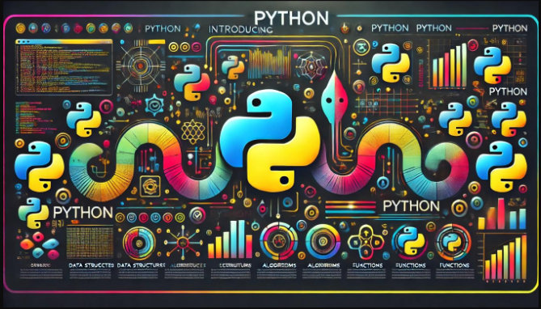

# Universidad Python - Cero a Experto (+86 horas) 🐍

## Tabla de Contenido
<!-- TOC -->
* [Universidad Python - Cero a Experto (+86 horas) 🐍](#universidad-python---cero-a-experto-86-horas-)
  * [Tabla de Contenido](#tabla-de-contenido)
  * [Introducción a Python](#introducción-a-python)
<!-- TOC -->

## Introducción a Python



Python es un lenguaje de programación muy popular que es conocido por ser fácil de aprender y utilizar. Fue creado por Guido van Rossum y lanza por primera vez en 1992. La simplicidad de Python permite a los programadores escribir menos líneas de código para realizar tareas en comparación con otros lenguajes de programación. Esto lo hace ideal para principiantes, así como para desarrolladores experimentados que buscan desarrollar proyectos de manera rápida y eficiente.
Python es muy versátil, lo que significa que se puede usar en una variedad de aplicaciones, desde desarrollo web hasta ciencia de datos, inteligencia artificial y más. Es apoyado por una gran comunidad de desarrolladores que contribuyen constantemente con nuevas bibliotecas y herramientas para hacer que el lenguaje sea aún más poderoso y accesible. Además, Python es un lenguaje de programación de alto nivel, lo que significa que se parece mucho al Inglés, facilitando su comprensión y aprendizaje.
Python tiene varias características que lo hacen muy atractivo para una amplia gama de programadores, desde principiantes hasta expertos. Aquí te detallo algunas de las principales:
1.  **Sintaxis clara y legible:** Python fue diseñado con la legibilidad en mente, lo que significa que su código se asemeja al inglés. Esto facilita su comprensión y aprendizaje, además de permitir a los desarrolladores escribir código limpio y bien estructurado.
2. **Tipado dinámico:** En Python, no necesitas declarar el tipo de una variable cuando la creas. El tipo de dato de una variable se determina en tiempo de ejecución, lo que hace que el lenguaje sea más flexible y fácil de usar.
3. **Gestión automática de memoria:** Python maneja automáticamente la memoria, lo que significa que el programador no tiene que preocuparse por detalles complejos como la asignación y liberación de memoria.
4. **Bibliotecas extensas:** Python viene con una gran biblioteca estándar que incluye módulos para realizar una gran variedad de tareas, desde expresiones regulares hasta la creación de servidores web. Además, hay muchas más bibliotecas disponibles que extienden aún más las capacidades de Python.
5. **Multiparadigma:** Aunque es principalmente un lenguaje de programación orientado a objetos, Python también soporta otros paradigmas de programación, como la programación imperativa y funcional.
6. **Portabilidad:** Los programas escritos en Python pueden ejecutarse en múltiples plataformas sin necesidad de cambiar el código. Python es compatible con sistemas operativoss como Windows, MacOS, Linux, entre otros.
7. **Interpretado:** Python es un lenguaje interpretado, lo que significa que los programas se ejecutan directamente desde el código fuente, sin necesidad de un paso de compilación previo.
8. **Extensible:** Si necesitas un bloque de código que debe ejecutarse muy rápido o quieres reutilizar bibliotecas de otros lenguajes como C o C++, Python permite integrar estas partes fácilmente.
9. **Comunidad grande y activa:** Python tiene una comunidad muy grande y activa de desarrolladores y usuarios que contribuyen regularmente con herramientas, documentación y soporte, lo que facilita encontrar recursos y aprender.

Estas características hacen que python sea una opción muy popular para todo tipo de proyectos, desde aplicaciones web simples hasta sistemas complejos de aprendizaje automático.

### Instalación de Python

Instalar Python en tu computadora es un proceso bastante sencillo, y lo mejor de todo es que puedes comenzar a programar rápidamente después de la instalación.

### Hola Mundo con Python

**Código 📄:**

```python
# Programa de Hola Mundo con Python
print("Hola Mundo")
print("Saludos")
```

**🟢 Ejecutar:**

```console
Hola Mundo
Saludos
```
