# Universidad Python - Cero a Experto (+86 horas) 🐍

## Tabla de Contenido

- [Universidad Python - Cero a Experto (+86 horas) 🐍](#universidad-python---cero-a-experto-86-horas-)
  - [Tabla de Contenido](#tabla-de-contenido)
  - [Introducción a Python](#introducción-a-python)
    - [Instalación de Python](#instalación-de-python)
    - [Hola Mundo con Python](#hola-mundo-con-python)
    - [Ejercicio Preséntate](#ejercicio-preséntate)
  - [Variables](#variables)
    - [Sintaxis para definir una variable](#sintaxis-para-definir-una-variable)
      - [Variables y la Memoria RAN](#variables-y-la-memoria-ran)
    - [Variables y la Memoria RAM](#variables-y-la-memoria-ram)
      - [Variables y Memoria Simplificado](#variables-y-memoria-simplificado)
    - [Ejemplo de Variables](#ejemplo-de-variables)
    - [Modificar Variables](#modificar-variables)
    - [Modificar variables](#modificar-variables-1)
    - [Reglas y buenas prácticas en nombres de variables](#reglas-y-buenas-prácticas-en-nombres-de-variables)
      - [Convenciones y buenas prácticas](#convenciones-y-buenas-prácticas)
    - [Ejemplo de regla de nombre de variables](#ejemplo-de-regla-de-nombre-de-variables)
    - [Tipos de datos](#tipos-de-datos)
    - [Ejemplo de Tipos de datos](#ejemplo-de-tipos-de-datos)
    - [Sistema de Reserva de Hoteles](#sistema-de-reserva-de-hoteles)
    - [Sistema Tienda Online](#sistema-tienda-online)
    - [Constantes](#constantes)
  - [Manejo de Cadenas](#manejo-de-cadenas)
    - [Detalle de una Cadena](#detalle-de-una-cadena)
    - [Inmutabilidad de una Cadena](#inmutabilidad-de-una-cadena)
    - [Caractéres Especiales](#caractéres-especiales)
    - [Concatenación de Cadenas](#concatenación-de-cadenas)
    - [Formateo de Cadenas](#formateo-de-cadenas)
    - [Métodos de cadenas](#métodos-de-cadenas)
    - [Largo de una cadena](#largo-de-una-cadena)
    - [Subcadenas](#subcadenas)
    - [Búsqueda de subcadenas](#búsqueda-de-subcadenas)
    - [Reemplazar subcadena](#reemplazar-subcadena)
    - [Separar en Subcadenas](#separar-en-subcadenas)
    - [Multiplicación de cadenas](#multiplicación-de-cadenas)
    - [Generador de Email](#generador-de-email)
  - [Entrada de Datos](#entrada-de-datos)
    - [Ejemplo de Conversión de Tipos de Datos](#ejemplo-de-conversión-de-tipos-de-datos)
    - [Entrada de Datos por Consola](#entrada-de-datos-por-consola)
      - [Características de la función `input`](#características-de-la-función-input)
    - [Sistema de Empleados](#sistema-de-empleados)
    - [Receta de Cocina](#receta-de-cocina)
    - [Generar valores aleatorios](#generar-valores-aleatorios)
    - [Reto Generador de ID Único](#reto-generador-de-id-único)
    - [Sistema Generador de Email](#sistema-generador-de-email)
  - [Operadores](#operadores)
    - [Operadores Aritméticos](#operadores-aritméticos)
    - [Operadores de Asignación](#operadores-de-asignación)
      - [Asignación Encadenada](#asignación-encadenada)
    - [Asignación Multiple](#asignación-multiple)
    - [Operadores de Asignación Compuestos](#operadores-de-asignación-compuestos)
    - [Operadores de Comparación](#operadores-de-comparación)
    - [Operadores Lógicos](#operadores-lógicos)
      - [Ejemplo Descuento VIP](#ejemplo-descuento-vip)
      - [Operador "or"](#operador-or)
      - [Sistema Préstamo de Libros](#sistema-préstamo-de-libros)
      - [Operador "not"](#operador-not)
      - [Fuera de rango - Operador not](#fuera-de-rango---operador-not)
    - [Generación Ticket Venta](#generación-ticket-venta)
      - [Generación Ticket de Venta con Descuento](#generación-ticket-de-venta-con-descuento)
    - [Sistema de Autenticación](#sistema-de-autenticación)
    - [Valor Dentro de Rango](#valor-dentro-de-rango)
    - [Cálculo Área y Perímetro de un rectángulo](#cálculo-área-y-perímetro-de-un-rectángulo)
    - [Precedencia de Operadores](#precedencia-de-operadores)
  - [Sentencias de decisión](#sentencias-de-decisión)
    - [Diagrama de Flujo](#diagrama-de-flujo)
    - [Diagrama de Flujo Sentencia `if`](#diagrama-de-flujo-sentencia-if)
    - [Sentencia if else](#sentencia-if-else)
      - [Diagrama de Flujo sentencia `if else`](#diagrama-de-flujo-sentencia-if-else)
    - [Sentencia `if` `elif` `else`](#sentencia-if-elif-else)
    - [Ejemplo Valor Positivo](#ejemplo-valor-positivo)
    - [Tienda en línea](#tienda-en-línea)
    - [Sistema de Bancario](#sistema-de-bancario)
    - [Casa de los Espejos](#casa-de-los-espejos)
    - [Operador Ternario](#operador-ternario)
    - [Aplicación de Salud y Fitness](#aplicación-de-salud-y-fitness)
    - [Sistema Reserva Hotel](#sistema-reserva-hotel)
    - [El mayor de 2 números](#el-mayor-de-2-números)
    - [Identifica la estación del año](#identifica-la-estación-del-año)
    - [Sistema de Calificaciones](#sistema-de-calificaciones)
    - [Sistema de Envíos](#sistema-de-envíos)
    - [Sistema de Autenticación en decisión](#sistema-de-autenticación-en-decisión)
  - [Ciclos en Python](#ciclos-en-python)
    - [Ciclo while](#ciclo-while)
      - [Diagrama de Flujo Ciclo `while`](#diagrama-de-flujo-ciclo-while)
    - [Ciclo for](#ciclo-for)
    - [Ejercicio Acumulador Suma en Ciclo](#ejercicio-acumulador-suma-en-ciclo)
    - [Menú Iterativo](#menú-iterativo)
    - [Reto - Cajero Automático](#reto---cajero-automático)
    - [Aplicación Calculadora](#aplicación-calculadora)
    - [Creación y validación de Password](#creación-y-validación-de-password)
    - [Juego de Adivinanzas](#juego-de-adivinanzas)
    - [Validación de Información de un Formulario](#validación-de-información-de-un-formulario)
    - [Función range en Python](#función-range-en-python)
    - [Imprimir mensaje función range](#imprimir-mensaje-función-range)
    - [Dibujar un Triángulo](#dibujar-un-triángulo)
    - [Palabra `break` y `continue` en ciclos](#palabra-break-y-continue-en-ciclos)
  - [Colecciones](#colecciones)
    - [Listas](#listas)
    - [Iterar elementos de una lista](#iterar-elementos-de-una-lista)
    - [Lista de Reproducción](#lista-de-reproducción)
    - [Promedio de calificaciones](#promedio-de-calificaciones)
    - [Tuplas](#tuplas)
    - [Desempaquetado de Tuplas (unpacking)](#desempaquetado-de-tuplas-unpacking)
    - [Combinación de Listas y Tuplas](#combinación-de-listas-y-tuplas)
    - [Sets en Python](#sets-en-python)
    - [Operaciones con Set](#operaciones-con-set)
    - [Lista de suscriptores](#lista-de-suscriptores)
    - [Lista de Suscriptores dinámica con Sets](#lista-de-suscriptores-dinámica-con-sets)
    - [Diccionarios en Python](#diccionarios-en-python)
    - [Agenda de Contactos](#agenda-de-contactos)
    - [Combinar Listas y Diccionarios en Python](#combinar-listas-y-diccionarios-en-python)
    - [Gestión de Inventario](#gestión-de-inventario)
    - [Comprensión de Listas en Python](#comprensión-de-listas-en-python)
  - [Funciones en Python](#funciones-en-python)
    - [Ventajas de las funciones](#ventajas-de-las-funciones)
    - [Manejo de Parámetros en una función](#manejo-de-parámetros-en-una-función)
    - [Función Suma](#función-suma)
    - [Módulos en Funciones](#módulos-en-funciones)
    - [Argumentos por nombres en una función](#argumentos-por-nombres-en-una-función)
    - [Regresar una tupla de valores desde una función](#regresar-una-tupla-de-valores-desde-una-función)
    - [Coordenadas en una función de Tuplas](#coordenadas-en-una-función-de-tuplas)
    - [Alcance de Variables](#alcance-de-variables)
    - [Argumentos variables \*args](#argumentos-variables-args)
    - [Argumentos variables \*\*kwargs](#argumentos-variables-kwargs)
    - [Suma con Argumentos Variables](#suma-con-argumentos-variables)
    - [con kwargs - Detalle de Persona](#con-kwargs---detalle-de-persona)
    - [Función de pares](#función-de-pares)
    - [Funciones Recursivas](#funciones-recursivas)
      - [Reglas Funciones Recursivas](#reglas-funciones-recursivas)
    - [Factorial de un Número con Recursividad](#factorial-de-un-número-con-recursividad)
    - [Potencia de un Número usando funciones recursivas](#potencia-de-un-número-usando-funciones-recursivas)
    - [Sistema de Inventario](#sistema-de-inventario)
    - [Máquina de Snacks](#máquina-de-snacks)
    - [Calculadora (Con Funciones)](#calculadora-con-funciones)
    - [Ejercicio: Calculadora de Impuestos](#ejercicio-calculadora-de-impuestos)
    - [Ejercicio: Convertidor de Temperatura](#ejercicio-convertidor-de-temperatura)
  - [Clases y Objetos](#clases-y-objetos)
    - [Elementos de una Clase](#elementos-de-una-clase)
    - [Constructores](#constructores)
    - [Dirección de Memoria de Objetos](#dirección-de-memoria-de-objetos)
    - [Clase Aritmética](#clase-aritmética)
    - [Flexibilidad de Constructores](#flexibilidad-de-constructores)
    - [Encapsulamiento](#encapsulamiento)
    - [Métodos get y set](#métodos-get-y-set)
    - [Mejora de Encapsulamiento](#mejora-de-encapsulamiento)
    - [Atributos dinámicos](#atributos-dinámicos)
    - [Encapsulamiento de clase Aritmética](#encapsulamiento-de-clase-aritmética)
      - [Atributos de Clase](#atributos-de-clase)
    - [Ejemplo Contador de Objetos de tipo Persona](#ejemplo-contador-de-objetos-de-tipo-persona)
    - [Métodos de Clase](#métodos-de-clase)
    - [Sistema de Empleados](#sistema-de-empleados-1)
    - [Sistema Biblioteca](#sistema-biblioteca)
  - [Programación Orientada a Objetos (POO)](#programación-orientada-a-objetos-poo)
    - [Herencia en Python](#herencia-en-python)
    - [Sobreescritura en Python](#sobreescritura-en-python)
    - [Polimorfismo](#polimorfismo)
    - [Duck Typing en Python](#duck-typing-en-python)
    - [Clase `Object` en Python](#clase-object-en-python)
      - [Características Principales](#características-principales)
      - [Métodos Comunes de `object`](#métodos-comunes-de-object)
      - [Importancia de `object`](#importancia-de-object)
      - [Ejemplo de Uso](#ejemplo-de-uso)
    - [Mundo PC](#mundo-pc)
    - [**Análisis del Diagrama**](#análisis-del-diagrama)

## Introducción a Python

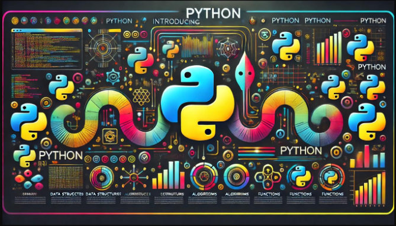

Python es un lenguaje de programación muy popular que es conocido por ser fácil de aprender y utilizar. Fue creado por
Guido van Rossum y lanza por primera vez en 1992. La simplicidad de Python permite a los programadores escribir menos
líneas de código para realizar tareas en comparación con otros lenguajes de programación. Esto lo hace ideal para
principiantes, así como para desarrolladores experimentados que buscan desarrollar proyectos de manera rápida y
eficiente.
Python es muy versátil, lo que significa que se puede usar en una variedad de aplicaciones, desde desarrollo web hasta
ciencia de datos, inteligencia artificial y más. Es apoyado por una gran comunidad de desarrolladores que contribuyen
constantemente con nuevas bibliotecas y herramientas para hacer que el lenguaje sea aún más poderoso y accesible.
Además, Python es un lenguaje de programación de alto nivel, lo que significa que se parece mucho al Inglés, facilitando
su comprensión y aprendizaje.
Python tiene varias características que lo hacen muy atractivo para una amplia gama de programadores, desde
principiantes hasta expertos. Aquí te detallo algunas de las principales:

1. **Sintaxis clara y legible:** Python fue diseñado con la legibilidad en mente, lo que significa que su código se
   asemeja al inglés. Esto facilita su comprensión y aprendizaje, además de permitir a los desarrolladores escribir
   código limpio y bien estructurado.
2. **Tipado dinámico:** En Python, no necesitas declarar el tipo de una variable cuando la creas. El tipo de dato de una
   variable se determina en tiempo de ejecución, lo que hace que el lenguaje sea más flexible y fácil de usar.
3. **Gestión automática de memoria:** Python maneja automáticamente la memoria, lo que significa que el programador no
   tiene que preocuparse por detalles complejos como la asignación y liberación de memoria.
4. **Bibliotecas extensas:** Python viene con una gran biblioteca estándar que incluye módulos para realizar una gran
   variedad de tareas, desde expresiones regulares hasta la creación de servidores web. Además, hay muchas más
   bibliotecas disponibles que extienden aún más las capacidades de Python.
5. **Multiparadigma:** Aunque es principalmente un lenguaje de programación orientado a objetos, Python también soporta
   otros paradigmas de programación, como la programación imperativa y funcional.
6. **Portabilidad:** Los programas escritos en Python pueden ejecutarse en múltiples plataformas sin necesidad de
   cambiar el código. Python es compatible con sistemas operativos como Windows, MacOS, Linux, entre otros.
7. **Interpretado:** Python es un lenguaje interpretado, lo que significa que los programas se ejecutan directamente
   desde el código fuente, sin necesidad de un paso de compilación previo.
8. **Extensible:** Si necesitas un bloque de código que debe ejecutarse muy rápido o quieres reutilizar bibliotecas de
   otros lenguajes como C o C++, Python permite integrar estas partes fácilmente.
9. **Comunidad grande y activa:** Python tiene una comunidad muy grande y activa de desarrolladores y usuarios que
   contribuyen regularmente con herramientas, documentación y soporte, lo que facilita encontrar recursos y aprender.

Estas características hacen que python sea una opción muy popular para todo tipo de proyectos, desde aplicaciones web
simples hasta sistemas complejos de aprendizaje automático.

### Instalación de Python

Instalar Python en tu computadora es un proceso bastante sencillo, y lo mejor de todo es que puedes comenzar a programar
rápidamente después de la instalación.

### Hola Mundo con Python

**Código 📄:**

```python
# Programa de Hola Mundo con Python
print("Hola Mundo")
print("Saludos")
```

**🟢 Ejecutar:**

```console
Hola Mundo
Saludos
```

### Ejercicio Preséntate

Realizar un programa un Python para presentarte.

La salida de tu programa debe ser similar al siguiente:

````text
Nombre: Juan 
Edad: 29
Pais: Colombia
````

**Código 📄:**

````python
# Ejercicio de Presentación con Python
print("Nombre: Juan")
print("Edad: 29")
print("País: Colombia")
````

**🟢 Ejecutar:**

```console
Nombre: Juan 
Edad: 29
Pais: Colombia
```

## Variables

Una variable en Python es un nombre que almacena valor guardado en la memoria temporal de la computadora o dispositivo.

Las variables en Python son dinámicas, por lo que pueden almacenar cualquier tipo en cualquier momento.

Algunos tipos de datos o valores que puede almacenar una variable son texto (cadenas o string), números enteros o con
punto flotante, valores lógicos o booleanos, lista, entre varios tipos más.

### Sintaxis para definir una variable

```python
# Sintaxis para definir una variable
nombre_de_la_variable = valor
```

**Ejemplo de Variables:**

```python
# Declaración de variables y asignación de valores
nombre = "María"
edad = 30
peso = 65.5
es_casado = False
```

#### Variables y la Memoria RAN

En Python, cada vez que creamos una variable y le asignamos un valor, estamos reservando espacio en memoria RAN (Random
Access Memory) o memoria de corto plazo

**Ejemplo:**

| Paso | Variable y valores | RAM  | Dir. Memoria (hex) |
|------|--------------------|------|--------------------|
| 1    | edad = 30          | 30   | 0x333              |
| 2    | edad=60.5          | 60.5 | 0x444              |
| 3    | edad = 32          | 32   | ...                |

### Variables y la Memoria RAM

En Python, cada vez que creamos una variable y le asignamos un valor, estamos reservando espacio en la memoria RAM.

**Ejemplo:**

````python
edad = 30
altura = 1.75
````

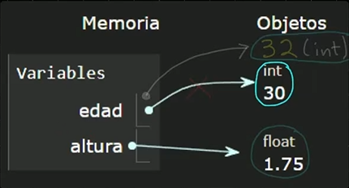

#### Variables y Memoria Simplificado

Para simplificar la explicación de creación de variables, de momento usaremos la siguiente explicación:

````python
edad = 30
altura = 1.68
````

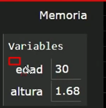

### Ejemplo de Variables

**Código 📄:**

```python
# Variables en Python

# Declaración e inicialización de variables
edad = 28
altura = 1.65
pais = "Colombia"

# Acceder a las variables
print("Edad:", edad)
print("Altura:", altura)
print("Pais", pais)
```

**🟢 Ejecutar:**

```console
Edad: 28
Altura: 1.65
Pais Colombia
```

### Modificar Variables

**Código 📄:**

```python
# Variables en Python

# Declaración e inicialización de variables
edad = 28
altura = 1.65
pais = "Colombia"

# Acceder a las variables
print("Edad:", edad)
print("Altura:", altura)
print("Pais", pais)
```

**🟢 Ejecutar:**

```console
Edad: 28
Altura: 1.65
Pais Colombia
```

### Modificar variables

**Código 📄:**

````python
# Variables en Python

# Declaración e inicialización de variables
edad = 28
altura = 1.65
pais = "Colombia"

# Acceder a las variables
print("Valores iniciales: ")
print("Edad:", edad)
print("Altura:", altura)
print("Pais", pais)

# Modificar el valor de una variable
edad = 30
altura = 1.68

# Acceder a las variables
print("Valores Modificados: ")
print("Edad:", edad)
print("Altura:", altura)
print("Pais", pais)

# En Python el tipo es dinámico
edad = "treinta"
print("Edad:", edad)

# Si queremos acceder a una variable no declarada manda error
telefono = "23156165"
print("Teléfono:", telefono)
````

**🟢 Ejecutar:**

````console
Valores iniciales: 
Edad: 28
Altura: 1.65
Pais Colombia
Valores Modificados: 
Edad: 30
Altura: 1.68
Pais Colombia
Edad: treinta
````

### Reglas y buenas prácticas en nombres de variables

- Los nombres de variables pueden tener letras (mayúsculas o minúsculas), dígitos, y guiones bajos (_)
- El nombre NO puede comenzar con dígitos
- No se puede usar palabras reservadas del lenguaje (keyword), Ejemplo: `for`, `if`, `class` , `try`, etc.
- Python es sensible a mayúsculas y minúsculas. Ejemplo: mi_nombre es distinto a Mi_nombre

#### Convenciones y buenas prácticas

- **snake case:** Es recomendable usar la notación de snake case, es decir, palabras en minúsculas separadas por guion
  bajo. Ejemplo: nombre_usuario, nombre_completo, etc.
- Nombres descriptivos: Los nombres de las variables deben reflejar el contenido de la variable. Ejemplo; no usar e,
  sino
  edad. No usar n, sino nombre, etc.
- Evitar nombres de un sólo caracter, ya que no son descriptivos y pueden ser confusos.

### Ejemplo de regla de nombre de variables

**Código 📄:**

```python
# Regla y convenciones en nombres de variables

# Ejemplo de reglas estrictas
nombre_usuario = "Juan Perez"
# 1nombre_usuario = "Karla Gomez"

# No podemos usar las palabras reservadas
# class = "Mi clase"
klass = 'Mi clase'

# Sensibles a mayusculas y minusculas
nombre = 'Juan'
Nombre = 'Karla'
print(nombre)
print(Nombre)
# print(NOMBRE) # esta variable no ha sido definido

# snake case
nombre_completo = "Ricardo Esparza"

# Prefijos y sufijos
es_casado = False
nombre_txt = 'archivo.txt'
```

**🟢 Ejecutar:**

```console
Juan
Karla
```

### Tipos de datos

Python es un lenguaje de tipado dinámico, por lo que no hay necesidad de indicar el tipo de la variable al momento de
declararla.

Los valores que pueden almacenar las variables son de distintos tipos, como:

- **Número (`int`):** Son números sin la parte decimal, Ej: 43, -34
- **Número con punto flotante (`float`):** Ejemplo, 3.1416, -0.032
- **Cadenas de texto (`str`):** Secuencia de caracteres, Ejemplo, 'Hola Mundo'
- **Booleanos:** Almacenan un valor lógico de verdadero (`True`) o falso (`False`). Este tipo de valores los usaremos
  para controlar el flujo de programas
- **`None`:** Es un tipo especial en Pytho que representa ausencia de valor

Estos son los tipos más básicos y estudiaremos más tipos posteriormente.

### Ejemplo de Tipos de datos

**Código 📄:**

```python
# Ejemplo de tipos de datos

# Entero
edad = 28
print(edad)

# Numero con punto flotante
altura = -1.56
print(altura)

# cadena de texto
nombre = "Juan"
print(nombre)

# Tipo boolean
es_estudiante = False
print("Es estudiante?", es_estudiante)

# None, ausencia de valor
direccion = None
print("Dirección:", direccion)
```

**🟢 Ejecutar:**

```console
30
1.56
Juan
Es estudiante? False
Dirección: None
```

### Sistema de Reserva de Hoteles

Crea un Sistema de reserva de hoteles que contenga la siguiente información de una reserva:

- Nombre del cliente
- Días de estancia
- Tarifa diaria
- Indicar si el cuarto tiene vista al mar
- Después mandar a imprimir los valores de cada variable
- Hacer algunos cambias y re-imprimir

El resultado debe ser similar al siguiente:

```console
*** Sistema de Reserva de Hoteles ***
Cliente: Laura Martínez
Días de estancia: 5
Tarifa diaria: 1200.0
Habitación con vista al mar? True
```

**Solución:**

**Código 📄:**

```python
print("*** Sistema de Reserva de Hoteles ***")
# Definimos las variables
nombre_cliente = "Laura Martínez"
dias_estancia = 5
tarifa_diaria = 1200.00
vista_al_mar = True

# Mostrar el detalle de la reserva
print("Cliente:", nombre_cliente)
print("Días de estancia:", dias_estancia)
print("Tarifa diaria:", tarifa_diaria)
print("Habitación con vista al mar?:", vista_al_mar)

# Realizamos algunas modificaciones
dias_estancia = 7
tarifa_diaria = 1000.00
vista_al_mar = False

# Mostrar el detalle de la reserva
print()
print("Cliente:", nombre_cliente)
print("Días de estancia:", dias_estancia)
print("Tarifa diaria:", tarifa_diaria)
print("Habitación con vista al mar?:", vista_al_mar)
```

**🟢 Ejecutar:**

```console
*** Sistema de Reserva de Hoteles ***
Cliente: Laura Martínez
Días de estancia: 5
Tarifa diaria: 1200.0
Habitación con vista al mar?: True

Cliente: Laura Martínez
Días de estancia: 7
Tarifa diaria: 1000.0
Habitación con vista al mar?: False
```

### Sistema Tienda Online

Crear el detalle de un producto de una tienda online.

El detalle del producto debe tener:

- Nombre del producto
- Precio del producto
- Cantidad en el Inventario
- Indicar si está disponible

Hacer algunos cambios y mandar a imprimir nuevamente el nuevo valor de las variables.

El resultado debe ser similar al siguiente:

```console
*** Sistema de Tienda Online ***
Producto: Cámara digital
Precio: $ 399.9
Cantidad inventario: 20
Disponible: True
```

---

**Solución:**

**Código 📄:**

```python
print('*** Sistema de Tienda Online ***')

# Definir las variables de un producto
nombre_producto = 'Cámara digital'
precion_producto = 399.9
cantidad_inventario = 20
disponible_producto = True

# Mostrar información del producto
print('Producto:', nombre_producto)
print('Precio: $', precion_producto)
print('Cantidad en el Inventario:', cantidad_inventario)
print('Disponible:', disponible_producto)

# Hacemos algunos cambio
precion_producto = 399.9
cantidad_inventario = 20
disponible_producto = True

# MOstrar información del producto
print()
print('Producto:', nombre_producto)
print('Precio: $', precion_producto)
print('Cantidad en el Inventario:', cantidad_inventario)
print('Disponible:', disponible_producto)
```

**🟢 Ejecutar:**

```console
*** Sistema de Tienda Online ***
Producto: Cámara digital
Precio: $ 399.9
Cantidad en el Inventario: 20
Disponible: True

Producto: Cámara digital
Precio: $ 399.9
Cantidad en el Inventario: 20
Disponible: True
```

### Constantes

A diferencia de otros lenguajes de programación, en Python no existe un tipo específico para definir una constante de
manera estricta. Sólo es una convención

Python no impide cambiar el valor de una variable, pero podemos seguir la siguiente convención de declarar el nombre de
una variable en mayúsculas y con ello indicamos que el valor de esta variable NO debe modificarse una vez inicializada,
es decir, esta variable se debe tratar como una constante.

```python
# Sintaxis para una constante
NOMBRE_CONSTANTE = valor
```

```python
# Ejemplo de constantes
PI = 3.14159
MENSAJE_ERROR = 'Usuario Inválido'
NOMBRE_USUARIO_VALIDO = 'admin'
```

---

**Código 📄:**

```python
import math

print('*** Constantes en Python ***')

PI = 3.14159
print('El valor de PI es:', PI)

NOMBRE_BASE_DATOS = 'clientes_db'
print('Nombre de la base de datos:', NOMBRE_BASE_DATOS)

# Esto NO se debe hacer, no se debe modificar el valor una constante
NOMBRE_BASE_DATOS = "listado_cliente_db"
print("No cambiar el valor de una constante:", NOMBRE_BASE_DATOS)

# User uan constante del lenguaje Python, aunque en este caso no esta en mayusculas
print("Valor de math.pi", math.pi)
```

**🟢 Ejecutar:**

```console
*** Constantes en Python ***
El valor de PI es: 3.14159
Nombre de la base de datos: clientes_db
No cambiar el valor de una constante: listado_cliente_db 
Valor de math.pi 3.141592653589793
```

## Manejo de Cadenas

Una cadena o string en inglés es un tipo de dato que se utiliza para almacenar una secuencia de caracteres

Las cadenas se deben encerrar entra comillas dobles o comillas simples.

Los caracteres pueden ser letras, números, símbolos o espacios.

```python
# Cadenas en Python
cadena1 = "Hola Mundo"
```

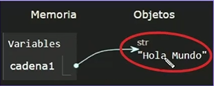

**Código 📄:**

```python
# Cadenas en Python
cadena1 = "Hola Mundo"
cadena1 = "Adiós"
cadena2 = "Python es Genial"
cadena3 = """Este es un ejemplo
de múltiples líneas
en una cadena"""

print(cadena1)
print(cadena2)
print(cadena3)
```

**🟢 Ejecutar:**

```console
Adiós
Python es Genial
Este es un ejemplo
de múltiples líneas
en una cadena
```

### Detalle de una Cadena

Los caracteres de una cadena están indexados de manera secuencial.

Por lo tanto, podemos acceder cada carácter indicando el índice del carácter que deseamos recuperar

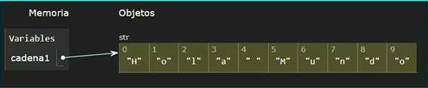

**📄 Código :**

```python
# Manejo de índice en una cadena
cadena1 = "Hola Mundo"
print(cadena1)
# Recuperara el primer caracter
primer_caracter = cadena1[0]  # recuperar 'H'
print(primer_caracter)
ultimo_caracter = cadena1[9]  # recuperar 'o'
print(ultimo_caracter)
```

**🟢 Ejecutar:**

```console
Hola Mundo
H
o
```

### Inmutabilidad de una Cadena

Una vez que se crea una cadena, los caracteres dentro de ella no pueden ser modificados

Si deseamos modificar una cadena, entonces tenemos que crear una nueva cadena.

Las cadenas no se pueden modificar, son inmutables:

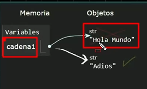

Nuevo valor.

**📄 Código :**

```python
# Inmutabilidad en cadenas
cadena1 = "Hola Mundo"
# cadena1 [0] = 'h' # no podemos modificar los carateres
cadena2 = cadena1
cadena1 = "Adios"
print(cadena1)
print(cadena2)
```

**🟢 Ejecutar:**

```console
Adios
Hola Mundo
```

### Caractéres Especiales

Las cadenas pueden incluir caractéres especiales

Estos caracteres se introducen usando el caracter de diagonal invertida (`\`). Ejemplo:

- **Nueva línea: `\n`** Inserta un salto de línea
- **Tabulación: `\t`** Inserta un tabulador horizontal, útil para alinear texto.
- **Comillas Simple: `\'`** Permite incluir comillas Simples en una cadena delimitada por comillas simples.
- **Comillas Doble: `\"`** Permite incluir comillas Dobles en una cadena delimitada por comillas simples.
- **Barra invertida:  `\\`** Permite incluir una barra invertida en la cadena

Existen más caracteres especiales, pero esto son los esenciales.

**📄 Código :**

```python
# Caracteres Especiales
print("Hola \nMundo")  # \n salto de linea
print("\t\tPython \t\tes genial")  # \t agrega un tabulador
print("Juan ' \"Perez")
print('Karla " Gomez')
print("Caracter \\ diagonal invertida")
```

**🟢 Ejecutar:**

```console
Hola 
Mundo
  Python   es genial
Juan ' "Perez
Karla " Gomez
Caracter \ diagonal invertida
```

### Concatenación de Cadenas

La concatenación de cadenas es una operación que permite combinar dos o más cadenas para formar una nueva cadena.

En python existen varias formas, vamos a ver varias.

- **Uso del operador +:** El operador `+` es el más directo para concatenar. Simplemente, tenemos que poner el operador
  `+` entre las cadenas que deseamos unir.

**Ejemplo:**

```python
concatenacion = "Hola" + "Mundo"
```

- **Uso de la función `join`:** La función `join` nos permite unir tantas cadenas como necesitemos. Solo necesitamos
  pasar cada cadena a concatenar separadas por coma y entre paréntesis.

**Ejemplo:**

```python
"".join(["cadena1", "cadena2", "cadena3"])
```

--

**📄 Código :**

```python
# Concatenación de Cadenas
cadena1 = "Hola"
cadena2 = "Mundo"
concatenacion = cadena1 + " " + cadena2

print(concatenacion)

# Utilizando el metodo join

concatenacion = "".join([cadena1, " ", cadena2])
print(concatenacion)
```

**🟢 Ejecutar:**

```console
Hola Mundo
Hola Mundo
```

### Formateo de Cadenas

Python ofrece varias maneras de formatear cadenas, que incluyen la capacidad de concatenar texto, variables e incluso
dar indicar el número de decimales a utilizar en el formato.

- **f-string (Python 3.6+)**: Esta es la opción más recomendada, por ser la más sencilla, rápida y legible.

```python
resultado = f'hola {variable}'
```

- **Método format** Es muy versátil y poderoso permite construir cadenas muy complejas.

```python
resultado = 'Hola {}'.format(variable)
```

### Métodos de cadenas

Las cadenas en Python vienen con una serie de métodos útiles que facilitan su manipulación. Por ejemplo:

- `upper()` -> Cambiar las letras a mayúsculas.
- `lower()` -> Cambiar las letras a minúsculas.
- `strip()` -> Elimina espacios en blanco al inicio y al final de la cadena

**📄 Código :**

```python
# Método de cadenas

cadena1 = 'Hola Mundo'
print(f'Cadena original: {cadena1}')
mayusculas = cadena1.upper()  # Convertir a mayúsculas
print(f'Cadena en mayúsculas: {mayusculas}')
print(f'Cadena en minúsculas: {cadena1.lower()}')  # Convertir a minúsculas
cadena2 = ' Juan Perez '
print(f'Cadena con espacios: {cadena2}')
print(f'Cadena sin espacios: {cadena2.strip()}')  # Eliminar espacio al inicio y al final
```

**🟢 Ejecutar:**

```console
Cadena original: Hola Mundo
Cadena en mayúsculas: HOLA MUNDO
Cadena en minúsculas: hola mundo
Cadena con espacios:  Juan Perez 
Cadena sin espacios: Juan Perez
```

### Largo de una cadena

**Obtener el largo de una cadena:**

Para obtener la longitud de una cadena, utilizamos la función incorporada `len()`

La función `len` funciona con varios tipos de datos incluyendo cadenas, listas, etc.

Cuando se calcula el largo de una cadena se toman en cuenta todos los caracteres de una cena, incluyendo espacios en
blanco, caracteres especiales, etc.

````python
cadena1 = 'Hola, Mundo!'
longitud = len(cadena1)  # -> devuelve largo de 12
````

**📄 Código :**

```python
# Largo de una cadena
cadena = "Hola, mundo!"
largo_cadena = len(cadena)
print(f"Cadena original: {cadena}")
print(f"Largo de la cadena: {largo_cadena}")
```

**🟢 Ejecutar:**

```console
Cadena original: Hola, mundo!
Largo de la cadena: 12
```

### Subcadenas

Una subcadena es una parte de una cadena principal, y hay varias maneras de extraer subcadenas en Python

Podemos extraer subcadenas, buscarlas, reemplazarlas, entre otras operaciones.

- **Extracción cadenas (Slicing):** El slicing o segmentación permite indicar el índice de inicio y el índice final (sin
  incluir este último caracter)

```python
subcadena = cadena[inicio:fin]
```

**📄 Código :**

```python
# Manejo de subcadenas
cadena = "Hola, Mundo!"
# Obtenemos la subcadena de hola[inicio:fin (sin incluirlo)]
subcadena_hola = cadena[0:4]
print(f"Subcadena de hola: {subcadena_hola}")
# Obtene la subcadena de mundo
subcadena_mundo = cadena[6:11]
print(f"Subcadena de mundo: {subcadena_mundo}")
```

**🟢 Ejecutar:**

```console
Subcadena de hola: Hola
Subcadena de mundo: Mundo
```

### Búsqueda de subcadenas

- **Buscar subcadenas (`find`):** El método `find()` devuelve el índice de la primera aparición de la subcadena. Si no
  encuentra la subcadena, devuelve -1

```python
cadena = 'Hola Mundo'
posicion = cadena.find("Mundo")
print(posicion)  # Imprime 5
```

**📄 Código :**

```python
# Buscar subcadenas
cadena = "Hola, mundo"
indice = cadena.find("mundo")
print(f"Indice de la subcadena mundo: {indice}")
# Obtener el indicie de la subcadena de Hola
indice = cadena.find("Hola")
print(f"Indice la subcadena de Hola: {indice}")
```

**🟢 Ejecutar:**

```console
Indice de la subcadena mundo: 6
Indice la subcadena de Hola: 0
```

### Reemplazar subcadena

- **Reemplazar subcadena (`replace`)** El método `replace()` reemplaza una subcadena por otra dentro de una cadena
  principal

```python
cadena = 'Hola mundo'
nueva_cadena = cadena.replace('mundo', 'a todos')
print(nueva_cadena)  # 'Hola a todos'
```

**📄 Código :**

```python
# Reemplazar subcadenas
cadena = 'Hola, mundo!'
print(f'Cadena original: {cadena}')
nueva_cadena = cadena.replace('mundo', 'a todos')
print(f'Nueva cadena reemplazada:  {nueva_cadena}')
# Sustituir hola por adios
nueva_cadena = cadena.replace('Hola', 'Adiós')
print(f'Nueva cadena reemplazada: {nueva_cadena}')
```

**🟢 Ejecutar:**

```console
Cadena original: Hola, mundo!
Nueva cadena reemplazada:  Hola, a todos!
Nueva cadena reemplazada: Adiós, mundo!
```

### Separar en Subcadenas

- **Extraer subcadenas por separadores (`split`):** La función `split()` permite dividir una cadena en una lista de
  subcadenas basadas en un caracter separador.

**Ejemplo:**

```python
datos = 'Juan, 30, Colombia'
lista = datos.split(',')
print(lista)  # ['Juan', '30', 'Colombia']
```

**📄 Código :**

```python
# Separar cadenas (split)
datos = "Hola Mundo"
lista = datos.split()  # Por defualt separa cada elemento por espacios en blanco
print(lista)

datos = "Juan,30,Colombia"
lista = datos.split(",")
print(lista)
```

**🟢 Ejecutar:**

```console
['Hola', 'Mundo']
['Juan', '30', 'Colombia']
```

### Multiplicación de cadenas

**📄 Código :**

```python
print("*** Multiplicación de Cadenas ***")

texto = "Hola"
veces = 4

resultado = texto * veces
print(resultado)
```

**🟢 Ejecutar:**

```console
*** Multiplicación de Cadenas ***
HolaHolaHolaHola
```

### Generador de Email

Crea un programa para generar un email a partir de los siguientes datos:

- **Nombre:** Ubaldo Acosta Soto
- **Empresa:** Global Mentoring
- **Dominio:** com.mx

Resultado Final:

**Email:** `ubaldo.acosta.soto@globalmentoring.com.mx`

Este es el resultado del programa:

```console
*** Generador de Email ***
Nombre Usuario: Ubaldo Acosta Soto
Nombre Usuario normalizado: ubaldo.acosta.soto

Nombre Empresa: Global Mentoring
Extensión del dominio: com.mx
Dominio de email normalizado: @globalmentoringcom.mx  

Email final generado: ubaldo.acosta.soto@globalmentoringcom.mx
```

**📄 Código :**

```python
# Generador de Email
print("*** Generador de Email ***")

nombre_completo = "Ubaldo Acosta Soto"
print(f"Nombre Usuario: {nombre_completo}")
nombre_normalizado = nombre_completo.strip().lower().replace(" ", ".")
print(f"Nombre Usuario normalizado: {nombre_normalizado}")
print()
empresa = "Global Mentoring"
print(f"Nombre Empresa: {empresa}")
empresa_normalizado = empresa.strip().lower().replace(" ", "")
dominio = "com.mx"
print(f"Extensión del dominio: {dominio}")
dominio_email = "".join(["@", empresa_normalizado, dominio])
print(f"Dominio de email normalizado: {dominio_email}")
print()
print(f"Email final generado: {nombre_normalizado + dominio_email}")
```

**🟢 Ejecutar:**

```console
*** Generador de Email ***
Nombre Usuario: Ubaldo Acosta Soto
Nombre Usuario normalizado: ubaldo.acosta.soto

Nombre Empresa: Global Mentoring
Extensión del dominio: com.mx
Dominio de email normalizado: @globalmentoringcom.mx  

Email final generado: ubaldo.acosta.soto@globalmentoringcom.mx
```

## Entrada de Datos

**Conversión de tipos de datos:**

La conversion de tipos de datos, también conocida como casting, es una técnica para manipular datos que no están en el
tipo requerido.

Podemos hacer conversiones desde y hacia distintos tipos de datos

- **Convertir a entero** -> Función `int()`
- **Convertir a flotante** -> Función `float()`
- **Convertir a cadena** -> Función `str()`
- **Convertir a booleano** -> Función `bool()`

**📄 Código :**

```python
# Conversión de Tipos de datos

# Convertir de cadena a numero
numero_cadena = "10"
numero_entero = int(numero_cadena)
print(f"Valor numérico en cadena: {numero_cadena}")
print(f"Cadena a entero: {numero_cadena}")

# Convertir de cadena a flotante
numero_cadena = "3.14"
numero_flotante = float(numero_cadena)
print(f"Cadena a flotante: {numero_flotante}")

# Convertir de Numero a cadena
numero_entero = 25
numero_cadena = str(numero_entero)
print(f"Valor numero a cadena: {numero_cadena}")

# Convertir a booleano
# tipo bool es False en los siguientes casos
# Si el valor es 0, cadena vacío, o None, entonce regresa False
# Regresa True, si el valor es distinto de 0, si es distinto de cadena vacia
# y también si es distinto de None
numero_entero = 0
booleano = bool(numero_entero)
print(f"Valor booleano de 0: {booleano}")  # False, incluye 0, 0.0

numero_entero = 5
booleano = bool(numero_entero)
print(f"Valor booleano de 1: {booleano}")  # True

cadena = ""  # El largo de la cadena es 0
booleano = bool(cadena)
print(f"Valor booleano de cadena vacía: {booleano}")  # False

cadena = "Cadena con valor"
booleano = bool(cadena)
print(f"Valor booleano de cadena NO vacía: {booleano}")  # True

ninguno = None
booleano = bool(ninguno)
print(f"Valor booleano de None: {booleano}")  # False
```

**🟢 Ejecutar:**

```console
Valor numérico en cadena: 10
Cadena a entero: 10
Cadena a flotante: 3.14
Valor numero a cadena: 25
Valor booleano de 0: False
Valor booleano de 1: True
Valor booleano de cadena vacía: False
Valor booleano de cadena NO vacía: True
Valor booleano de None: False
```

### Ejemplo de Conversión de Tipos de Datos

**📄 Código :**

```python
# Ejemplo tipos de datos

# Ejemplo de concatenación o suma de valores
numero1_cadena = "10"
print(f"Número 1 en cadena: {numero1_cadena}")
numero2_cadena = "20"
print(f"Número 2 en cadena: {numero1_cadena}")
resultado = numero1_cadena + numero2_cadena
print(f"concatenación: {resultado}")

# Convertimos a tipos enteros
numero1_cadena = int(numero1_cadena)
numero2_cadena = int(numero2_cadena)
resultado = numero1_cadena + numero2_cadena
print(f"Suma: {resultado}")
```

**🟢 Ejecutar:**

```console
Número 1 en cadena: 10
Número 2 en cadena: 10
concatenación: 1020
Suma: 30
```

### Entrada de Datos por Consola

En Python, la entrada de datos se realiza usando la función `input()`

Esta función pasa la ejecución del programa y espera a que el usuario introduzca algún texto desde el teclado.

Una vez que el usuario presiona Enter, el texto introducido se devuelve como una cadena (str)

#### Características de la función `input`

- **Interactividad:** Permite a los usuarios de nuestros programas proporcionar valores dinámicos, en lugar de utilizar
  valores en código duro o estáticos.
- **Sencillez:** La función `input` es muy fácil de usar y solo necesita, opcionalmente, indicar la cadena o mensaje a
  mostrar al usuario, para que este sepa lo que se le está solicitando.
- **Tipo de Datos:** Siempre devuelve una cadena, si requiere otro tipo hay que Convertirlo

**📄 Código :**

```python
# Entrada de datos por consola

nombre = input("Introduce tu nombre: ")
print(f"Recibiendo el valor de nombre: {nombre}")

# Pedir la edad al usuario (entra como cadena, y lo convertirmos a numero)
edad = int(input("Introduce tu edad: "))
print(f"Tu edad es: {edad}, y en un año tendras {edad + 1}")
```

**🟢 Ejecutar:**

```console
Introduce tu nombre: Juan
Recibiendo el valor de nombre: Juan
Introduce tu edad: 32
Tu edad es: 32, y en un año tendras 33
```

### Sistema de Empleados

Crea un programa para solicitar la información de un empleado, introduciendo los datos por consola.

- Nombre Empleado
- Edad del Empleado (convertir a entero)
- Salario del Empleado (convertir a flotante)
- Es jefe de departamento (Si/No)

**📄 Código :**

```python
estrella = "*" * 3
print(estrella, "Sistema de Empleado", estrella)

nombre_empleado = input("Nombre del empleado: ")
edad_empleado = int(input("Edad del empleado: "))
salario_empleado = float(input("Salario de empleado: "))
es_jefe_departamento = str(input("¿Es jefe de departamento (Si/No)? "))

# Vamos a convertir a un tipo bool la variable es_jefe_departamento
es_jefe_departamento = es_jefe_departamento.lower() == "si"

# Imprimir los valores del Empleado
print()
print(estrella, "Datos del Empleado", estrella)
print(f"Nombre: {nombre_empleado}")
print(f"Edad: {edad_empleado}")
print(f"Salario: {salario_empleado:.2f}")
print(f"Jefe de departamento es: {es_jefe_departamento}")
```

**🟢 Ejecutar:**

```console
*** Sistema de Empleado ***
Nombre del empleado: Juan Gomez
Edad del empleado: 32
Salario de empleado: 34223.253
¿Es jefe de departamento (Si/No)?No

*** Datos del Empleado ***
Nombre: Juan Gomez
Edad: 32
Salario: 34223.25
Jefe de departamento es: False
```

### Receta de Cocina

Crear un programa para solicitar algunos valores importante para una receta de cocina.

Los valores que debe introducir el usuario son:

- Nombre de la receta
- Ingredientes
- Tiempo de preparación (en minutos)
- Dificultad (Fácil, Media, Alta)

Mandar a imprimir la receta

**📄 Código :**

```python
estrella = "*" * 3
print(f"{estrella} Receta de Cocina {estrella}")
nombre_receta = str(input("Ingresa el nombre de la receta: "))
ingredientes = str(input("Ingresa los ingredientes: "))
tiempo_preparacion = int(input("Ingresa el tiempo de preparación (min): "))
dificultad = str(input("Ingresa la dificultad: "))

print("-" * 20)
print(f"Nombre receta: {nombre_receta}")
print(f"Ingredientes: {ingredientes}")
print(f"Tiempo de preparación: {tiempo_preparacion}")
print(f"Dificultad: {nombre_receta}")
```

**🟢 Ejecutar:**

```console
*** Receta de Cocina ***
Ingresa el nombre de la receta: Pasta con brocolis
Ingresa los ingredientes: Pasta fusili, brocoli, nueces de brasil espinaca y aceite de oli
va
Ingresa el tiempo de preparación (min): 10
Ingresa la dificultad: Fácil
--------------------
Nombre receta: Pasta con brocolis
Ingredientes: Pasta fusili, brocoli, nueces de brasil espinaca y aceite de oliva
Tiempo de preparación: 10
Dificultad: Pasta con brocolis
```

### Generar valores aleatorios

La función `randint()`, que es parte de módulo `random`, nos permite generar números aleatorios

`randint(a, b)` devuelve un número aleatorio entre a y b, incluyendo estos valores.

Es necesario importar en primera línea el módulo `random` antes de usar la función `randint()```

Para importar un módulo, usamos la sintaxis `import random`

**📄 Código :**

```python
### Valores aleatorios con la función randint

# import random
import random

# Generar un numero aleatorio entre 1 y 10
numero = random.randint(1, 10)
print(f'Numero aleatorio entre 1 y 10: {numero}')

# Simular un dado de seis caras
dado = random.randint(1, 6)
print(f'Resultado de lanzar el dado: {dado}')
```

**🟢 Ejecutar:**

```console
Numero aleatorio entre 1 y 10: 4
Resultado de lanzar el dado: 4
```

### Reto Generador de ID Único

Con los datos recibidos el sistema deberá realizar lo siguiente:

1. Del valor recibido de nombre, usar sólo las 2 primeras letras y convertirlas a mayúsculas
2. Del valor de apellido, usar las 2 primeras letras y convertirlas a mayúsculas.
3. Del valor de año, tomar los 2 últimos dígitos.

Además, el sistema deberá generar un valor aleatorio de 4 dígitos, con ayuda de la función `rantint`

Finalmente, con los datos obtenidos generar un ID único uniendo los valores como sigue:

**Ejemplo:**

```txt
Nombre -> Juan -> JU
Apellido -> Perez -> PE
Año nacimiento -> 1995 -> 95
Valor aleatorio -> randint -> 7326

Resultado ID Único: JUPE957326
```

**📄 Código :**

```python
from random import randint

print("*** Sistema Generador de ID Único ***")

nombre = str(input('¿Cuál es tu nombre?: '))
apellido = str(input('¿Cuál es tu apellido?: '))
anio_nacimiento = str(input('¿Cuál es tu año de nacimiento (YYYY)?: '))

# Normalizar los valores

nombre_2 = nombre.strip().upper()[0:2]
apellido_2 = apellido.strip().upper()[0:2]
anio_nacimiento_2 = anio_nacimiento.strip()[2:]  # También puede ser [2:4]

# Generar el valor aleatorio
aleatorio = randint(1000, 9999)

# Generamos el valorr de id único
id_unico = f'{nombre_2}{apellido_2}{anio_nacimiento_2}{aleatorio}'

print(f'''\nHola {nombre},
      Tu nuevo número de identificación (ID) generador por el sistema es:
      {id_unico}
¡Felicitaciones!''')
```

**🟢 Ejecutar:**

```console
*** Sistema Generador de ID Único ***
¿Cuál es tu nombre?: Juan
¿Cuál es tu apellido?: Perz
¿Cuál es tu año de nacimiento (YYYY)?: 1995

Hola Juan,
      Tu nuevo número de identificación (ID) generador por el sistema es:
      JUPE952106
¡Felicitaciones!
```

### Sistema Generador de Email

Se solicita crear una nueva versión del sistema generador de emails.

Para generar un email se debe solicitar

- Nombre -> ej. Juan Carlos
- Apellido -> ej. Gómez lara
- Nombre Empresa -> ej. Global Mentoring
- Extensión Dominio -> Ej. .com.mx

El resultado debe ser:
`juan.carlos.gomez.lara@globalmentoring.com.mx`

**📄 Código :**

```python
print("*** Sistema Generador de Emails ***")
nombre = input("¿Cual es tu nombre?: ")
apellidos = input("¿Cuales son tus apellidos?: ")
empresa = input("¿Nombre de tu empresa?: ")
extension_dominio = input("¿Extensión de dominio de tu empresa?: ")

# Normalizamos los valores recibidos.
nombre = nombre.strip().lower().replace(" ", ".")
apellidos = apellidos.strip().lower().replace(" ", ".")
empresa = empresa.strip().lower().replace(" ", "")
extension_dominio = extension_dominio.strip().lower().replace(" ", "")

# Generar el email

email = f"{nombre}.{apellidos}@{empresa}{extension_dominio}"

print(
    f"""
Tu nuevo email generado por el sistema de es:
      {email}
¡Felicidades!"""
)
```

**🟢 Ejecutar:**

```console
*** Sistema Generador de Emails ***
¿Cual es tu nombre?: Juan Carlos
¿Cuales son tus apellidos?: Gomez Lara
¿Nombre de tu empresa?: Global Mentoring
¿Extensión de dominio de tu empresa?: .com.mx

Tu nuevo email generado por el sistema de es:
      juan.carlos.gomez.lara@globalmentoring.com.mx      
¡Felicidades!
```

## Operadores

Los operadores son símbolos especiales que están diseñados para realizar operaciones específicas. Tenemos varios tipos,
como son:

- **Operadores Aritméticos:** Permiten realizar cálculos matemáticos básicos, como suma, resta, multiplicación o
  división.
- **Operadores de asignación:** Se utilizan para asignar valores a variables.
- **Operadores de Comparación:** Se utiliza para comparar un valor con otro.
- **Operadores Lógicos:** Se utilizan para combinar expresiones condicionales o lógicas
- **Operadores de Identidad:** Se utilizan para comparar si dos variables son el mismo objeto.
- **Operadores de membresía:** Se utilizan para poder probar si una secuencia (Ej. una subcadena) se presenta en un
  objeto.

### Operadores Aritméticos

Los operadores aritméticos nos permiten realizar cálculos matemáticos básicos entre números. Por ejemplo:

- **Suma (`+`):** Suma dos operandos
- **Resta (`-`):** Resta dos operandos
- **Multiplicación (`*`):** Multiplica dos operandos
- **División (`/`):** Divide el primer operando enter el segundo. Resulta un valor flotante.
- **División Entera (`//`):** Divide el primer operando entre el segundo. Resulta un tipo entero.
- **Módulo (`%`):** Regresa el residuo de la división.
- **Exponente (`**`):** Eleva el primer operando a la potencia de segunda.

**📄 Código :**

```python
# Operadores Aritméticos

a = 10
b = 3

# Suma +
suma = a + b
print(f"Suma: {suma}")

# Resta -
resta = a - b
print(f"Resta: {resta}")

# Multiplicación *
multiplicacion = a * b
print(f"Multiplicación: {multiplicacion}")

# División / (retorna un tipo flotante)
division = a / b
print(f"División: {division:.2f}")

# División Entera //
division_entera = a // b
print(f"División Entera: {division_entera}")

# Módulo %
modulo = a % b
print(f"Módulo: {modulo}")

# Exponente **
exponente = a ** b
print(f"Exponente: {exponente}")
```

**🟢 Ejecutar:**

```console
Suma: 13
Resta: 7
Multiplicación: 30
División: 3.33
División Entera: 3
Módulo: 1
Exponente: 1000
```

### Operadores de Asignación

El operador de asignación se utiliza para asignar un valor a una variable, y se utiliza el carácter (`=`)

```python
# Sintaxis Operador asignación
variable = valor
```

```python
# Ejemplo Operador Asignación
numero = 10
texto = "Hola, mundo"
```

En Python también tenemos la asignación múltiple, lo que nos permite asignar valores a varias variables en una sola
línea de código. El código es más compacto y fácil de leer

```python
# Sintaxis de Asignación Múltiple
variable1, variable2 = valor1, valor2
```

```python
# Ejemplo de Asignación Múltiple
a, b, c = 10, 'Saludo', 14.5
```

#### Asignación Encadenada

En Python también contamos con la asignación encadenada. Esto permite asignar el mismo valor a múltiples variables.

```python
# Sintaixs de Asignación Encadenada
variable1 = variable2 = ... = valor
```

```python
# Ejemplo. Inicializar contadores
contador1 = contador2 = 0
```

**📄 Código :**

```python
print("*** Operadores de Asignación ***")
numero = 5
print(f"Valor de la variable numero: {numero}")
numero = 10
print(f"Valor de la variable numero: {numero}")
cadena = "Hola, mundo"
print(f"Valor de la variable cadena: {cadena}")

# Asignación Múltiple
a, b, c = 10, "Saludo", 14.5
print(f"Valor de a = {a}, b = {b}, c = {c}")

# Asignación Encadenada
x = y = z = 10
print(f"Valor de x = {x}, y = {y}, z = {z}")
```

**🟢 Ejecutar:**

```console
*** Operadores de Asignación ***
Valor de la variable numero: 5
Valor de la variable numero: 10
Valor de la variable cadena: Hola, mundo
Valor de a = 10, b = Saludo, c = 14.5
Valor de x = 10, y = 10, z = 10
```

### Asignación Multiple

**📄 Código :**

```python
print("*** Operadores de Asignación ***")
numero = 5
print(f"Valor de la variable numero: {numero}")
numero = 10
print(f"Valor de la variable numero: {numero}")
cadena = "Hola, mundo"
print(f"Valor de la variable cadena: {cadena}")

# Asignación Múltiple
a, b, c = 10, "Saludo", 14.5
print(f"Valor de a = {a}, b = {b}, c = {c}")

# Asignación Encadenada
x = y = z = 10
print(f"Valor de x = {x}, y = {y}, z = {z}")

# Intercambio de valores de una variable, sin utilizar variables temporales.
x, y = 5, 10
print(f"Valor de iniciales x = {x}, y = {y}")
# Aplicando el concepto de asignación múltiple, intercambiamos los valores de las variables x y y.
x, y = y, x
print(f"Valor de intercambio x = {x}, y = {y}")

# Recibir múltiples valores de la entrada del usuario
nombre, apellido = input("Ingresa tu nombre y apellido separados por coma: ").split(",")
print(f"Nombre: {nombre.strip()}, Apellido: {apellido.strip()}")
```

**🟢 Ejecutar:**

```console
*** Operadores de Asignación ***
Valor de la variable numero: 5
Valor de la variable numero: 10
Valor de la variable cadena: Hola, mundo
Valor de a = 10, b = Saludo, c = 14.5
Valor de x = 10, y = 10, z = 10
Valor de iniciales x = 5, y = 10
Valor de intercambio x = 10, y = 5
Ingresa tu nombre y apellido separados por coma: Juan, Perez
Nombre: Juan, Apellido: Perez
```

### Operadores de Asignación Compuestos

Los operadores de asignación compuesta combinan una operación aritmética con una asignación, haciendo las operaciones
más concisas

Los operadores pueden ser +=, -=, *=, /=, etc.
Operador `=`

```python
# Sintaxis operador Asignación compuesto
variable
OPERADOR = valor
```

```python
# Ejemplo Operador Asginación Compuesto
contador = 0
contador += 1  # contador = contador + 1
```

**📄 Código :**

```python
print("*** Operadores de Asignación Compuestos ***")
a, b = 10, 15
print(f"Valor de a = {a}, b = {b}")

# Operador de Asignación Compuesto suma +=
a += b  # a = a + b
print(f"Valor de suma a = {a}, b = {b}")

# Operador de Asignación Compuesto resta -=
a = 10
a -= b  # a = a - b
print(f"Valor de resta a = {a}, b = {b}")

# Operador de Asignación Compuesto multiplicación *=
a = 10  # reiniciamos el valor de a
a *= b  # a = a * b
print(f"Valor de multiplicación a = {a}, b = {b}")

# Operador de Asignación Compuesto división /=
a = 10  # reiniciamos el valor de a
a /= b  # a = a / b
print(f"Valor de división a = {a}, b = {b}")

# Operador de Asignación Compuesto división entera //=
a = 10  # reiniciamos el valor de a
a //= b  # a = a // b
print(f"Valor de división entera a = {a}, b = {b}")

# Operador de Asignación Compuesto módulo %=
a = 10  # reiniciamos el valor de a
a %= b  # a = a % b
print(f"Valor de módulo a = {a}, b = {b}")

# Operador de Asignación Compuesto exponenciación **=
a, b = 10, 2  # reiniciamos el valor de a
a **= b  # a = a ** b
print(f"Valor de exponenciación a = {a}, b = {b}")
```

**🟢 Ejecutar:**

```console
Valor de a = 10, b = 15
Valor de suma a = 25, b = 15
Valor de resta a = -5, b = 15
Valor de multiplicación a = 150, b = 15
Valor de división a = 0.6666666666666666, b = 15
Valor de división entera a = 0, b = 15
Valor de módulo a = 10, b = 15
```

### Operadores de Comparación

Los operadores de comparación en Python se utilizan para comparar dos valores. El resultado de una comparación es un
valor booleano: `True` o `False`. Aquí tienes una lista de los operadores de comparación más comunes:

1. **Igual a (`==`)**: Comprueba si dos valores son iguales.

   ```python
   a == b
   ```

2. **Distinto de (`!=`)**: Comprueba si dos valores son diferentes.

   ```python
   a != b
   ```

3. **Mayor que (`>`)**: Comprueba si el valor de la izquierda es mayor que el de la derecha.

   ```python
   a > b
   ```

4. **Menor que (`<`)**: Comprueba si el valor de la izquierda es menor que el de la derecha.

   ```python
   a < b
   ```

5. **Mayor o igual que (`>=`)**: Comprueba si el valor de la izquierda es mayor o igual al de la derecha.

   ```python
   a >= b
   ```

6. **Menor o igual que (`<=`)**: Comprueba si el valor de la izquierda es menor o igual al de la derecha.

   ```python
   a <= b
   ```

Aquí tienes un ejemplo de cómo se pueden usar estos operadores en un programa:

```python
# Ejemplo de operadores de comparación
a = 10
b = 20

print(a == b)  # False
print(a != b)  # True
print(a > b)  # False
print(a < b)  # True
print(a >= b)  # False
print(a <= b)  # True
```

Estos operadores son fundamentales para controlar el flujo de un programa, especialmente en estructuras de control como
condicionales (`if`, `else`) y bucles (`while`, `for`).

**📄 Código :**

```python
print("*** Operadores de Comparación ***")
a, b = 7, 5
print(f"Valor inicial: a = {a}, b = {b}")

# Operador de Igualdad
resultado = a == b
print(f"Resultado de a == b es: {resultado}")

# Operador de Desigualdad
resultado = a != b
print(f"Resultado a != b es: {resultado}")

# Operador mayor que
resultado = a > b
print(f"Resultado a > b es: {resultado}")

# Operador mayor o igual que
resultado = a >= b
print(f"Resultado a >= b es: {resultado}")

# Operador menor que
resultado = a < b
print(f"Resultado a < b es: {resultado}")

# Operador menor o igual que
resultado = a <= b
print(f"Resultado a <= b es: {resultado}")

```

**🟢 Ejecutar:**

```console
*** Operadores de Comparación ***
Valor inicial: a = 7, b = 5
Resultado de a == b es: False
Resultado a != b es: True
Resultado a > b es: True
Resultado a >= b es: True
Resultado a < b es: False
Resultado a <= b es: False
```

### Operadores Lógicos

Los operadores lógicos nos permiten combinar múltiples condiciones o valores booleanos y obtener un resultado verdadero
o falso. Los principales operadores lógicos en Python son:

- `and`: Devuelve True si ambas condiciones son verdaderas
- `or`: Devuelve True si al menos una condición es verdadera
- `not`: Invierte el valor booleano (True a False o False a True)

| a     | b     | a and b | a or b | not a |
|-------|-------|---------|--------|-------|
| True  | True  | True    | True   | False |
| True  | False | False   | True   | False |
| False | True  | False   | True   | True  |
| False | False | False   | False  | True  |

**📄 Código :**

```python
print("*** Operador 'and' ***")
# Regresa Verdadero si ambos valores a evaluar son verdaderos
condicion1 = True
condicion2 = False
resultado = condicion1 and condicion2
print(f"Resultado {condicion1} and {condicion2} = {resultado}")
```

**🟢 Ejecutar:**

```console
*** Operador 'and' ***
Resultado True and False = False
```

#### Ejemplo Descuento VIP

**📄 Código :**

```python
print("*** Sistema Descuentos VIP ***")

NO_PRODUCTOS_DESCUENTOS = 10
cantidad_productos = int(input("¿Cuántos productos compraste hoy?: "))
tiene_membresia = str(input("¿Tienes la membresía de la tienda (Si/No)?: "))

es_elegible_descuento = (
        cantidad_productos >= NO_PRODUCTOS_DESCUENTOS
        and tiene_membresia.strip().lower() == "si"
)

print(f"¿Tienes acceso al descuento VIP?: {es_elegible_descuento}")

```

**🟢 Ejecutar:**

```console
*** Sistema Descuentos VIP ***
¿Cuántos productos compraste hoy?: 12
¿Tienes la membresía de la tienda (Si/No)?: Si
¿Tienes acceso al descuento VIP?: True
```

#### Operador "or"

**📄 Código :**

```python
print("*** Operador 'or' ***")
# Regresa or regresa True si cualquiera de los operandos es True
condicion1 = True
condicion2 = False
resultado = condicion1 or condicion2
print(f"Resultado {condicion1} or {condicion2} = {resultado}")
```

**🟢 Ejecutar:**

```console
*** Operador 'or' ***
Resultado True or False = True
```

#### Sistema Préstamo de Libros

Se pide crear un sistema para una biblioteca, la cual desea prestar libros si cumples con cualquiera de las siguientes
condicionales.

1. El usuario tiene credencial de estudiante
2. El usuario vive a no más de 3 km a la redonda

Si cumple con cualquiera de estas condiciones se le puede prestar el libro

**📄 Código :**

```python
print("*** Sistema Préstamo de Libros ***")

DISTANCIA_PERMITIDA_KM = 3
tiene_credencial = input("¿Cuentas con credencial de estudiante (Si/No)?: ")
distancia_biblioteca_km = int(input("¿A cuántos km vives de la biblioteca?: "))

es_elegible_prestamo = (
        tiene_credencial.strip().lower() == "si"
        or distancia_biblioteca_km <= DISTANCIA_PERMITIDA_KM
)

print(f"¿Eres elegible para préstamo de libros?: {es_elegible_prestamo}")
```

**🟢 Ejecutar:**

```console
*** Sistema Préstamo de Libros ***
¿Cuentas con credencial de estudiante (Si/No)?: si
¿A cuántos km vives de la biblioteca?: 5
¿Eres elegible para préstamo de libros?: True
```

#### Operador "not"

**📄 Código :**

```python
print('*** Operador "not" ***')

condicion = False
print(f"Operador de variable es: {condicion}")
resultado = not condicion
print(f"Operador not store {condicion} = {resultado}")

# Revisar si una variable es cadena vacia
nombre = ""
es_cadena_vacia = not nombre
print(
    f"Varaible es cadena vacía '{nombre}'\nLa variable NO tiene ningún valor? {es_cadena_vacia}"
)

# Revisar si una variable no tiene ningún valor asignado
variable = None
es_variable_sin_valor = not variable
print(
    f"Varaible es sin valor asignado {variable} \n¿La variable NO tiene ningún valor asignado?: {es_variable_sin_valor}"
)
```

**🟢 Ejecutar:**

```console
*** Operador "not" ***
Operador de variable es: False
Operador not store False = True
Varaible es cadena vacía ''
La variable NO tiene ningún valor? True
Varaible es sin valor asignado None
¿La variable NO tiene ningún valor asignado?: True
```

#### Fuera de rango - Operador not

**📄 Código :**

```python
# Revisar si una variable se encuentra dentro de rango entre 1 Y 10
dato = int(input("Proporciona un dato entero: "))

# Revisamos si está dentro de rango
# esta_dentro_rango  = 1 <= dato <= 10
# print(f'Variable está dentro de rango (entre 1 y 10): {esta_dentro_rango}')

# revisamos la lógica inversa, si el dato está fuera de rango
esta_fuera_rango = not (1 <= dato <= 10)
print(f"Variable está fuera de rango (entre 1 y 10): {esta_fuera_rango}")
```

**🟢 Ejecutar:**

```console
Proporciona un dato entero: 2
Variable está fuera de rango (entre 1 y 10): False
```

### Generación Ticket Venta

Supongamos que compramos varios artículos en el supermercado y queremos obtener el ticket de venta total incluyendo
impuestos.

El sistema solicitará el precio de cada producto a comprar y el usuario deberá indicar su precio (valor de tipo de punto
decimal)

El sistema debe realizar la suma de cada producto, calcular el impuesto y finalmente imprimir el total de la compra.

**📄 Código :**

```python
print("*** Generación Ticket de Venta ***")

precio_leche = float(input("Precio leche: "))
precio_pan = float(input("Precio pan: "))
precio_lechuga = float(input("Precio lechuga: "))
precio_platanos = float(input("Precio plátanos: "))

# Cálculo del subtotal (sin impuesto)
subtotal = precio_leche + precio_pan + precio_lechuga + precio_platanos

# Cálculo con impousto (16%)
impuesto = subtotal * 0.16

# Calculo total de la compra (con impuesto)
costo_total_compra = subtotal + impuesto
print(
    f"""
subtotal: ${subtotal:.2f}
impuesto: ${impuesto:.2f}
Costo total de la compra: ${costo_total_compra:.2f}
      """
)
```

**🟢 Ejecutar:**

```console
*** Generación Ticket de Venta ***
Precio leche: 10
Precio pan: 5
Precio lechuga: 6
Precio plátanos: 9

subtotal: $30.00
impuesto: $4.80
Costo total de la compra: $34.80
```

#### Generación Ticket de Venta con Descuento

**📄 Código :**

```python
print("*** Generación Ticket de Venta ***")

precio_leche = float(input("Precio leche: "))
precio_pan = float(input("Precio pan: "))
precio_lechuga = float(input("Precio lechuga: "))
precio_platanos = float(input("Precio plátanos: "))
descuento_porcentaje = int(input("¿Aplicar algún descuento (%)?: "))

# Cálculo del subtotal (sin impuesto)
subtotal = precio_leche + precio_pan + precio_lechuga + precio_platanos

# Aplicar el descuento
descuento = subtotal * (descuento_porcentaje / 100)

# Subtotal con descuento
subtotal_con_descuento = subtotal - descuento

# Cálculo con impousto (16%)
impuesto = subtotal_con_descuento * 0.16

# Calculo total de la compra (con impuesto)
costo_total_compra = subtotal_con_descuento + impuesto
print(
    f"""
subtotal: ${subtotal:.2f}
Descuento: ${descuento} ({descuento_porcentaje})
Subtotal: con descuento: ${subtotal_con_descuento}
impuesto (16%): ${impuesto:.2f}
Costo total de la compra: ${costo_total_compra:.2f}
      """
)
```

**🟢 Ejecutar:**

```console
*** Generación Ticket de Venta ***
Precio leche: 10
Precio pan: 5
Precio lechuga: 6
Precio plátanos: 9
¿Aplicar algún descuento (%)?: 10

subtotal: $30.00
Descuento: $3.0 (10)
Subtotal: con descuento: $27.0
impuesto (16%): $4.32
Costo total de la compra: $31.32
```

### Sistema de Autenticación

Crea un programa para validar el usuario y password proporcionado por el usuario

Crear 2 constantes con los valores correctos y posteriormente compara que el usuario y password proporcionados por el
usuario sean válidos.

Debe solicitar el usuario y el password al usuario y si son iguales que los valores correctos almacenados en las
contantes debe imprimir True, de lo contrario debe imprimir False.

**📄 Código :**

```python
print("*** Sistema Autenticación ***")

USUARIO_VALIDO = "admin"
PASSWORD_VALIDO = "123"
usuario = input("¿Cuál es tu usuario?: ")
password = input("¿Cuál es tu contraseña?: ")

valido = usuario.strip() == USUARIO_VALIDO and password.strip() == PASSWORD_VALIDO

print(f"¿Datos correctos?: {valido}")
```

**🟢 Ejecutar:**

```console
*** Sistema Autenticación ***
¿Cuál es tu usuario?: admin
¿Cuál es tu contraseña?: 123 
¿Datos correctos?: True
```

### Valor Dentro de Rango

Solicitar al usuario un valor entre 0 y 5 e indicarle si el valor proporcionado está dentro de rango.

Se deben definir 2 constantes, `VALOR_MINIMO = 0` y `VALOR_MAXIMO = 5`

Y debemos comprobar si el valor proporcionado se encuentra en el rango entre 0 y 5

Finalmente se debe imprimir: `valor dentro de rango: {True/False}`

**📄 Código :**

```python
print("*** Valor Dentro de Rango ***")

VALOR_MINIMO, VALOR_MAXIMO = 0, 5

numero = int(input("Proporciona un número dentro de rango entre 0 y 5: "))

# rango = numero >= VALOR_MINIMO and numero <= VALOR_MAXIMO
rango = VALOR_MINIMO <= numero <= VALOR_MAXIMO  # exactamente la misma de linea anterior

print(f"Valor dentro de rango: {rango}")
```

**🟢 Ejecutar:**

```console
*** Valor Dentro de Rango ***
Proporciona un número dentro de rango entre 0 y 5: 4
Valor dentro de rango: True
```

### Cálculo Área y Perímetro de un rectángulo

Se solicita calcular el área y perímetro de un rectángulo aplicando las siguientes fórmulas:

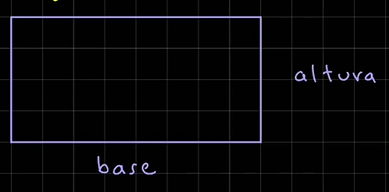

```python
area = base * altura
perimetro = 2 * (base + altura)
```

**📄 Código :**

```python
print("*** Cálculo Área y Perímetro de un Rectángulo ***")

base = float(input("Ingresa la base (cm) del rectángulo: "))
altura = float(input("Ingresa la altura (cm) del rectángulo: "))

area = base * altura
perimetro = 2 * (base + altura)

print(f"El área del rectángulo es: {area}")
print(f"El perímetro del rectángulo es: {perimetro}")
```

**🟢 Ejecutar:**

```console
*** Cálculo Área y Perímetro de un Rectángulo ***
Ingresa la base (cm) del rectángulo: 5
Ingresa la altura (cm) del rectángulo: 2
El área del rectángulo es: 10.0
El perímetro del rectángulo es: 14.0
```

### Precedencia de Operadores

La precedencia de operadores determina el orden en que se evalúan las operaciones en una expresión.

Python aplica la siguiente tabla para asegurar que algunos operadores tengan mayor prioridad que otros durante la
evaluación de expresiones.

1. Operador de paréntesis `()`
2. Exponente `**`
3. Unarios `+x`, `-x`
4. Multiplicación, División y Módulo `*`, `/`, `//`, `%`
5. Suma y resta `+`, `-`
6. Comparación `==`, `!=`, `>`, `>=`, `<`, `<=`
7. Operadores Lógicos `not`, `and` y `or`
8. Operadoras Asignaciones `=`, `+=`, `-=`, `/=`, `%=`, `//==`, `**=`

```python
resultado = 5 + 3 * 2 ** 2  # 17
resultado = (5 + 3) * 2 ** 2  # 32
```

**📄 Código :**

```python
print("*** Precedencia de Operadores ***")
# Ejemplo de precedencia de operadores
# 1. División 12 / 3 = 4
# 2. Multiplicación 2 * 3 = 6
# 3. Suma 4 + 6 = 10
# 4. Resta 10 - 1 = 9
resultado = 12 // 3 + 2 * 3 - 1
print(f"Resultado: {resultado}")

```

**🟢 Ejecutar:**

```console
*** Precedencia de Operadores ***
Resultado: 9
```

## Sentencias de decisión

Las sentencias de decisión nos permiten controlar el flujo de ejecución de un programa.

Las estructuras que podemos usar son: `if`, `else`, y `elif`

- La sentencia `if` permite ejecutar un bloque de código si la condición a evaluar es verdadera. Una condición es una
  expresión que evaluar a  `True` o `False`, Ej.: `edad >= 18`

```python
# Sintaxis sentencias if
if condicion:
# Bloque de código que se
# Ejecuta si la condición es True
```

```python
# Ejemplo Sentencia fi
edad = 30
if edad >= 18:
    print("Eres mayor de edad.")
```

### Diagrama de Flujo

Un programa de flujo es una representación gráfica de los pasos a ejecutar para lograr un resultado específico.

Se utilizan símbolos estandarizados para representar distintos tipos de acciones:

- Un óvalo representa el inicio o fin de un proceso:
  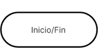
- Un rectángulo muestra instrucciones o acciones a ejecutar
  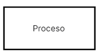
- Un rombo o diamante indica decisiones, con múltiples flujos dependiendo si la respuesta es verdadera o falsa
  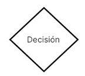
- Las fechas dirigen el flujo del proceso, mostrando la dirección en que se mueven la secuencia de acciones.
  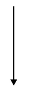

### Diagrama de Flujo Sentencia `if`

Dado el código siguiente, vamos a crear su diagram de flujo equivalente:

```python
# Ejemplo Sentencia if
edad = 30
if edad >= 18:
    print("Eres mayor de edad.")
```

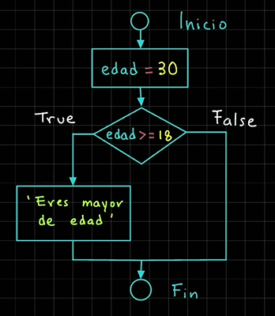

**📄 Código :**

```python
print("*** Sentencia IF ***")

edad = 30
if edad >= 18:
    print(f"Eres mayor de edad. Tienes {edad} años")
#     print()
#     print()
# print()
# print()
```

**🟢 Ejecutar:**

```console
*** Sentencia IF ***
Eres mayor de edad. Tienes 30 años
```

### Sentencia if else

- La sentencia `else` se usa para ejecutar un bloque de código cuando la condición del `if` es falsa.

```python
# Sintaxis sentecia if else
if condicion:
# Bloque de código que se ejecuta
# si la condición es verdadera
else:
# Bloque de código que se ejecuta
# Si la condición es falsa
```

```python
# Ejemplo Sentencia if else
edad = 10
if edad >= 18:
    print("Eres mayor de edad.")
else:
    print("Eres menor de edad.")
```

#### Diagrama de Flujo sentencia `if else`

Dado el siguiente código, vamos a crear el diagrama de flujo equivalente:

```python
# Ejemplo Sentencia if else
edad = 10
if edad >= 18:
    print("Eres mayor de edad.")
else:
    print("Eres menor de edad.")
```

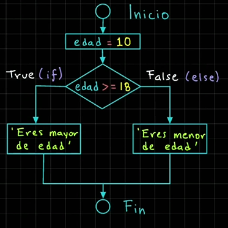

**📄 Código :**

```python
print("*** Sentencia IF ***")

edad = 10
if edad >= 18:
    print(f"Eres mayor de edad. Tienes {edad} años")
else:
    print(f"Eres menor de edad. Tienes {edad} años")
```

**🟢 Ejecutar:**

```console
*** Sentencia IF ***
Eres menor de edad. Tienes 10 años
```

### Sentencia `if` `elif` `else`

La sentencia `elif` es una abreviatura de `else if`, y se utiliza cuando necesitamos verificar múltiples condiciones,
una tras otra.

Se pueden agregar tantas nuevas condiciones de tipo `elif` como necesitemos, pero deben después de un `if` y antes de un
`else`.

```python
# Sintaxis sentencia if else
if condicion1:
# Bloque de código condicion1 True
elif condicion2:
# Bloque de código condicion2 True
else:
# Bloque de código condiciones False
```

```python
# Ejemplo sintaxis if elif else
edad = 16
if edad >= 18:
    print("Eres mayor de edad.")
elif 13 <= edad < 18:
    print("Eres un adolescente.")
else:
    print("Eres un niño.")
```

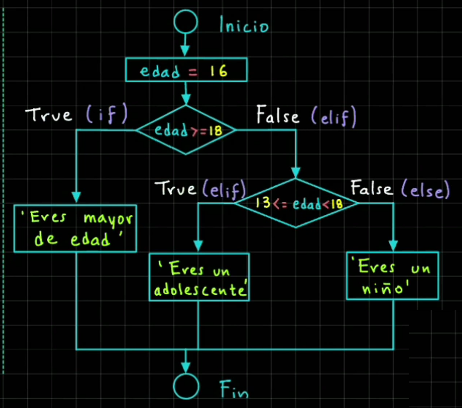

**📄 Código :**

```python
print("*** Sentencia IF ***")

edad = 9
if edad >= 18:
    print(f"Eres mayor de edad. Tienes {edad} años")
elif 13 <= edad < 18:
    print(f"Eres un adolescente. Tienes {edad} años")
else:
    print(f"Eres un niño. Tienes {edad} años")
```

**🟢 Ejecutar:**

```console
*** Sentencia IF ***
Eres un niño. Tienes 9 años
```

### Ejemplo Valor Positivo

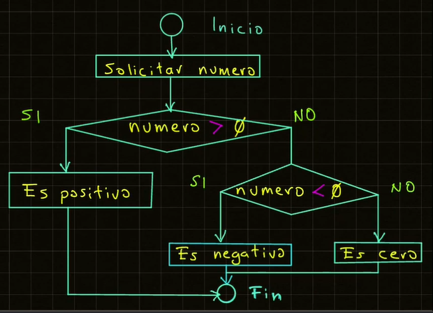

**📄 Código :**

```python
print("*** Ejemplo Valor Positivo ***")

numero = int(input("Proporciona un número positivo: "))

if numero > 0:
    print(f"Número es positivo: {numero}")
elif numero < 0:
    print(f"Número es negativo: {numero}")
else:
    print(f"Número es cero: {numero}")
```

**🟢 Ejecutar:**

```console
*** Ejemplo Valor Positivo ***
Proporciona un número positivo: -3
Número es negativo: -3
```

### Tienda en línea

Crear un sistema que ofrezca descuentos dependiendo del monto de la compra, o si es miembro de la tienda.

Se deben revisar las siguientes condiciones:

1. Si ha comprado más de $1,000 y es miembro -> descuento de 10%
2. Si sólo es miembro de la tienda -> Descuento del 5%
3. Si no es miembro mi compro más de $1,000 -> Descuento del 0%

**📄 Código :**

```python
print("*** Sistema Tienda en Línea con Descuentos ***")

# condiciones
MONTO_COMPRA_DESC = 1000

monto_compra = float(input("¿Cuál fue el monto de tu compra?: "))
es_miembro = input("¿Eres miembro de la tienda (Si/No)?: ")

descuento = 0
# verificar cada case, con los datos proporcionados
if monto_compra >= MONTO_COMPRA_DESC and es_miembro.strip().lower() == "si":
    descuento = 0.1  # Descuento del 10%
elif es_miembro.strip().lower() == "si":
    descuento = 0.05  # Descuento del 5%
elif monto_compra >= MONTO_COMPRA_DESC:
    descuento = 0.03  # Descuento del 3%
else:
    descuento = 0

# Hacemos los cálculos respectivos para obtener el monto final
if descuento != 0:
    monto_descuento = monto_compra * descuento
    monto_final = monto_compra - monto_descuento
    print(
        f"""
Felicidades, has obtenido un descuento del {descuento * 100:.0f}%
Monto de la compra: ${monto_compra:.2f}
Monto del descuento: ${monto_descuento:.2f}
Monto final de la compra con descuento: ${monto_final:.2f}
          """
    )
else:
    print(
        f"""
No obtuviste ningún tipo de descuento
Te invitamos a hacerte miembro de la tienda
Monto final de la compra: ${monto_compra:.2f}
          """
    )

```

**🟢 Ejecutar:**

```console
*** Sistema Tienda en Línea con Descuentos ***
¿Cuál fue el monto de tu compra?: 1500 
¿Eres miembro de la tienda (Si/No)?: si

Felicidades, has obtenido un descuento del 10%
Monto de la compra: $1500.00
Monto del descuento: $150.00
Monto final de la compra con descuento: $1350.00
```

### Sistema de Bancario

Considerando que estamos dentro de un sistema bancario, se solicita preguntar al usuario si desea continuar dentro del
sistema.

Utilizando el operador `not` para aplicar una lógica inversa se debe programar las siguientes condiciones:

- Si NO deseamos salir del sistema, imprimir: continuamos dentro del sistema.
- De lo contrario, imprimimos: Saliendo del sistema.

**📄 Código :**

```python
print("*** Bienvenidos al sistema bancario ***")

salir_sistema_txt = input("¿Deseas salir del sistema (Si/No)? ")
salir_sistema = salir_sistema_txt.strip().lower() == "si"

if not salir_sistema:
    print("Continuamos dentro del sistema")
else:
    print("Salimos del sistema")
```

**🟢 Ejecutar:**

```console
*** Bienvenidos al sistema bancario ***
¿Deseas salir del sistema (Si/No)? si
Salimos del sistema
```

### Casa de los Espejos


Supón que estás en un parque de diversiones y quieres entrar a la casa de los espejos.

Sin embargo, debes cumplir con algunas condiciones.

1. Debes tener más de años
2. No debe darte miedo la oscuridad

Si se cumplen las condiciones anteriores puedes entrar.

Para realizar estes ejemplos vamos a utilizar el operador `not` para aplicar una lógica inversa.

**📄 Código :**

```python
print("*** Bienvenido a la casa de los espejos ***")

edad = int(input("¿Cuál es tu edad?: "))
tienes_miedo_oscuridad = input("¿Tienes miedo a la oscuridad (Si/No)?: ")
tienes_miedo_oscuridad = tienes_miedo_oscuridad.strip().lower() == "si"

if not tienes_miedo_oscuridad and edad >= 10:
    print("Puedes entrar a la casa de los espejos")
else:
    print("Lo siento, la casa de los espejos podría darte miedo")
```

**🟢 Ejecutar:**

```console
*** Bienvenido a la casa de los espejos ***
¿Cuál es tu edad?: 13
¿Tienes miedo a la oscuridad (Si/No)?: no
Puedes entrar a la casa de los espejos
```

### Operador Ternario

El operador ternario en Python es una forma compacta del agregar una condición, y el objetivo es asignar un valor a una
variable dependiendo del valor de la condición.

```python
# Sintaxis Operador Ternario
resultado = valor_si_verdadero if condicion else valor_si_falso
```

```python
# Ejemplo Operador Ternario
edad = 18
es_adulto = "Sí" if edad >= 18 else "No"
print(es_adulto)
```

**📄 Código :**

```python
print("*** Operador Ternario ***")

edad = int(input("¿Cuál es tu edad?: "))

es_adulto = "Si" if edad >= 18 else "No"

print(f"¿Es un adulto?: {es_adulto}")
```

**🟢 Ejecutar:**

```console
*** Operador Ternario ***
¿Cuál es tu edad?: 12
¿Es un adulto?: No
```

### Aplicación de Salud y Fitness

Si solicita crear una aplicación de salud y fitness que solicite lo siguiente:

- Nombre del usuario
- Paso Caminados en el día

Además, definiremos las siguientes constantes:

```python
META_PASOS_DIARIO = 10000
CALORIAS_POR_PASO = 0.04  # Valor aproximado en kilocalorias
```

Con los valores anteriores debemos calcular las calorías quemadas según los pasos caminados

```python
calorias_quemadas = pasos_diarios * CALORIAS_POR_PASO
```

Y verificaremos si se cumplió la meta de pasos diarios

```python
meta_alcanzada = pasos_diarios >= META_PASOS_DIARIOS
```

**📄 Código :**

```python
print("*** Aplicación de Salud y Fitness ***")

# Constantes
META_PASOS_DIARIO = 1000
CALORIAS_POR_PASO = 0.04  # Valor aproximado, son kilocalorias

# Pedimos los valores al usuario
nombre_usuario = input("¿Cuál es tu nombre?: ")
pasos_diarios = int(input("¿Cuántos pasos has caminado hoy?: "))

# Verificar si el usuario alcanzó la meta de pasos diarios
meta_alcanzada = pasos_diarios >= META_PASOS_DIARIO
meta_alcanzada_txt = "Si" if meta_alcanzada else "No"
# Calculamos las calorías quemadas
calorias_quemada = pasos_diarios * CALORIAS_POR_PASO

# Mostramos la información
print(
    f"""
Usuario: {nombre_usuario}
Pasos dados hoy: {pasos_diarios}
Calorías quemadas: {calorias_quemada} kcal
Meta de pasos diarios alcanzada: {meta_alcanzada_txt}
La meta de pasos diarios es de: {META_PASOS_DIARIO} pasos
"""
)
```

**🟢 Ejecutar:**

```console
*** Aplicación de Salud y Fitness ***
¿Cuál es tu nombre?: Sergio
¿Cuántos pasos has caminado hoy?: 15000

Usuario: Sergio
Pasos dados hoy: 15000
Calorías quemadas: 600.0 kcal
Meta de pasos diarios alcanzada: Si
La meta de pasos diarios es de: 1000 pasos
```

### Sistema Reserva Hotel

Se solicita crear un sistema de Reservación de un Hotel se debe pedir la siguiente información al usuario:

- Nombre del Usuario
- Días de estadía en el hotel
- ¿Cuarto con vista al mar?

El hotel tiene las siguientes tarifas:

- Cuarto sin vista al mar: $150.50 por día
- Cuarto con vista al mar: $190.50 por día

El sistema debe calcular el costo total de la estadía dependiendo si escogió un cuarto con vista al mar o no. Además de
indicar si escogió un cuarto con vista al mar o no.

**📄 Código :**

```python
print("*** Sistema Reserva Hotel ***")

# Variables del hotel
TARIFA_DIARIA_SIN_VISTA_MAR = 150.50
TARIFA_DIARIA_CON_VISTA_MAR = 190.50

# Pedimos la información al usuario
nombre_cliente = input("Ingresa el nombre de cliente: ")
dias_estadia = int(input("Ingresa el número de los días de estadía: "))
vista_al_mar_txt = input("Ingresa con vista al mar (Si/No): ")
vista_al_mar = vista_al_mar_txt.strip().lower == "si"

# Cálculo del costo total de la estancia
costo_total = (
    dias_estadia * TARIFA_DIARIA_CON_VISTA_MAR
    if vista_al_mar
    else dias_estadia * TARIFA_DIARIA_SIN_VISTA_MAR
)

# Mostramos los detalles de la reserva
print(
    f"""
{'-' * 10} Detalles de la Reservación {'-' * 10}
Cliente: {nombre_cliente}
Días de estandía: {dias_estadia}
Costo total: ${costo_total:.2f}
Habitación con vista al mar: {'Sí' if vista_al_mar else 'No'}
"""
)
```

**🟢 Ejecutar:**

```console
*** Sistema Reserva Hotel ***
¿Cuál es tu nombre del cliente?: Susana
¿Cuántos son tus días de estadía?: 3
¿Deseas al cuarto con vista al mar (Si/No)?: no

---------- Detalle de la Reservación ----------
Cliente: Susana
Días de estadía: 3
Costo total: $451.50
Habitación con Vista al mar: No
```

### El mayor de 2 números

Crear un programa para indicar cuál es el mayor de dos números
El programa debe pedir al usuario dos números enteros.
Posteriormente, se deben comparar y mandar a imprimir el número mayor.

**📄 Código :**

```python
print("*** El mayor  de dos números ***")

numero1 = int(input("Ingresa un primer número entero: "))
numero2 = int(input("Ingresa un segundo número entero: "))

numero_mayor = (
    "El primer numero es mayor." if numero1 > numero2 else "El segundo numero es mayor."
)

print(
    f"El primer es: {numero1}\nEl segundo es: {numero2}\n Resultado: *** {numero_mayor} ***"
)
```

**🟢 Ejecutar:**

```console
*** El mayor  de dos números ***
Ingresa un primer número entero: 4
Ingresa un segundo número entero: -1
El primer es: 4
El segundo es: -1
 Resultado: *** El primer numero es mayor. ***
```

### Identifica la estación del año

Se solicita proporcionar el valor de un mes (valor numérico entre 1 y 12), e indicar la estación del año según lo
siguiente:

meses 1, 2 o 12 -> Invierno
meses 3, 4 o 5 -> Primavera
meses 6, 7 o 8 -> Verano
meses 9, 10 o 11 -> Otoño
Cualquier otro valor -> Estación desconocida.

**📄 Código :**

```python
print("*** La estación del Año ***")

numero_mes = int(input("Introduce el número de mes entre 1 y 12: "))
mensaje = ""

match numero_mes:
    case 1 | 2 | 12:
        mensaje = "Es Invierno"
    case 3 | 4 | 5:
        mensaje = "Es Primavera"
    case 6 | 7 | 8:
        mensaje = "Es Verano"
    case 9 | 10 | 11:
        mensaje = "Es Otoño"
    case _:
        mensaje = "Introdujiste es un inválido"

print(
    f"""{'-' * 10} Estación del Año {'-' * 10}
Esta la estación: {mensaje}
"""
)
```

**🟢 Ejecutar:**

```console
*** La estación del Año ***
Introduce el número de mes entre 1 y 12: 9
---------- Estación del Año ----------
Esta la estación: Es Otoño
```

### Sistema de Calificaciones

Crear un programa para convertir una calificación numérica (entre 0 y 10) a una letra (de la F a la A)

- Si es mayor o igual a 9 y menor o igual a 10 es una A
- Si es mayor o igual a 8 y menor a 9 es una B
- Si es mayor o igual a 7 y menor a 8 es una C
- Si es mayor o igual a 6 y menor a 7 es una D
- Si es mayor o igual a 0 y menor a 6 es una F

En otro caso, imprimir:

"Valor desconocido"

**📄 Código :**

```python
print("*** Sistema de Calificaciones")

calificacion = float(input("Introduzca el número de calificado entre 0 y 10: "))
calificacion_letra = None

# Revisamos si está en los siguientes rangos
if 9 <= calificacion <= 10:
    calificacion_letra = "A"
elif 8 <= calificacion < 9:
    calificacion_letra = "B"
elif 7 <= calificacion < 8:
    calificacion_letra = "C"
elif 6 <= calificacion < 7:
    calificacion_letra = "D"
elif 0 <= calificacion < 6:
    calificacion_letra = "F"
else:
    calificacion_letra = "Valor Desconocido"

# Imprimir el resultado
print(f"Calificación {calificacion} es equivalente a {calificacion_letra}")
```

**🟢 Ejecutar:**

```console
*** Sistema de Calificaciones
Introduzca el número de calificado entre 0 y 10: 9
Calificación 9.0 es equivalente a A
```

### Sistema de Envíos

Crea un programa para determinar el costo de envío de un paquete según el destino (nacional o internacional) y el peso
del paquete

costo tarifas:

- Nacional = $10 x kilo
- Internacional = $20 x kilo

El programa debe solicitar 2 valores:

1. Destino (nacional o internacional)
2. Peso (kilogramos) del paquete

Al final debe imprimir el costo envío del paquete

**📄 Código :**

```python
print("*** Sistema de Envíos ***")

# Definimos las tarifas de envío por kilogramo
TARIFA_NACIONAL = 10
TARIFA_INTERNACIONAL = 20

# Solicitamos los valores de destino y peso al usuario
destino = input("Ingresa el destino ddel paquete (nacional/internacional): ")
peso = float(input("Ingresa el peso del paquete (en kg): "))

# Calculo del envío del paquete
costo_envio = None
destino = destino.strip().lower()

if destino == "nacional":
    costo_envio = peso * TARIFA_NACIONAL
elif destino == "internacional":
    costo_envio = peso * TARIFA_INTERNACIONAL
else:
    print("Destino no válido. Ingresa el valor de nacional o internacional")

# Mostramos el costo de envío sólo si es un valor válido
if costo_envio is not None:
    print(f"El costo de envío del paquete es: ${costo_envio:.2f}")
```

**🟢 Ejecutar:**

```console
*** Sistema de Envíos ***
Ingresa el destino ddel paquete (nacional/internacional): nacional
Ingresa el peso del paquete (en kg): 3
El costo de envío del paquete es: $30.00
```

### Sistema de Autenticación en decisión

Crear un sistema para validar los valores de usuario y password proporcionados.
Se deben definir dos constantes con los valores válidos de usuario y password
Y el sistema debe comparar los valores válidos contra los valores proporcionados
Se deben considerar 4 casos:

1. Usuario y password válidos. Debe imprimir 'Bienvenido al Sistema'
2. Usuario inválido
3. Password inválido
4. Usuario y Password inválidos

**📄 Código :**

```python
print("*** Sistema de Autenticación ***")

USUARIO_VALIDO = "admin"
PASSWORD_VALIDO = "123"

usuario = str(input("Ingresa tu usuario: "))
password = str(input("Ingresa tu password: "))

if usuario == USUARIO_VALIDO and password == PASSWORD_VALIDO:
    print("Bienvenido al sistema")
elif usuario == USUARIO_VALIDO:
    print("password es inválido, favor de corregirlo!")
elif password == PASSWORD_VALIDO:
    print("Usuario es inválido, favor de corregirlo!")
else:
    print("usuario y password son inválidos, favor de corregirlo!")
```

**🟢 Ejecutar:**

```console
*** Sistema de Autenticación ***
Ingresa tu usuario: admin
Ingresa tu password: 234
password es inválido, favor de corregirlo!
```

## Ciclos en Python

### Ciclo while

Los ciclos en Python son estructuras de control que repitan una serie de instrucciones hasta que se cumple una condición
específica.

En Python tenemos dos tipos de estructuras para ejecutar ciclos: Ciclo `while` y ciclo `for`. Comencemos con el ciclo
`while`.

El ciclo `while` repite una serie de instrucciones mientras la condición a evaluar sea verdadera.

```python
# Sintaxis ciclo while:
while condicion:
# Bloque de código a ejecutar
```

```python
# Ejemplo ciclo while:
# Imprimir de 1 a 3
contador = 1
while contador <= 3:
    print(contador)
    contador += 1
```

#### Diagrama de Flujo Ciclo `while`

Dado el siguiente código, veamos el diagrama de flujo asociado:


Valor contador = ~~1~~ 2

Resultado Condición:

`1 <= 3 -> True`

Salida a Consola

```console
1
2
3
```

**📄 Código :**

```python
print("*** Ciclo while ***")

# Imprimir los valores del 1 al 5
contador = 1
while contador <= 5:
    print(contador, end=" ")
    contador += 1  # contador = contador + 1
```

**🟢 Ejecutar:**

```console
*** Ciclo while ***
1 2 3 4 5
```

### Ciclo for

El ciclo `for` itera o recorre una secuencia de valores, por ejemplo los caracteres de una cadena, una lista, etc. y
ejecuta bloque de código por cada elemento de la secuencia.

```python
# Sintaxis ciclo for
for variable in secuencia:
# Bloque de código a ejecutar
```

```python
# Ejemplo ciclo for
cadena = 'Hola Mundo'
for letra in cadena:
    print(letra, end=' ')
```

Salida a consola:

```console
H o l a  M u n d o
```

**📄 Código :**

```python
print("*** Ciclo for ***")

print("Recorremos los caracteres de una cadena")
cadena = "Hola Mundo"
# Iteramos los caracteres
for letra in cadena:
    print(letra, end=" ")

print("\n\nRecorremos la lista de frutas:")
frutas = ["Plátano", "Fresa", "Mango", "Uva", "Manzana", "Pera", "Naranja"]
for fruta in frutas:
    print(fruta, end=" ")
```

**🟢 Ejecutar:**

```console
*** Ciclo for ***
Recorremos los caracteres de una cadena
H o l a   M u n d o

Recorremos la lista de frutas:
Plátano Fresa Mango Uva Manzana Pera Naranja
```

### Ejercicio Acumulador Suma en Ciclo

Realizar la suma de los primeros 5 números utilizando un ciclo while


**📄 Código :**

```python
print('*** Suma Acumulativa "while" ***')

# Sumar los primeros 5 números
MAXIMO = 5
numero = 1
acumulador_suma = 0

# Empezamos a iterar
while numero <= MAXIMO:
    # Imprimir lo que se va a sumar
    print(f"(acumulador_suma + numer) -> {acumulador_suma} + {numero}")
    acumulador_suma += numero
    numero += 1

    # Imprimir el resultado de la suma parcial
    print(f"Suma parcial acumulada: {acumulador_suma}")

print(f"\nResultado suma acumulado: {acumulador_suma}")
```

**🟢 Ejecutar:**

```console
*** Suma Acumulativa "while" ***
(acumulador_suma + numer) -> 0 + 1
Suma parcial acumulada: 1
(acumulador_suma + numer) -> 1 + 2
Suma parcial acumulada: 3
(acumulador_suma + numer) -> 3 + 3
Suma parcial acumulada: 6
(acumulador_suma + numer) -> 6 + 4
Suma parcial acumulada: 10
(acumulador_suma + numer) -> 10 + 5
Suma parcial acumulada: 15

Resultado suma acumulado: 15
```

### Menú Iterativo

**📄 Código :**

```python
print("*** Sistema de Administración de Cuenta ***")

salir = False
while not salir:
    print(
        f"""Menú:
          1. Crear cuenta
          2. Eliminar cuenta
          3. Salir"""
    )
    opcion = int(input("Escoge una opción: "))
    match opcion:
        case 1:
            print("Creando tu cuenta... \n")
        case 2:
            print("Eliminado tu cuenta... \n")
        case 3:
            print("Salimos del sistema. Hasta pronto!\n")
            salir = True
        case _:
            print("Opción inválida, proporciona otra opción...\n")
else:
    print("Terminando el sistema de Administración de Cuentas")
```

**🟢 Ejecutar:**

```console
*** Sistema de Administración de Cuenta ***
Menú:
          1. Crear cuenta
          2. Eliminar cuenta
          3. Salir
Escoge una opción: 1
Creando tu cuenta... 

Menú:
          1. Crear cuenta
          2. Eliminar cuenta
          3. Salir
Escoge una opción: 5
Opción inválida, proporciona otra opción...

Menú:
          1. Crear cuenta
          2. Eliminar cuenta
          3. Salir
Escoge una opción: 3
Salimos del sistema. Hasta pronto!

Terminando el sistema de Administración de Cuentas
```

### Reto - Cajero Automático

**Aplicación Cajero Automático:**

Se les deja crear la aplicación de cajero automático.
Las funciones principales de un cajero automático son: depositar, retirar y consultar el saldo.

El saldo puede tener un valor inicial por ejemplo $1,000.00

Si haces un retiro se resta de tu saldo. Y si haces un depósito se suma a tu saldo.

**📄 Código :**

```python
print("*** Aplicación de Cajero Automático ***")

salir = False
saldo = 1000.00

while not salir:
    print(
        """Operaciones que puedes realizar:
          1. Consultar Saldo
          2. Retirar
          3. Depositar
          4. Salir."""
    )
    opcion = int(input("Escoge un número de opción: "))

    match opcion:
        case 1:
            print(f"\nTu saldo actual es: {saldo:.2f}\n")
        case 2:
            monto_retirar = float(input("Ingresa el monto a retirar: "))
            if monto_retirar <= saldo:
                saldo -= monto_retirar
                print(f"\nTu nuevo saldo es: ${saldo:.2f}\n")
            else:
                print(
                    f"\nNo cuentas con el saldo suficiente. Tu saldo actual: ${saldo:.2f}\n"
                )
        case 3:
            monto_depositar = float(input("Ingresa el monto a depositar: "))
            saldo += monto_depositar
            print(f"\nTu nuevo saldo es: ${saldo:.2f}\n")
        case 4:
            salir = True
        case _:
            print(
                "\nLa opción es inválida. Ingresa de nuevo debe ser un número entero de opción...\n"
            )
else:
    print("\nSaliendo del cajero automático. ¡Hasta Pronto!")
```

**🟢 Ejecutar:**

```console
*** Aplicación de Cajero Automático ***
Operaciones que puedes realizar:
          1. Consultar Saldo
          2. Retirar
          3. Depositar
          4. Salir.
Escoge un número de opción: 2
Ingresa el monto a retirar: 3000

No cuentas con el saldo suficiente. Saldo actual: $1000.00

Operaciones que puedes realizar:
          1. Consultar Saldo
          2. Retirar
          3. Depositar
          4. Salir.
Escoge un número de opción: 3
Ingresa el monto a depositar: 5000

Tu nuevo saldo es: $6000.00

Operaciones que puedes realizar:
          1. Consultar Saldo
          2. Retirar
          3. Depositar
          4. Salir.
Escoge un número de opción: 4

Saliendo del cajero automático. ¡Hasta Pronto!
```

### Aplicación Calculadora

Crear una aplicación de calculadora con las opciones de:

1. Suma
2. Resta
3. Multiplicación
4. División

El programa debe mostrar un menú con cada opción, y debe solicitar los valores de operando 1 y operando 2 para realizar
la operación seleccionada.

**📄 Código :**

```python
print("*** Calculadora en Python ***")

salir = False
operadores = ["Suma", "Resta", "Multiplicación", "División"]
num1 = num2 = resultado = 0

while not salir:
    print(
        f"""Operaciones que puedes realizar:
        1. {operadores[0]}
        2. {operadores[1]}
        3. {operadores[2]}
        4. {operadores[3]}
        5. Salir"""
    )
    opcion = int(input("Escoge una opción con número: "))

    match opcion:
        case 1:
            print("-" * 5, f"{operadores[0]}", "-" * 5)
            num1 = float(input("Ingresa el primer número: "))
            num2 = float(input("Ingresa el segundo número: "))
            resultado = num1 + num2
            print(f"\nEl resultado de la {operadores[0]} es: {resultado}\n")
        case 2:
            print("-" * 5, f"{operadores[1]}", "-" * 5)
            num1 = float(input("Ingresa el primer número: "))
            num2 = float(input("Ingresa el segundo número: "))
            resultado = num1 - num2
            print(f"\nEl resultado de la {operadores[1]} es: {resultado}\n")
        case 3:
            print("-" * 5, f"{operadores[2]}", "-" * 5)
            num1 = float(input("Ingresa el primer número: "))
            num2 = float(input("Ingresa el segundo número: "))
            resultado = num1 * num2
            print(f"\nEl resultado de la {operadores[2]} es: {resultado}\n")
        case 4:
            print("-" * 5, f"{operadores[3]}", "-" * 5)
            num1 = float(input("Ingresa el primer número: "))
            num2 = float(input("Ingresa el segundo número: "))
            if num1 == 0 or num2 == 0:
                print("Error. Debes ingresar números sin cero.\n")
            else:
                resultado = num1 / num2
                print(f"\nEl resultado de la {operadores[3]} es: {resultado}\n")
        case 5:
            print("Saliendo del aplicación calculadora. ¡Hasta pronto!")
            salir = True
        case _:
            print("Opción inválida. Debe ingresar correctamente a la opción...")
```

**🟢 Ejecutar:**

```console
*** Calculadora en Python ***
Operaciones que puedes realizar:
        1. Suma
        2. Resta
        3. Multiplicación
        4. División
        5. Salir
Escoge una opción con número: 2
----- Resta -----
Ingresa el primer número: -5
Ingresa el segundo número: 6

El resultado de la Resta es: -11.0

Operaciones que puedes realizar:
        1. Suma
        2. Resta
        3. Multiplicación
        4. División
        5. Salir
Escoge una opción con número: 3
----- Multiplicación -----
Ingresa el primer número: 4
Ingresa el segundo número: 6

El resultado de la Multiplicación es: 24.0

Operaciones que puedes realizar:
        1. Suma
        2. Resta
        3. Multiplicación
        4. División
        5. Salir
Escoge una opción con número: 3
----- Multiplicación -----
Ingresa el primer número: 3.2
Ingresa el segundo número: 2.5

El resultado de la Multiplicación es: 8.0

Operaciones que puedes realizar:
        1. Suma
        2. Resta
        3. Multiplicación
        4. División
        5. Salir
Escoge una opción con número: 4
----- División -----
Ingresa el primer número: 6
Ingresa el segundo número: 3

El resultado de la División es: 2.0

Operaciones que puedes realizar:
        1. Suma
        2. Resta
        3. Multiplicación
        4. División
        5. Salir
Escoge una opción con número: 4
----- División -----
Ingresa el primer número: 7
Ingresa el segundo número: 3

El resultado de la División es: 2.3333333333333335

Operaciones que puedes realizar:
        1. Suma
        2. Resta
        3. Multiplicación
        4. División
        5. Salir
Escoge una opción con número: 5
Saliendo del aplicación calculadora. ¡Hasta pronto!
```

### Creación y validación de Password

Crear un programa para solicitar la validación al momento de crear un valor de un password o contraseña

La contraseña debe tener al menos 6 caracteres

En caso de no cumplir con esta condición el programa debe volver a solicitar un nuevo valor hasta que cumpla con la
condición.

Si el valor proporcionado es válido, se debe imprimir: 'Password válido' y debe terminar la ejecución del sistema.

**📄 Código :**

```python
print("*** Creación y Validación de Password")

password = input("Ingresa un password (debe tener al menos 6 caracteres): ")

# Validar el password
while len(password) < 6:
    print("El password no cumple con los requisitos. Debe tener al menos 6 caracteres.")
    password = input("Ingresa un nuevo valor de password: ")
else:
    print("El valor de password es válido")
```

**🟢 Ejecutar:**

```console
*** Creación y Validación de Password
Ingresa un password (debe tener al menos 6 caracteres): 4335   
El password no cumple con los requisitos. Debe tener al menos 6 caracteres.
Ingresa un nuevo valor de password: zoy2454
El valor de password es válido
```

### Juego de Adivinanzas

Crea un juego donde el jugador debe adivinar un número secreto.

Puedes usar un ciclo `while` hasta que el jugador adivine correctamente.

El número secreto se puede crear usando la función `randint` para generar un valor aleatorio entre 1 y 50

Por cada intento fallido se debe incrementar una variable que lleve el conteo de intentos.

El programa debe orientar al jugador indicándole si el valor que proporcionó fue mayor o menor que el número secreto

Finalmente, si adivina el número secreto debe felicitar al usuario e indicar cuántos intentos realizó

Opcionalmente, se puede limitar el juego a un número de intentos máximo (Ej.: 10) de lo contrario termina el juego.

**📄 Código :**

```python
from random import randint

print("*** Juego de Adivinanzas ***")

numero_secreto = int(randint(1, 50))
intentos = 0
adivinanza = None
INTENTOS_MAXIMOS = 5

while adivinanza != numero_secreto and intentos < INTENTOS_MAXIMOS:
    adivinanza = int(input("Adivina el número secreto (1-50): "))
    # Agregamos un ayuda para orientar al jugador
    if adivinanza < numero_secreto:
        print("El número secreto es mayor")
    elif adivinanza > numero_secreto:
        print("El número secreto es menor")
    # Incrementamos la variable de intentos
    intentos += 1
# Conclusion del juego
if adivinanza == numero_secreto:
    print(f"Felicidades, adivinaste el número secreto en {intentos} intentos")
else:
    print(f"Lo siento, has agotado tus intentos máximos: {INTENTOS_MAXIMOS}")
    print(f"El número secreto era: {numero_secreto}")
```

**🟢 Ejecutar:**

```console
*** Juego de Adivinanzas ***
Adivina el número secreto (1-50): 20
El número secreto es menor
Adivina el número secreto (1-50): 10
El número secreto es mayor
Adivina el número secreto (1-50): 15
Felicidades, adivinaste el número secreto en 3 intentos
```

### Validación de Información de un Formulario

**📄 Código :**

```python
print("*** Validación Campo de un Formulario ***")

nombre_usuario = None

while not nombre_usuario:
    nombre_usuario = str(input("Ingresa tu nombre de usuario: "))

print(f"Nombre de usuario válido: {nombre_usuario}")
```

**🟢 Ejecutar:**

```console
*** Validación Campo de un Formulario ***
Ingresa tu nombre de usuario:
Ingresa tu nombre de usuario: 
Ingresa tu nombre de usuario: zolyn
Nombre de usuario válido: zolyn
```

### Función range en Python

La función `range` es una función incorporada que genera una secuencia de números.

Es comúnmente utilizada para iterar sobre ciclos tipo `for`

```python
# Sintaxis función range
# inicio - valor inicial (opcional)
# fin - valor final, sin incluirlo
# incremento - diferencia entre cada número (opcional)
range(inicio, fin, incremento)
```

```python
# usar range para imprimir 0 al 4
for i int range(5):
    print(i)

# Usar range para imprimir del 0 al 9
# con incremento de 2
for i in range(0, 10, 2):
    print(i)  # imprime 0, 2, 4, 6, 8
```

**📄 Código :**

```python
print("*** Función Range ***")

print("Secuencia del 0 al 4")
# Inicio = 0 (opcional)
# fin = 5 - 1 = 4
# incremento = 1 (opcional)
for i in range(5):  # fin = 5 - 1
    print(i, end=" ")

print("\n\nSecuencia del 10 al 20:")
# incremento = 1 (default y es opcional)
for i in range(10, 20 + 1):
    print(i, end=" ")

print("\n\nSecuencia del 20 al 30 de 2 en 2:")
for i in range(20, 30 + 1, 2):
    print(i, end=" ")
```

**🟢 Ejecutar:**

```console
*** Función Range ***
Secuencia del 0 al 4
0 1 2 3 4

Secuencia del 10 al 20:
10 11 12 13 14 15 16 17 18 19 20

Secuencia del 20 al 30 de 2 en 2:
20 22 24 26 28 30
```

### Imprimir mensaje función range

**📄 Código :**

```python
print("*** Repetición de un Mensaje ***")

mensaje = input("Proporciona un mensaje a repetir: ")
numero_de_repeticion = int(input("Proporciona el número de repeticiones: "))

# Iterar sobre el rango de repeticiones
for _ in range(numero_de_repeticion):
    # print(f"{i+1} - {mensaje}")
    print(mensaje)
```

**🟢 Ejecutar:**

```console
*** Repetición de un Mensaje ***
Proporciona un mensaje a repetir: hola mundo
Proporciona el número de repeticiones: 3
hola mundo
hola mundo
hola mundo
```

### Dibujar un Triángulo

**📄 Código :**

```python
print("*** Dibujar Triángulo Simétrico ***")

numero_fila = int(input("Proporciona el número de filas: "))

# Iterar sobre cada fila del triángulo
for fila in range(1, numero_fila + 1):
    espacios_blanco = " " * (numero_fila - fila)
    asteriscos = "*" * (2 * fila - 1)
    print(f"{espacios_blanco}{asteriscos}")
```

**🟢 Ejecutar:**

```console
*** Dibujar Triángulo Simétrico ***
Proporciona el número de filas: 3
  *
 ***
*****
```

### Palabra `break` y `continue` en ciclos

**📄 Código :**

```python
print("*** Palabra break y continue en ciclos ***")

# Ejemplo con break
print("Palabra break:")
for numero in range(1, 10):
    if numero % 2 == 0:  # Numero par
        print(numero)
        break  # Salimos del ciclo inmediatamente

# Ejemplo con continue
print("Palabra continue:")
for numero in range(1, 10):
    if numero % 2 == 1:  # Numero impar
        continue
    print(numero)  # números pares
```

**🟢 Ejecutar:**

```console
*** Palabra break y continue en ciclos ***
Palabra break:
2
Palabra continue:
2
4
6
8
```

## Colecciones

Una colección es un conjunto de datos. En Python tenemos varios tipos que podemos utilizar con el objetivo de almacenar,
organizar y manipular múltiples conjuntos de datos, por ello también se les conoce como Estructures de Datos.

Los tipos que vamos a estudiar son:

- Listas
- Tuplas
- Set (conjunto)
- Diccionarios

Estos son los tipos más comunes y más utilizados. Comencemos con el tipo lista.

### Listas

Las listas son colecciones ordenadas y mutables de elementos que pueden ser de diferentes tipos. Las listas son
dinámicas, lo que significa que pueden cambiar de tamaño, podemos añadir, modificar o eliminar elementos.

```python
# Sintaxis Listas
mi_list = [elemento1, elemento2, elemento3, ...]
```

```python
# Ejemplos de listas
numeros = [1, 2, 3, 4, 5]
frutas = ["manzana", "banana", "cereza"]
mixta = [1, "dos", 3.0, [4, 5]]
```

**📄 Código :**

```python
print("*** Manejo de Listas ***")

mi_lista = [1, 2, 3, 4, 5]
print(f"{mi_lista} -> Lista original")

# Largo de una lista
print(f"Largo de la lista: {len(mi_lista)}")

# Acceder a los elementos de la lista por indice
print(f"Accedemos al valor del indice 4: {mi_lista[4]}")
print(f"Accedemos al último índice de la lista: {mi_lista[-1]}")

# Modificar los elementos de una lista
mi_lista[1] = 10
print(f"Modificamos el valor del indice 1: {mi_lista[1]}")

# Agregar un nuevo elemento al final de la lista
mi_lista.append(6)
print(f"{mi_lista} -> Se agregó el elemento 6")

# Añadir un nuevo elemento en un indice específico
mi_lista.insert(2, 15)
print(f"{mi_lista} -> Se añadió el valor de 15 en el índice 2")

# Eliminar elementos de una lista
# Usando el método remove
mi_lista.remove(5)
print(f"{mi_lista} -> Se removió el valor 5")
# Removemos por índice con el método pop
mi_lista.pop(1)  # Remueve el elemento del índice 1
print(f"{mi_lista} -> Se eliminó el índice 1 ")
# Eliminar usando la palabra del
del mi_lista[2]
print(f"{mi_lista} -> Se eliminó el índice 2")

# Obtener sublistas
sublista = mi_lista[1:3]  # Genera una sublista del índice 1 al 2 (3 no se incluye)
print(f"sublista [1:3]: {sublista}")
```

**🟢 Ejecutar:**

```console
*** Manejo de Listas ***
[1, 2, 3, 4, 5] -> Lista original
Largo de la lista: 5
Accedemos al valor del indice 4: 5
Accedemos al último índice de la lista: 5
Modificamos el valor del indice 1: 10
[1, 10, 3, 4, 5, 6] -> Se agregó el elemento 6
[1, 10, 15, 3, 4, 5, 6] -> Se añadió el valor de 15 en el índice 2
[1, 10, 15, 3, 4, 6] -> Se removió el valor 5
[1, 15, 3, 4, 6] -> Se eliminó el índice 1
[1, 15, 4, 6] -> Se eliminó el índice 2
sublista [1:3]: [15, 4]
```

### Iterar elementos de una lista

**📄 Código :**

```python
print("*** Iterar Listas ***")

nombres = ["Karla", "Juan", "Laura"]

for nombre in nombres:
    print(nombre)

lista_heterogenea = [100, True, "Ivonne"]
print()
for elemento in lista_heterogenea:
    print(elemento)
```

**🟢 Ejecutar:**

```console
*** Iterar Listas ***
Karla
Juan
Laura

100
True
Ivonne
```

### Lista de Reproducción

Crea un programa para administrar una lista de canciones.

Debes solicitar al usuario cuántas canciones desea agregar a la lista y posteriormente ir solicitando cada canción que
desea agregar a la lista.

Finalmente, debe desplegar la lista de canciones en orden alfabético.

**📄 Código :**

```python
print("*** PlayList de canciones ***")

# creamos la lista vacia
lista_reproduccion = []

numero_canciones = int(input("¿Cuentas  canciones deseas agregar?: "))

# iteramos cada elemento de la lista para agregar un nuevo elemento
for indice in range(numero_canciones):
    cancion = input(f"Proporciona la cancion {indice + 1}: ")
    lista_reproduccion.append(cancion)

# Empezamos a agregar canciones
"""
lista_reproduccion.append("Hotel California - Eaglles")
lista_reproduccion.append("Staying Alive - Bee Gees")
lista_reproduccion.append("Dream on - Aerosmith")
"""
# Ordenar la lista en orden alfabético (sort)
# lista_reproduccion.sort(reverse=True)
lista_reproduccion.sort()

# Mostrar la lista de canciones
print(f"\nLista de Reproducción en orden alfabético:\n{lista_reproduccion}")

# Mostrar la lista iteramos sus elementos
print(f"\nIteramos el Playlist")
for cancion in lista_reproduccion:
    print(f"- {cancion}")
```

**🟢 Ejecutar:**

```console
*** PlayList de canciones ***
¿Cuentas  canciones deseas agregar?: 3
Proporciona la cancion 1: Hotel California - Eaglles
Proporciona la cancion 2: Staying Alive - Bee Gees
Proporciona la cancion 3: Dream on - Aerosmith

Lista de Reproducción en orden alfabético:
['Dream on - Aerosmith', 'Hotel California - Eaglles', 'Staying Alive - Bee Gees']

Iteramos el Playlist
- Dream on - Aerosmith
- Hotel California - Eaglles
- Staying Alive - Bee Gees
```

### Promedio de calificaciones

Crea un programa para realizar el cálculo promedio de calificaciones.

El programa debe solicitar el número de calificaciones a utilizar para obtener el promedio.

Posteriormente, se debe solicitar cada calificación al usuario.

Posteriormente, realizar la suma de todas las calificaciones y finalmente mandar a imprimir el promedio.

**📄 Código :**

```python
print("*** Promedio de Calificaciones ***")

total_calificaciones = int(input("Proporciona el no. de calificaciones a evaluar: "))
calificaciones = []
promedio = 0

# Iterar las calificaciones
for indice in range(total_calificaciones):
    calificacion = int(input(f"Calificación[{indice + 1}] = "))
    calificaciones.append(calificacion)

# Imprimimos las calificaciones proporcionadas
print(
    f"""
Las calificaciones proporcionadas son: {calificaciones}
"""
)

# Calculamos el promedio de las calificaciones
# sum(iterable)
suma_calificaciones = sum(calificaciones)
promedio = suma_calificaciones / total_calificaciones

print(f"Promedio de las calificaciones: {promedio:.2f}")
```

**🟢 Ejecutar:**

```console
*** Promedio de Calificaciones ***
Proporciona el no. de calificaciones a evaluar: 4      
Calificación[1] = 3
Calificación[2] = 6
Calificación[3] = 8 
Calificación[4] = 9

Las calificaciones proporcionadas son: [3, 6, 8, 9]    

Promedio de las calificaciones: 6.50
```

### Tuplas

Las tuplas son similares a las listas, ya que también son una colección de datos ordenados, pero las tuplas son
inmutables, lo que significa que una vez creada una tupla no es posible modificar su tamaño, ni podemos agregar más
elementos, ni modificarlos ni eliminarlos.

Las tuplas suelen utilizarse para crear colecciones de datos que no deben cambiar con el tiempo

```python
# Sintaxis de una tupla
mi_tupla = (elemento1, elemento2, elemento3)
mi_tupla_sin_parentesis = elemento1, elemento2, elemento3
```

```python
# Ejemplo de tuplas
tuplas_numeros = (1, 2, 3, 4, 5)
tupla_mixta = ("manzana", 10, 3.14, [1, 2, 3])
tupla_sin_parentesis = 'Juan', 'Karla'
tupla_un_elemento = 10,  # La coma no es opcional
```

**📄 Código :**

```python
print("*** Manejo de Tuplas ***")

mi_tupla = (1, 2, 3, 4, 5)
print(mi_tupla)
# No podemos modificar una tupla
# mi_tupla[0] = 10
# No podemos agregar un elemento de la tupla
# mi_tupla.append(6)

# Iteramos los elementos de una tupla
for elemento in mi_tupla:
    print(elemento, end=" ")

# Crear una tupla para una coordenada x, y
coordenadas = (3, 5)
# Accedemos a cada elemento de la tupla
print(f"\nCoordenada en el eje x:{coordenadas[0]}")
print(f"Coordenada en el eje y:{coordenadas[1]}")

# Crear una tupla unitaria
tupla_un_elemento = (10,)
print(f"Tupla de un elemento {tupla_un_elemento}")

# Tupla anidada
tuplas_anidada = (1, (2, 3), (4, 5))
print(f"Segundo elemento tupla anidada: {tuplas_anidada[1]}")
```

**🟢 Ejecutar:**

```console
*** Manejo de Tuplas ***
(1, 2, 3, 4, 5)
1 2 3 4 5 
Coordenada en el eje x:3
Coordenada en el eje y:5
Tupla de un elemento (10,)
Segundo elemento tupla anidada: (2, 3)
```

### Desempaquetado de Tuplas (unpacking)

**📄 Código :**

```python
print("*** Desempaquetado de Tuplas ***")

producto = ("P001", "Camisa", 20.00)

# Desempaquetado
id, descripcion, precio = producto

# imprimir los valores
print(f"Tupla completa: {producto}")
# Valores independientes ya desempaquetados
print(f"Producto: id = {id}, descripción = {descripcion}, precio = {precio}")
```

**🟢 Ejecutar:**

```console
*** Desempaquetado de Tuplas ***
Tupla completa: ('P001', 'Camisa', 20.0)
Producto: id = P001, descripción = Camisa, precio = 20.0
```

### Combinación de Listas y Tuplas

**📄 Código :**

```python
print("*** Combinación de Listas y Tuplas ***")

# definir una lista que almacena tuplas de productos.
productos = [
    ("P001", "Camiseta", 20.00),
    ("P002", "Jeans", 30.00),
    ("P003", "Sudadera", 40.00),
]

# Imprimir la información de cada producto
#  y además calculamos el precio total
precio_total = 0

print("Información de los productos: ")
for producto in productos:
    id, descripcion, precio = producto  # unpacking
    print(f"Product: id = {id}, descripción = {descripcion}, precio = {precio}")
    precio_total += precio  # Productos[2]
print(f"Precio total de los productos: {precio_total}")
```

**🟢 Ejecutar:**

```console
*** Combinación de Listas y Tuplas ***
Información de los productos:
Product: id = P001, descripción = Camiseta, precio = 20.0
Product: id = P002, descripción = Jeans, precio = 30.0 
Product: id = P003, descripción = Sudadera, precio = 40.0
Precio total de los productos: 90.0
```

### Sets en Python

Los sets (conjuntos) son colecciones de datos no ordenados de elementos únicos. Son muy útiles cuando debemos
asegurarnos de que no haya elementos duplicados en nuestra colección.

```python
# Sintaxis de un set
mi_set = {elemento1, elemento2, elemento3}
```

```python
# Ejemplo de sets
set_a = {1, 2, 3, 4}
set_b = {3, 'Juan', True, 6.5}
numeros = {1, 2, 2, 3, 4}
print(numeros)  # Salida: {1, 2, 3, 4}
```

**📄 Código :**

```python
print("*** Manejo de Sets ***")
# Crear un conjunto
mi_set = {1, 2, 3, 4, 5, 4}
print(f"Mi set: {mi_set}")

# Agregar elementos al set
mi_set.add(6)
mi_set.add(7)

# Intentamos agregar un elemento duplicado
mi_set.add(3)
print(f"Mi set modificado: {mi_set}")

# Eliminar un elemento del conjunto
mi_set.remove(4)

# Iterar los elementos del set
for elemento in mi_set:
    print(elemento, end=" ")

# Comprobar si existe un elemento en el set
print(
    f"\nExiste el valor de 4 en el set? {4 in mi_set}"
)  # False, fue eliminado un elemento de 4 anterior en el código

# Obtener la longitud del set
print(f"Longitud del conjunto: {len(mi_set)}")
```

**🟢 Ejecutar:**

```console
*** Manejo de Sets ***
Mi set: {1, 2, 3, 4, 5}
Mi set modificado: {1, 2, 3, 4, 5, 6, 7}
1 2 3 5 6 7
Existe el valor de 4 en el set? False
Longitud del conjunto: 6
```

### Operaciones con Set

**📄 Código :**

```python
print("*** Operaciones con Set ***")

a = {1, 2, 3, 4}
b = {3, 4, 5, 6}

union = a | b
print(f"Unión a | b: {union}")

interseccion = a & b
print(f"Intersección a & b: {interseccion}")

diferencia = a - b
print(f"Diferencia a - b: {diferencia}")
```

**🟢 Ejecutar:**

```console
*** Operaciones con Set ***
Unión a | b: {1, 2, 3, 4, 5, 6}
Intersección a & b: {3, 4}
Diferencia a - b: {1, 2}
```

### Lista de suscriptores

Crea un programa para administrar una lista de suscriptores utilizando su email.

Supón que una persona se suscribe al boletín información utilizando su email.

A medida que la lista crece, hay que asegurarnos que no tengamos suscriptores duplicados.

También deberemos poder agregar y eliminar suscriptores.

**📄 Código :**

```python
print("*** Lista de Suscriptores ***")

suscriptores = {"luisa@mail.com", "marcos@mail", "elena@mail.com"}
print(f"Lista de suscriptores inicial: {suscriptores}")

# Verifica si un nuevo suscriptor ya está en la lista
nuevo_suscriptor = "karla@mail.com"
if nuevo_suscriptor in suscriptores:
    print(f"El nuevo suscriptor ya está en lista {nuevo_suscriptor}")
else:
    suscriptores.add(nuevo_suscriptor)
    print(f"El nuevo suscriptor se ha agregado a la lista {nuevo_suscriptor}")

print(f"Lista de suscriptores: {suscriptores}")

# Eliminamos un suscriptor
suscriptor_eliminar = "elena@mail.com"
suscriptores.remove(suscriptor_eliminar)
print(f"El suscriptor {suscriptor_eliminar} ha sido eliminado de la lista")
print(f"Lista de suscriptores: {suscriptores}")

# Verificamos la cantidad total de suscriptores
print(f"Cantidad total suscriptores: {len(suscriptores)}")

# Mostramos todos los suscriptores
print("-" * 5, "Lista de Suscriptores", "-" * 5)
for suscriptor in suscriptores:
    print(f"- {suscriptor}")
```

**🟢 Ejecutar:**

```console
*** Lista de Suscriptores ***
Lista de suscriptores inicial: {'luisa@mail.com', 'marcos@mail', 'elena@mail.com'}
El nuevo suscriptor se ha agregado a la lista karla@mail.com
Lista de suscriptores: {'luisa@mail.com', 'marcos@mail', 'elena@mail.com', 'karla@mail.com'}
El suscriptor elena@mail.com ha sido eliminado de la lista
Lista de suscriptores: {'luisa@mail.com', 'marcos@mail', 'karla@mail.com'}
Cantidad total suscriptores: 3
----- Lista de Suscriptores -----
- luisa@mail.com
- marcos@mail
- karla@mail.com
```

### Lista de Suscriptores dinámica con Sets

```python
print("*** Lista de Suscriptores ***")

# Definimos el set inicial
# suscriptores = {} # Aquí se define un diccionario vacío
suscriptores = set()  # Definimos un set vacío

# Definimos el número entero con entrada de datos
numero_suscriptores = int(input("Proporciona el número de suscriptores iniciales: "))
# Iteramos el numero de suscriptores
for _ in range(numero_suscriptores):
    suscriptores.add(input("Nuevo Suscriptor (email): "))

suscriptores = {"luisa@mail.com", "marcos@mail", "elena@mail.com"}
print(f"Lista de suscriptores inicial: {suscriptores}")

# Verifica si un nuevo suscriptor ya está en la lista
nuevo_suscriptor = input("Proporciona el  nuevo suscriptor: ")
if nuevo_suscriptor in suscriptores:
    print(f"El nuevo suscriptor ya está en lista {nuevo_suscriptor}")
else:
    suscriptores.add(nuevo_suscriptor)
    print(f"El nuevo suscriptor se ha agregado a la lista {nuevo_suscriptor}")

print(f"Lista de suscriptores: {suscriptores}")

# Eliminamos un suscriptor
suscriptor_eliminar = input("Proporciona el suscriptor a eliminar: ")
suscriptores.remove(suscriptor_eliminar)
print(f"El suscriptor {suscriptor_eliminar} ha sido eliminado de la lista")
print(f"Lista de suscriptores: {suscriptores}")

# Verificamos la cantidad total de suscriptores
print(f"Cantidad total suscriptores: {len(suscriptores)}")

# Mostramos todos los suscriptores
print("-" * 5, "Lista de Suscriptores", "-" * 5)
for suscriptor in suscriptores:
    print(f"- {suscriptor}")
```

### Diccionarios en Python

Los diccionarios son una colección de datos ordenada (3.7+). Y se almacenan en forma de llave:valor. Es una estructura
muy útil cuando necesitas asociar un conjunto de valores con un conjunto de claves o llaves que sirven como índices
únicos.

```python
# Sintaxis de un diccionario
mi_diccionario = {clave1: valor1, clave2: valor2}
```

```python
# Ejemplo de un diccionario
persona = {'nombre': 'Pedro', 'edad': 30, 'es_casado': True}
```

**📄 Código :**

```python
print("*** Diccionarios en Python ***")

# Creamos un dict de persona con clave y valor
persona = {"nombre": "Sergio", "edad": 30, "ciudad": "México"}

print(f"Diccionario de persona: {persona}")

# Acceder a los elementos del diccionario
print(f"Nombre: {persona['nombre']}")
print(f"Edad: {persona.get('edad')}")
print(f"Ciudad: {persona.get('ciudad')}")

# Modificar un valor del diccionario
persona["edad"] = 35
print(f"Diccionario de persona: {persona}")

# Agregar un nuevo elemento
persona["profesion"] = "Ingeniero"
print(f"Diccionario de persona: {persona}")

# Eliminar un elemento
del persona["ciudad"]
print(f"Diccionario de persona: {persona}")

persona.pop("profesion")
print(f"Diccionario de persona: {persona}")

# Iterar los elementos de un dict (llave, valor)
for llave, valor in persona.items():
    print(f"Llave: {llave}, Valor: {valor}")

# Obtener los valores
print(f"\nValores de diccionario:")
for valor in persona.values():
    print(f"- Valor: {valor}")

# Obtener las llaves
for llave in persona.keys():
    print(f"- {llave}")
```

**🟢 Ejecutar:**

```console
*** Diccionarios en Python ***
Diccionario de persona: {'nombre': 'Sergio', 'edad': 30, 'ciudad': 'México'}
Nombre: Sergio
Edad: 30
Ciudad: México
Diccionario de persona: {'nombre': 'Sergio', 'edad': 35, 'ciudad': 'México'}
Diccionario de persona: {'nombre': 'Sergio', 'edad': 35, 'ciudad': 'México', 'profesion': 'Ingeniero'}
Diccionario de persona: {'nombre': 'Sergio', 'edad': 35, 'profesion': 'Ingeniero'}
Diccionario de persona: {'nombre': 'Sergio', 'edad': 35}
Llave: nombre, Valor: Sergio
Llave: edad, Valor: 35

Valores de diccionario:
- Valor: Sergio
- Valor: 35
- nombre
- edad
```

### Agenda de Contactos

Crear una agenda de contactos utilizando un diccionario de Python con la siguiente estructura

````python
agenda
{
    nombre
{
    telefono
email
dirección
}
}
````

**📄 Código :**

```python
print("*** Agenda de contactos ***")

agenda = {
    "Carlos": {
        "telefono": "34235435",
        "email": "carlos@mail.com",
        "direccion": "Calle Principal 132",
    },
    "María": {
        "telefono": "4353344",
        "email": "maria@mail.com",
        "direccion": "Avenida Central 453",
    },
    "Pedro": {
        "telefono": "4334344",
        "email": "pedro@mail.com",
        "direccion": "Plaza Mayor 898",
    },
}

print(agenda)

# Acceder a la información de un contacto en especifico
print(
    f"""Información del contacto de María:
Teléfono: {agenda['María']['telefono']}
Email: {agenda.get('María').get('email')}
Dirección: {agenda.get('María').get('direccion')}
"""
)

# Agregar un nuevo contacto
agenda["Ana"] = {
    "telefono": "453563443",
    "email": "ana@mail.com",
    "direccion": "Calle Salvador Diaz 321",
}

print(agenda)

# Eliminar un contacto existente
agenda.pop("Pedro")
# del agenda["Pedro"]
print(agenda)

# Mostramos los contactos de la agenda
# Usar iterable
print()
print("Contactos en la agena".center(35, "="))
for nombre, detalles in agenda.items():
    print(
        f"""
{'=' * 50}
Nombre: {nombre}
    Teléfono: {detalles.get('telefono')}
    Email: {detalles.get('email')}
    Dirección: {detalles.get('direccion')}"""
    )
```

**🟢 Ejecutar:**

```console
*** Agenda de contactos ***
{'Carlos': {'telefono': '34235435', 'email': 'carlos@mail.com', 'direccion': 'Calle Principal 132'}, 'María': {'telefono': '4353344', 'email': 'maria@mail.com', 'direccion': 'Avenida Central 453'}, 'Pedro': {'telefono': '4334344', 'email': 'pedro@mail.com', 'direccion': 'Plaza Mayor 898'}}
Información del contacto de María:
Teléfono: 4353344
Email: maria@mail.com
Dirección: Avenida Central 453

{'Carlos': {'telefono': '34235435', 'email': 'carlos@mail.com', 'direccion': 'Calle Principal 132'}, 'María': {'telefono': '4353344', 'email': 'maria@mail.com', 'direccion': 'Avenida Central 453'}, 'Pedro': {'telefono': '4334344', 'email': 'pedro@mail.com', 'direccion': 'Plaza Mayor 898'}, 'Ana': {'telefono': '453563443', 'email': 'ana@mail.com', 'direccion': 'Calle Salvador Diaz 321'}}
{'Carlos': {'telefono': '34235435', 'email': 'carlos@mail.com', 'direccion': 'Calle Principal 132'}, 'María': {'telefono': '4353344', 'email': 'maria@mail.com', 'direccion': 'Avenida Central 453'}, 'Ana': {'telefono': '453563443', 'email': 'ana@mail.com', 'direccion': 'Calle Salvador Diaz 321'}}

=======Contactos en la agena=======

==================================================
Nombre: Carlos
    Teléfono: 34235435
    Email: carlos@mail.com
    Dirección: Calle Principal 132

==================================================
Nombre: María
    Teléfono: 4353344
    Email: maria@mail.com
    Dirección: Avenida Central 453

==================================================
Nombre: Ana
    Teléfono: 453563443
    Email: ana@mail.com
    Dirección: Calle Salvador Diaz 321
```

### Combinar Listas y Diccionarios en Python

**📄 Código :**

```python
print("*** Listas y Diccionarios ***")

personas = [
    {"nombre": "Regina", "apellido": "Flores", "edad": 21},
    {"nombre": "Alejandro", "apellido": "Reyes", "edad": 32},
]

print(personas)

# Acceder a un diccionario desde una lista
print(
    f"""{'=' * 20}
Detalle del primer elemento de la lista
    Nombre:{personas[0].get('nombre')}
    Apellido: {personas[0].get('apelliod')}
    Edad: {personas[0].get('edad')}"""
)

# Recorrer los elementos de la lista
print()
for contador, persona in enumerate(personas):
    print(f"{contador}. Persona: {persona}")
    """print(
        f"Detalle: Nombre: {persona.get('nombre')}, Apellido: {persona.get('apellido')}, Edad: {persona.get('edad')}"
    )"""
```

**🟢 Ejecutar:**

```console
*** Listas y Diccionarios ***
[{'nombre': 'Regina', 'apellido': 'Flores', 'edad': 21}, {'nombre': 'Alejandro', 'apellido': 'Reyes', 'edad': 32}]
====================
Detalle del primer elemento de la lista
    Nombre:Regina
    Apellido: None
    Edad: 21

0. Persona: {'nombre': 'Regina', 'apellido': 'Flores', 'edad': 21}
1. Persona: {'nombre': 'Alejandro', 'apellido': 'Reyes', 'edad': 32}
```

### Gestión de Inventario

Crea un programa para gestionar el inventario de un almacén.

Para ello se debe utilizar una lista de Python para mantener un registro de los productos disponibles en el almacén.

Y Para almacenar el detalle del producto se debe utilizar un diccionario, con el ID, nombre, precio y cantidad
disponible del producto en almacén.

**📄 Código :**

```python
print("*** Sistema de Inventario ***")

inventario = []

while True:
    print(
        f"""{'-' * 10}Inventario de menú:{'-' * 10}
1. Mostrar el Inventario
2. Ingresar los productos
3. Buscar ID
4. Salir"""
    )
    try:
        opcion: int = int(input("Ingresa un número de menú (opción): "))
        match opcion:
            case 1:
                if not inventario:
                    print(
                        "\nInventario no tiene los productos.\nPor favor ingresar los productos en la opción de 2...\n"
                    )
                else:
                    # Mostrar el inventario detalle
                    print(f"\n{'=' * 10} Inventario detallado {'=' * 10}")
                    for producto in inventario:
                        print(f"ID: {producto.get('id')}")
                        print(f"Nombre: {producto.get('nombre')}")
                        print(f"Precio: ${producto.get('precio'):.2f}")
                        print(f"Cantidad: {producto.get('cantidad')}")
                        print("-" * 20)
                    print("=" * 42)
                print()
            case 2:
                # Definimos a los productos agregan a pedir al usuario
                numero_productos = int(
                    input("Cuanto producto deseas agregar al inventario?: ")
                )

                # Iteramos a las variables de productos para diccionario
                for indice in range(numero_productos):
                    print(f"Proporciona los valores del producto {indice + 1} ")
                    nombre = input("Nombre: ")
                    precio = float(input("Precio: "))
                    cantidad = int(input("Cantidad: "))
                    # Creamos el diccionario con el detalle del producto
                    producto = {
                        "id": indice,
                        "nombre": nombre,
                        "precio": precio,
                        "cantidad": cantidad,
                    }
                    # Agregamos el nuevo producto al inventario
                    inventario.append(producto)
                # Mostrar el inventario inicial
                print(f"\nInventario inicial: {inventario}\n")
            case 3:
                if not inventario:
                    print(
                        "\nInventario no tiene los productos.\nPor favor ingresar los productos en la opción de 2...\n"
                    )
                else:
                    # Buscar un producto por ID
                    id_buscar = int(input("\nIngresa el ID del producto a buscar: "))
                    producto_encontrado = None
                    for producto in inventario:
                        if producto.get("id") == id_buscar:
                            producto_encontrado = producto
                            break
                    if producto_encontrado is not None:
                        print("Información de producto encontrado")
                        print(f"ID: {producto_encontrado.get('id')}")
                        print(f"Nombre: {producto_encontrado.get('nombre')}")
                        print(f"Precio: ${producto_encontrado.get('precio'):.2f}")
                        print(f"Cantidad: {producto_encontrado.get('cantidad')}")
                    else:
                        print(f"Producto con ID {id_buscar} No encontrado")
                    print()
            case 4:
                print("Salido de sistema de Inventario")
                break
            case _:
                print("\nOpción inválida. Por favor Ingresa una opción correcta.\n")
    except ValueError:
        print("Error: entrada no válida. Debes ingresar un número entero.")
```

**🟢 Ejecutar:**

```console
*** Sistema de Inventario ***
----------Inventario de menú:----------
1. Mostrar el Inventario
2. Ingresar los productos
3. Buscar ID
4. Salir
Ingresa un número de menú (opción): 1

Inventario no tiene los productos.
Por favor ingresar los productos en la opción de 2...


----------Inventario de menú:----------
1. Mostrar el Inventario
2. Ingresar los productos
3. Buscar ID
4. Salir
Ingresa un número de menú (opción): 2
Cuanto producto deseas agregar al inventario?: 2
Proporciona los valores del producto 1 
Nombre: Camiseta
Precio: 34.2
Cantidad: 5
Proporciona los valores del producto 2 
Nombre: Pantalón
Precio: 45.3
Cantidad: 6

Inventario inicial: [{'id': 0, 'nombre': 'Camiseta', 'precio': 34.2, 'cantidad': 5}, {'id': 1, 'nombre': 'Pantalón', 'precio': 45.3, 'cantidad': 6}]

----------Inventario de menú:----------
1. Mostrar el Inventario
2. Ingresar los productos
3. Buscar ID
4. Salir
Ingresa un número de menú (opción): 1

========== Inventario detallado ==========
ID: 0
Nombre: Camiseta
Precio: $34.20
Cantidad: 5
ID: 1
Nombre: Pantalón
Precio: $45.30
Cantidad: 6
==========================================

----------Inventario de menú:----------
1. Mostrar el Inventario
2. Ingresar los productos
3. Buscar ID
4. Salir
Ingresa un número de menú (opción): 3

Ingresa el ID del producto a buscar: 5
Producto con ID 5 No encontrado

----------Inventario de menú:----------
1. Mostrar el Inventario
2. Ingresar los productos
3. Buscar ID
4. Salir
Ingresa un número de menú (opción): 3

Ingresa el ID del producto a buscar: 1
Información de producto encontrado
ID: 1
Nombre: Pantalón
Precio: $45.30
Cantidad: 6

----------Inventario de menú:----------
1. Mostrar el Inventario
2. Ingresar los productos
3. Buscar ID
4. Salir
Ingresa un número de menú (opción): 4
Salido de sistema de Inventario
```

### Comprensión de Listas en Python

La comprensión de listas es una forma concisa y eficiente de crear listas a partir de otros iterables (listas, tuplas,
set o diccionarios)

Permite filtrar elementos y aplicar expresiones a cada elemento de un iterable, de manera muy legible y en una sola
línea de código.

```python
# sintaxis comprension de listas
[nueva_expresion for elemento in iterabl if condicion]
```

**Nueva expresión:** `nueva_expresion` - Es la expresión que define cómo se modifica o procesa cada elemento del
iterable.
**Elemento:** `elemento` - Variable que representa cada elemento del iterable original
**Iterable:** `iterable` - La secuencia o colección sobre la cual se itera
**Condición:** (opcional) `condicion` - Es una condición para filtrar los elementos del iterable

````python
# Ejemplo comprension de listas
numeros = [1, 2, 3, 4, 5, 6]
pares = x
for x in numeros if x % 2 == 0
    print(pares)  # salida: [2, 4, 6]
````

````python
# Ejemplo comprensión de listas
numeros[1, 2, 3, 4, 5]
cuadrados = [x ** 2 for x in numeros]
print(cuadrados)  # Salida: [1, 4, 9, 16, 25]
````

**📄 Código :**

```python
print("*** Comprensión de la Listas ***")

# Una lista con el cuadrado de cada número
numeros = [1, 2, 3, 4, 5]
cuadrados = [x ** 2 for x in numeros]
print(cuadrados)

# Lista de números pares
numeros = range(10 + 1)
print(numeros)
pares = [x for x in numeros if x % 2 == 0]
print(pares)

# Lista saludando a cada nombre
nombres = ["Ana", "Jerónimo", "Carlos"]
saludando = [f"Hola {nombre}" for nombre in nombres]
print(saludando)
```

**🟢 Ejecutar:**

```console
*** Comprensión de la Listas ***
[1, 4, 9, 16, 25]
range(0, 11)
[0, 2, 4, 6, 8, 10]
['Hola Ana', 'Hola Jerónimo', 'Hola Carlos']
```

## Funciones en Python

Las funciones son bloque de código para realizar una tarea en particular.

Las funciones se pueden reutilizar en diferentes partes de un programa.

````python
# sintaxis definición de una función
# 1. Definición de la función (verbo o accion)
def nombre_de_la_funcion(parametro1, parametro2):
    # 2. Cuerpo de la función
    resultado = parametro1 + parametro2
    return resultado  # Devuelve un valor # 8
````

````python
# Llamada a la función
resultado_final = nombre_de_la_funcion(5, 3)
print(resultado_final)  # Imprime 8
````

### Ventajas de las funciones

- **Modularidad:** Las funciones permiten dividir un programa en partes más pequeñas y manejables. Cada función puede
  ser desarrollada por separado e incluso por distintos programadores, creando al final programas más complejos.
- **Reutilización:** Una vez creada la función, podemos utilizarla tantas veces como necesitemos. Esto evita duplicación
  de código y minimiza los errores.
- **Mantenimiento:** Modificar un programa que usa funciones es más fácil. Podemos localizar los errores más rápidamente
  y corregirlos. Esto reduce el riesgo de efectos no deseados en otras partes del programa.
- **Parametrización:** Las funciones pueden ser diseñadas para aceptar parámetro, lo que hace más flexibles nuestros
  programas.
- **Colaboración:** En proyectos grandes, el uso de módulos (archivos con múltiples funciones) se hace imprescindible,
  al colaborar varios programadores

**📄 Código :**

```python
print("*** Funciones en Python ***")


# Definir una función para mandar a saludar
def saludar():  # Firma del método
    # Cuerpo de la función
    print("Saludos desde una función...")


# Programa principal, llamamos a la función
saludar()
saludar()
saludar()
```

**🟢 Ejecutar:**

```console
*** Funciones en Python ***
Saludos desde una función...
Saludos desde una función...
Saludos desde una función...
```

### Manejo de Parámetros en una función

**📄 Código :**

```python
print("*** Funciones en Python ***")


# Definir una función para mandar a saludar
# Definir un parámetro y puede ser (mensaje:str) es variable estática
def saludar(mensaje):  # Firma del método
    # Cuerpo de la función
    print(f"Mensaje Recibido: {mensaje}")


# Programa principal, llamamos a la función
saludar("Hola a todos")
```

**🟢 Ejecutar:**

```console
*** Funciones en Python ***
Mensaje Recibido: Hola a todos
```

### Función Suma

**📄 Código :**

```python
print("*** Función suma ***")


# Definimos la función
def sumar(a, b):
    resultado_suma = a + b
    return resultado_suma


# Llamar a la función
resultado_funcion = sumar(8, 5)
print(f"Resultado función Suma: {resultado_funcion}")

resultado_funcion = sumar(9, 15)
print(f"Resultado función Suma: {resultado_funcion}")
```

**🟢 Ejecutar:**

```console
*** Función suma ***
Resultado función Suma: 13
Resultado función Suma: 24
```

### Módulos en Funciones

**📄 Código :**

```python
from py_03_sumar import sumar

print("*** Módulo Función Suma ***")

# Llamar a la función
if __name__ == "__main__":
    resultado_funcion = sumar(8, 5)
    print(f"Resultado función Suma: {resultado_funcion}")
```

**🟢 Ejecutar:**

```console
*** Módulo Función Suma ***
Resultado función Suma: 13
```

### Argumentos por nombres en una función

**📄 Código :**

```python
print("*** Función con argumentos por nombre ***")


def imprimir_persona(nombre, apellido="", edad=0):
    print(f"Persona: nombre = {nombre}, apellido = {apellido}, edad = {edad}")


# Primero llamamos la función pasando los argumentos de manera posicional
imprimir_persona("Ricardo", "Quintana", 32)
# Llamar la función usando argumentos por nombre, pero intercambiando el orden
imprimir_persona(edad=28, apellido="Rojas", nombre="Carlos")
# Argumentos con valor por default
imprimir_persona(nombre="Carlos")
imprimir_persona(nombre="Carlos", apellido="Rojas")
imprimir_persona(edad=28, nombre="Carlos")
```

**🟢 Ejecutar:**

```console
*** Función con argumentos por nombre ***
Persona: nombre = Ricardo, apellido = Quintana, edad = 32
Persona: nombre = Carlos, apellido = Rojas, edad = 28
Persona: nombre = Carlos, apellido = , edad = 0
Persona: nombre = Carlos, apellido = Rojas, edad = 0
Persona: nombre = Carlos, apellido = , edad = 28
```

### Regresar una tupla de valores desde una función

**📄 Código :**

```python
print("*** Regresar una tupla de valores desde una función ***")


# Definición de la función
def persona_mayusculas(nombre, apellido, edad):
    print(f"Esta función regresa varios valores (tuplas)")
    return nombre.upper(), apellido.upper(), edad


# Programa Principal
nombre, apellido, edad = persona_mayusculas("Sandra", "Jimenez", 42)
print(f"Resultado Persona: Nombre = {nombre}, apellido = {apellido}, edad = {edad}")
```

**🟢 Ejecutar:**

```console
*** Regresar una tupla de valores desde una función ***
Esta función regresa varios valores (tuplas)
Resultado Persona: Nombre = SANDRA, apellido = JIMENEZ, edad = 42
```

### Coordenadas en una función de Tuplas

**📄 Código :**

```python
print("*** Obtener coordenadas ***")


def obtener_coordenadas():
    x, y, z = 10, 20, 30
    return x, y, z


# Llama la función
resultado = obtener_coordenadas()
print(resultado)

# Unpacking de la tupla
x1, y1, z1 = resultado
print(f"Coordenada x = {x1}, Coordenada y = {y1}, Coordenada z = {z1}")
```

**🟢 Ejecutar:**

```console
*** Obtener coordenadas ***
(10, 20, 30)
Coordenada x = 10, Coordenada y = 20, Coordenada z = 30
```

### Alcance de Variables

Las variables pueden tener un alcance global o local dependiendo de dónde y cómo se declaren

Las variables globales son aquellos que están disponibles a lo largo de todo el programa

Mientras que las variables locales sólo están disponibles dentro del bloque de código o la función donde fueron
declaradas.

**📄 Código :**

```python
print("*** Alcance de Variables ***")

# Variable global
contador_global: int = 0


def incrementar_contador():
    # Declaramos una variable local
    contador_local = 0
    # usar la variable global
    global contador_global
    # Incrementamos la variable global
    contador_global += 1
    # Incrementamos la variable local
    contador_local += 1
    # Imprimimos ambos contadores
    print("Contador local:", contador_local)
    print("Contador global:", contador_global, "\n")


#  Llamamos varias veces la función
incrementar_contador()
incrementar_contador()
incrementar_contador()

# Terminando el programa
print("Valor variable global:", contador_global)
```

**🟢 Ejecutar:**

```console
*** Alcance de Variables ***
Contador local: 1
Contador global: 1 

Contador local: 1
Contador global: 2 

Contador local: 1
Contador global: 3 

Valor variable global: 3
```

### Argumentos variables *args

En Python, los argumentos variables permiten que una función acepte un número arbitrario de elementos. Hay dos tipos
principales

1. **Argumentos posicionales variables `*args`:** Permite pasar múltiples argumentos posicionales a una función,
   recibiéndolos como una tupla dentro de la función.
2. **Argumentos con Palabra Clave `**kwargs`:** Recibe los argumentos en forma de diccionario (llave - valor o key -
   value).

**📄 Código :**

```python
print("*** Argumentos Variables ***")


def superheroe_superpoderes(superheroe, nombre, *args):
    print(f"Superheroe: {superheroe} - {nombre} - {args}")
    for superporder in args:
        print(f"\tSuperpoder: {superporder}")


# Llama la función
superheroe_superpoderes("Spiderman", "Peter Parker", "Instinto Arácnido", "Teleraña")
superheroe_superpoderes("Ironman", "Tony Stark", "Armadura", "Playboy", "Millonario")

# Es opcional enviar argumentos variables
superheroe_superpoderes("Mi vecino", "Juan Perez")

```

**🟢 Ejecutar:**

```console
*** Argumentos Variables ***
Superheroe: Spiderman - Peter Parker - ('Instinto Arácnido', 'Teleraña')
 Superpoder: Instinto Arácnido
 Superpoder: Teleraña
Superheroe: Ironman - Tony Stark - ('Armadura', 'Playboy', 'Millonario')
 Superpoder: Armadura
 Superpoder: Playboy
 Superpoder: Millonario
Superheroe: Mi vecino - Juan Perez - ()
```

### Argumentos variables **kwargs

**📄 Código :**

```python
# *args -> argumentos = tuplas
# **kwargs -> keyword argumentos (key, value) como un dict

print("*** Argumentos Variables en forma de dict ***")


def superheroe_superpoderes(nombre, *args, **kwargs):
    print(f"Superheroe: {nombre} - {args} - Más info: {kwargs}")


# Llama la función
superheroe_superpoderes("Spiderman", "Instinto Arácnido", edad=17, empresa="Marvel")
superheroe_superpoderes("Ironman", "Armadura", "Playboy", edad=45)

# Es opcional enviar argumentos variables
superheroe_superpoderes("Mi vecino", personalidad="Buena onda!")

```

**🟢 Ejecutar:**

```console
*** Argumentos Variables en forma de dict ***
Superheroe: Spiderman - ('Instinto Arácnido',) - Más info: {'edad': 17, 'empresa': 'Marvel'}
Superheroe: Ironman - ('Armadura', 'Playboy') - Más info: {'edad': 45}
Superheroe: Mi vecino - () - Más info: {'personalidad': 'Buena onda!'}
```

### Suma con Argumentos Variables

**📄 Código :**

```python
print("*** Suma con Argumentos Variables ***")


# Función sumar que acepta argumentos variables
def sumar(*args):
    total = 0
    for numero in args:
        total += numero
    return total


# Llamamos a la función sumar
resultado = sumar(1, 2, 3, 4, 5, 6, 7, 8, 9, 10)
print("Resultado de la suma:", resultado)

```

**🟢 Ejecutar:**

```console
*** Suma con Argumentos Variables ***
Resultado de la suma: 55
```

### con kwargs - Detalle de Persona

**📄 Código :**

```python
print("*** Imprimir detalles de una persona usando kwargs ***")


# Función que acepta argumentos variables en forma de llave-valor dict
def imprimir_detalle_persona(**kwargs):
    print("\nValores recibidos:")
    for llave, valor in kwargs.items():
        print(f"{llave}:{valor}")


imprimir_detalle_persona(nombre="Karla", edad=30, ciudad="México")
imprimir_detalle_persona(nombre="Carlos", edad=28, ciudad="Colombia", puesto="Gerente")

```

**🟢 Ejecutar:**

```console
*** Imprimir detalles de una persona usando kwargs ***

Valores recibidos:
nombre:Karla
edad:30
ciudad:México

Valores recibidos:
nombre:Carlos
edad:28
ciudad:Colombia
puesto:Gerente
```

### Función de pares

**📄 Código :**

```python
print("*** Función par ***")


# Función para saber si un número es par o no
def es_par(numero):
    if numero % 2 == 0:
        return True
    else:
        return False


# LLamamos a la función
if __name__ == "__main__":
    numero = int(input("Proporciona un valor numérico: "))
    print("¿Número par?:", es_par(numero))

```

**🟢 Ejecutar:**

```console
*** Función par ***
Proporciona un valor numérico: 3
¿Número par?: False
```

### Funciones Recursivas


#### Reglas Funciones Recursivas

1. Una función que se llama a sí misma
   
2. Debe avanzar hacia un caso base, de lo contrario caemos en ciclos infinitos.

````text
# Con cada llamada recursiva nos acercamos al caso base
mi_funcion(n)
    Si n == 1 Entonces
        regresa n
    SiNo
        mi_funcion(n - 1)
````

**📄 Código :**

```python
print("*** Imprimir del 1 al 5 de forma recursiva ***")


# Definir la función recursiva
def funcion_recursiva(numero):
    # Caso Base
    if numero == 1:
        print(numero, end=" ")  # 1
    else:
        funcion_recursiva(numero - 1)
        print(numero, end=" ")  # 1


# Programa Principal
funcion_recursiva(5)

```

**🟢 Ejecutar:**

```console
*** Imprimir del 1 al 5 de forma recursiva ***
1 2 3 4 5 
```

### Factorial de un Número con Recursividad


**📄 Código :**

```python
print("*** Factorial de un Número con Recursividad ***")


# Definimos la función factorial recursiva
def factorial_recursiva(numero):
    # Caso Base, factorial 0! = 1, 1! = 1
    if numero == 0 or numero == 1:
        print(f"Resultado factorial parcial {numero} es: 1")
        return 1
    else:  # Caso Recursivo
        factorial_parcial = numero * factorial_recursiva(numero - 1)
        print(f"Resultado factorial parcial {numero} es: {factorial_parcial}")
        return factorial_parcial


numero = 5
resultado = factorial_recursiva(numero)
print(f"El factorial de {numero} es: {resultado}")
```

**🟢 Ejecutar:**

```console
*** Factorial de un Número con Recursividad ***
Resultado factorial parcial 1 es: 1
Resultado factorial parcial 2 es: 2
Resultado factorial parcial 3 es: 6
Resultado factorial parcial 4 es: 24
Resultado factorial parcial 5 es: 120
El factorial de 5 es: 120
```

### Potencia de un Número usando funciones recursivas

Calcular la potencia de un número usando una función recursiva la fórmula es:


Donde "a" es la base y "b" es la potencia, lo que significa multiplicar a por sí mismo 'b' veces


El caso base, exponente == 0 -> 1

**📄 Código :**

```python
print("*** Potencia de un Número usando funciones recursivas ***")


def potencia(base, exponente):
    # Caso  Base
    if exponente == 0:
        return 1
    else:  # Caso recursivo
        return base * potencia(base, exponente - 1)


print(f"2 elevado a la 3: {potencia(2, 3)}")
print(f"5 elevado a la 0: {potencia(5, 0)}")
print(f"4 elevado a la 5: {potencia(4, 5)}")

```

**🟢 Ejecutar:**

```console
*** Potencia de un Número usando funciones recursivas ***
2 elevado a la 3: 8
5 elevado a la 0: 1
4 elevado a la 5: 1024
```

### Sistema de Inventario

Crear un sistema de inventario que tenga las siguientes opciones:

Mostrar un menú:

1. Mostrar inventario
2. Agregar nuevo producto
3. Buscar producto por ID
4. Salir

Detalle de un Producto

- ID
- Nombre
- Precio
- Cantidad

**📄 Código :**

```python
print("*** Sistema de Inventarios (con funciones) ***")

# Inventario del almacén
inventario = []
titulo = ["Menú", "Mostar", "Agregar", "Buscar", "Salir", "¡Error!"]
id_add = 0


def barrar_titulo(numero: int):
    return "-" * 20 + titulo[numero] + "-" * 20


def mostrar_inventario():
    print(barrar_titulo(1))
    if not inventario:
        print(barrar_titulo(5))
        print(
            "El inventario ha sido vacío."
            "\nDebes ingresar agregado un nuevo producto en 2 punto de opción..."
        )
        return
    for producto in inventario:
        print(
            f"ID: {producto.get('id')}, Nombre: {producto.get('nombre')}, "
            f"Precio: ${producto.get('precio')}, Cantidad: {producto.get('cantidad')}"
        )


def agregar_producto():
    print(barrar_titulo(2))
    global id_add
    print("Proporciona nuevo producto:")
    nombre = input("Nombre: ")
    precio = float(input("Precio: "))
    cantidad = int(input("Cantidad: "))
    nuevo_producto = {
        "id": id_add,
        "nombre": nombre,
        "precio": precio,
        "cantidad": cantidad,
    }
    inventario.append(nuevo_producto)
    id_add += 1
    print("Producto agregado al inventario")


def buscar_producto_por_id():
    print(barrar_titulo(3))
    if not inventario:
        print(barrar_titulo(5))
        print(
            "El inventario ha sido vacío."
            "\nDebes ingresar agregado un nuevo producto en 2 punto de opción..."
        )
        return
    print("Buscar Producto por ID")
    id_buscar = int(input("Ingresa el ID a buscar: "))
    for producto in inventario:
        if producto.get("id") == id_buscar:
            print("-" * 5, "Información del Producto encontrado:", "" * 5)
            print(
                f"ID: {producto.get('id')}, "
                f"Nombre: {producto.get('nombre')}, "
                f"Precio: ${producto.get('precio')}, "
                f"Cantidad: {producto.get('cantidad')}"
            )
            return
    print("Producto NO encontrado.")


def salir():
    print(barrar_titulo(4))
    print("Has salido el sistema de inventario")


# Programa Principal
if __name__ == "__main__":
    while True:
        print(barrar_titulo(1))
        print("\t1. Mostrar inventario")
        print("\t2. Agregar nuevo producto")
        print("\t3. Buscar producto por ID ")
        print("\t4. Salir")
        try:
            option: int = int(input("Proporciona una opción (1-4): "))
            match option:
                case 1:  # Mostrar un inventario
                    mostrar_inventario()
                case 2:  # Agregar nuevo producto
                    agregar_producto()
                case 3:  # Buscar producto por ID
                    buscar_producto_por_id()
                case 4:  # Salir
                    salir()
                    break

        except ValueError:
            print(barrar_titulo(5))
            print("Entrada no válida. Debes ingresar un número entero.")

```

**🟢 Ejecutar:**

```console
*** Sistema de Inventarios (con funciones) ***
--------------------Mostar--------------------
 1. Mostrar inventario
 2. Agregar nuevo producto
 3. Buscar producto por ID 
 4. Salir
Proporciona una opción (1-4): 2
--------------------Agregar--------------------
Proporciona nuevo producto:
Nombre: Camiseta
Precio: 43.99
Cantidad: 34
Producto agregado al inventario
--------------------Mostar--------------------
 1. Mostrar inventario
 2. Agregar nuevo producto
 3. Buscar producto por ID 
 4. Salir
Proporciona una opción (1-4): 1
--------------------Mostar--------------------
ID: 0, Nombre: Camiseta, Precio: $43.99, Cantidad: 34
--------------------Mostar--------------------
 1. Mostrar inventario
 2. Agregar nuevo producto
 3. Buscar producto por ID 
 4. Salir
Proporciona una opción (1-4): 2
--------------------Agregar--------------------
Proporciona nuevo producto:
Nombre: Pantalon
Precio: 60.99
Cantidad: 30
Producto agregado al inventario
--------------------Mostar--------------------
 1. Mostrar inventario
 2. Agregar nuevo producto
 3. Buscar producto por ID 
 4. Salir
Proporciona una opción (1-4): 1
--------------------Mostar--------------------
ID: 0, Nombre: Camiseta, Precio: $43.99, Cantidad: 34
ID: 1, Nombre: Pantalon, Precio: $60.99, Cantidad: 30
--------------------Mostar--------------------
 1. Mostrar inventario
 2. Agregar nuevo producto
 3. Buscar producto por ID 
 4. Salir
Proporciona una opción (1-4): 3
--------------------Buscar--------------------
Buscar Producto por ID
Ingresa el ID a buscar: 1
----- Información del Producto encontrado: 
ID: 1, Nombre: Pantalon, Precio: $60.99, Cantidad: 30
--------------------Mostar--------------------
 1. Mostrar inventario
 2. Agregar nuevo producto
 3. Buscar producto por ID 
 4. Salir
Proporciona una opción (1-4): 4
--------------------Salir--------------------
Has salido el sistema de inventario
```

### Máquina de Snacks

Crea un programa donde podrás comprar snack de una lista inicial

Cada snack tiene su id, nombre y precio

Para comprar un snack se debe indicar el ID del snack a comprar y se agregará a una lista de productos comprados

Además, se debe mostrar el ticket de venta final con el total de productos y el total de la venta.

**📄 Código :**

```python
print("*** Máquina de Snacks ***")

# Definimos la lista de snacks inicial
snacks = [
    {"id": 1, "nombre": "Papas", "precio": 30},
    {"id": 2, "nombre": "Refresco", "precio": 50},
    {"id": 3, "nombre": "Sandwich", "precio": 120},
]

# Lista de productos (vacíos). Son los snacks ya comprados
productos = []


def mostrar_snacks():
    print("-" * 15, "Snacks Disponibles", "-" * 15)
    for snack in snacks:
        print(
            f"\tID: {snack.get('id')} -> {snack.get('nombre')} - ${snack.get('precio')}"
        )


def buscar_snack_por_id(id_buscar):
    for snack in snacks:
        if snack.get("id") == id_buscar:
            return snack
    # Si llegamos al final y no se encontró el snack regresa None
    return None


def comprar_snacks():
    print(f"{'-' * 15} Comprar Snacks {'-' * 15}")
    id_snack = int(input("¿Qué snack quieres comprar (id): "))
    snack_encontrado = buscar_snack_por_id(id_snack)
    if snack_encontrado is not None:
        productos.append(snack_encontrado)
        print(f"Snack agregado: {snack_encontrado}")
    else:
        print(f"Snack NO encontrado con el ID: {id_snack}")


def mostrar_ticket():
    ticket = f"\t{10 * '-'} Ticket de Venta {10 * '-'}"
    total = 0
    for producto in productos:
        ticket += f"\n\t- {producto.get('nombre')} - ${producto.get('precio')}"
        total += producto.get("precio")
    ticket += f"\n\tTotal: ${total}"
    print(ticket)


# Programa Principal
if __name__ == "__main__":
    # Creamos el menú
    while True:
        print("-" * 15, "Menú", "-" * 15)
        print("\t1. Mostrar Snacks")
        print("\t2. Comprar Snack")
        print("\t3. Mostrar Ticket")
        print("\t4. Salir")

        option = int(input("Escoge una opción: "))
        if option == 1:
            mostrar_snacks()
        elif option == 2:
            comprar_snacks()
        elif option == 3:
            mostrar_ticket()
        elif option == 4:
            print("-" * 15, "Salir", "-" * 15)
            print("¡Regresa Pronto!")
            break
        else:
            print("-" * 15, "Opción inválida", "-" * 15)
            print("Proporciona otra opción.")

```

**🟢 Ejecutar:**

```console
*** Máquina de Snacks ***
--------------- Menú ---------------
 1. Mostrar Snacks
 2. Comprar Snack
 3. Mostrar Ticket
 4. Salir
Escoge una opción: 1
--------------- Snacks Disponibles ---------------
 ID: 1 -> Papas - $30
 ID: 2 -> Refresco - $50
 ID: 3 -> Sandwich - $120
--------------- Menú ---------------
 1. Mostrar Snacks
 2. Comprar Snack
 3. Mostrar Ticket
 4. Salir
Escoge una opción: 2
--------------- Comprar Snacks ---------------
¿Qué snack quieres comprar (id): 2
Snack agregado: {'id': 2, 'nombre': 'Refresco', 'precio': 50}
--------------- Menú ---------------
 1. Mostrar Snacks
 2. Comprar Snack
 3. Mostrar Ticket
 4. Salir
Escoge una opción: 2
--------------- Comprar Snacks ---------------
¿Qué snack quieres comprar (id): 3
Snack agregado: {'id': 3, 'nombre': 'Sandwich', 'precio': 120}
--------------- Menú ---------------
 1. Mostrar Snacks
 2. Comprar Snack
 3. Mostrar Ticket
 4. Salir
Escoge una opción: 3
 ---------- Ticket de Venta ----------
 - Refresco - $50
 - Sandwich - $120
 Total: $170
--------------- Menú ---------------
 1. Mostrar Snacks
 2. Comprar Snack
 3. Mostrar Ticket
 4. Salir
Escoge una opción: 4
--------------- Salir ---------------
¡Regresa Pronto!
```

### Calculadora (Con Funciones)

Crear un programa para agregar las operaciones básicas de una calculadora.

Las operaciones que debe poder realizar son:

1. Sumar
2. Restar
3. Multiplicar
4. Dividir

Se debe agregar un menú para mostrar cada opción.

**📄 Código :**

```python
print("*** Calculadora con Funciones ***")


def mostrar_menu():
    print(
        """Operaciones que puedes realizar:
    1. Suma
    2. Resta
    3. Multiplicación
    4. División
    5. Salir"""
    )
    return int(input("Escoge una opción: "))


def pedir_valores():
    operacion1 = float(input("Dame el valor 1: "))
    operacion2 = float(input("Dame el valor 2: "))
    return operacion1, operacion2


# Método de ejecutar la operación
def ejecutar_operacion(option, salir):
    # Solicitar los valores de los operaciones
    if 1 <= option <= 4:
        operacion1, operacion2 = pedir_valores()
    resultado = 0
    match option:
        case 1:
            resultado = operacion1 + operacion2
            print(f"El resultado de la suma es: {resultado}")
        case 2:
            resultado = operacion1 - operacion2
            print(f"El resultado de la resta es: {resultado}")
        case 3:
            resultado = operacion1 * operacion2
            print(f"El resultado de la multiplicación es: {resultado}")
        case 4:
            resultado = operacion1 / operacion2
            print(f"El resultado de la división es: {resultado}")
        case 5:
            print("Saliendo del programa de calculadora, ¡Hasta pronto!")
            salir = True
        case _:
            print("Opción Inválida.\nDebes escoger correctamente la opción.")
    return salir


# Programa principal
if __name__ == "__main__":
    salir = False
    while not salir:
        option = mostrar_menu()
        salir = ejecutar_operacion(option, salir)

```

**🟢 Ejecutar:**

```console
*** Calculadora con Funciones ***
Operaciones que puedes realizar:
    1. Suma
    2. Resta
    3. Multiplicación
    4. División
    5. Salir
Escoge una opción: 1
Dame el valor 1: 4
Dame el valor 2: 5
El resultado de la suma es: 9.0
Operaciones que puedes realizar:
    1. Suma
    2. Resta
    3. Multiplicación
    4. División
    5. Salir
Escoge una opción: 4
Dame el valor 1: 4
Dame el valor 2: 2
El resultado de la división es: 2.0
Operaciones que puedes realizar:
    1. Suma
    2. Resta
    3. Multiplicación
    4. División
    5. Salir
Escoge una opción: 7
Opción Inválida.
Debes escoger correctamente la opción.
Operaciones que puedes realizar:
    1. Suma
    2. Resta
    3. Multiplicación
    4. División
    5. Salir
Escoge una opción: 5
Saliendo del programa de calculadora, ¡Hasta pronto!
```

### Ejercicio: Calculadora de Impuestos

Crear una función para calcular el total de un pago un impuesto aplicado.

**Formula:** `pago_total = pago_sin_impuesto + pago_sin_impuesto * (impuesto/100)`

**📄 Código :**

```python
# Ejercicio: Calculadora de impuesto

print("*** Calculadora de Impuestos")


# Función que calcula el total de un pago incluyendo el impuesto
def calcular_total_pago(pago_sin_impuesto, impuesto):
    pago_total: float = pago_sin_impuesto + pago_sin_impuesto * (impuesto / 100)
    return pago_total


# Programa Principal
if __name__ == "__main__":
    pago_sin_impuesto = float(input("Proporcione el pago sin impuesto: "))
    impuesto = float(input("Proporcione el monto del impuesto: "))
    pago_con_impuesto = calcular_total_pago(pago_sin_impuesto, impuesto)
    print(f"Pago con impuesto: {pago_con_impuesto}")

```

**🟢 Ejecutar:**

```console
*** Calculadora de Impuestos
Proporcione el pago sin impuesto: 1000
Proporcione el monto del impuesto: 16
Pago con impuesto: 1160.0
```

### Ejercicio: Convertidor de Temperatura

Realizar dos funciones para convertir de grados celsius a fahrenheit y viceversa.

**📄 Código :**

```python
print("*** Convertidor de Temperatura ***")


# Función que convierte de fehrenheit a celsius
def fahrenheit_a_celsius(fahrenheit):
    return (fahrenheit - 32) * 5 / 9


# Función que convierte de celsius a fehrenheit
def celsius_a_fahrenheit(celsius):
    return (celsius * 9 / 5) + 32


if __name__ == "__main__":
    salir = False
    while not salir:
        print(
            """Menú
        1. Convertido en Fahrenheit a Celsius
        2. Convertido en Celsius a Fahrenheit
        3. Salir"""
        )
        option = int(input("Escoge una opción: "))
        match option:
            case 1:
                fahrenheit = float(
                    input("Proporcione un número de fahrenheit en grado: ")
                )
                print(
                    f"Resultado de que a celsius: {fahrenheit_a_celsius(fahrenheit):.2f}"
                )
            case 2:
                celsius = float(input("Proporcione un número de celsius en grado: "))
                print(
                    f"Resultado de que a fahrenheit: {celsius_a_fahrenheit(celsius):.2f}"
                )
            case 3:
                print("Salida de Convertidor de Temperatura.\n¡Hasta Pronto!")
            case _:
                print("Opción inválida. Escoge otra opción correcta.")
                salir = True

```

**🟢 Ejecutar:**

```console
*** Convertidor de Temperatura ***
Menú
        1. Convertido en Fahrenheit a Celsius
        2. Convertido en Celsius a Fahrenheit
        3. Salir
Escoge una opción: 1
Proporcione un número de fahrenheit en grado: 50
Resultado de que a celsius: 10.00
Menú
        1. Convertido en Fahrenheit a Celsius
        2. Convertido en Celsius a Fahrenheit
        3. Salir
Escoge una opción: 2
Proporcione un número de celsius en grado: 32
Resultado de que a fahrenheit: 89.60
Menú
        1. Convertido en Fahrenheit a Celsius
        2. Convertido en Celsius a Fahrenheit
        3. Salir
Escoge una opción: 3
Salida de Convertidor de Temperatura.
¡Hasta Pronto!
```

## Clases y Objetos

Python es un lenguaje orientado a objetos.
Un objeto es una representación de una entidad de la vida real en nuestro programa.
Para crear un objeto primero necesitamos crear una clase o plantilla.
Una clase representa las características en común de nuestros objetos. Es una abstracción.
Por ejemplo, si queremos construir un edificio, primero necesitamos su plano, es decir, una clase o plantilla, y a
partir de ese plano, podemos generar muchos edificios similares, es decir, los objetos

### Elementos de una Clase

Una clase se compone de atributos y métodos.
Los atributos son las características de nuestros objetos.

Los métodos son las acciones que pueden realizar nuestros objetos. En sí, estas acciones son funciones, pero cuando se
asocian con una clase se les llama métodos.

Una vez que hemos definido nuestra clase, podemos crear objetos, a esto se le llama instancia una clase.

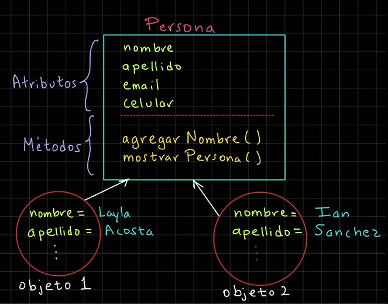

**📄 Código :**

```python
# Definición de una clase
class Persona:
    def inicializar_persona(self, nombre, apellido):
        # Creamos los atributos de la clase
        self.nombre = nombre
        self.apellido = apellido

    def mostrar_persona(self):
        print(
            f"""Persona:
    Nombre: {self.nombre}
    Apellido: {self.apellido}"""
        )


# Creación de objetos
if __name__ == "__main__":
    # Creación de un primer objeto
    persona1 = Persona()  # Crea un objeto vacio en memoria
    persona1.inicializar_persona("Layla", "Acosta")
    persona1.mostrar_persona()

    # Creamos un segundo objeto
    persona2 = Persona()  # Crea un objeto vacío en memoria
    persona2.inicializar_persona("Ian", "Sánchez")
    persona2.mostrar_persona()

```

**🟢 Ejecutar:**

```console
Persona:
    Nombre: Layla
    Apellido: Acosta
Persona:
    Nombre: Ian
    Apellido: Sánchez
```

### Constructores

Un constructor es un método especial y se utiliza para crear un objeto, o instancia una clase.

Además, nos puede servir para crear e inicializar los atributos de un nuevo objeto.

````python
# Sintaxis de un constructor
class NombreDeLaClase:
    # __init()__ -> El método init se conoce como un método mágico o de tipo dunder (double underscore)
    def __init__(self, parametro1, parametro2):
        self.parametro1 = parametro1
        self.parametro2 = parametro2
````

````python
# Ejemplo de un contructor
class Persona:
    def __init__(self, nombre, apellido):
        self.nombre = nombre
        self.apellido = apellido
````

**📄 Código :**

```python
# Definición de una clase
class Persona:
    def __init__(self, nombre, apellido):
        # Creamos los atributos de la clase
        self.nombre = nombre
        self.apellido = apellido

    def mostrar_persona(self):
        print(
            f"""Persona:
    Nombre: {self.nombre}
    Apellido: {self.apellido}"""
        )


# Creación de objetos
if __name__ == "__main__":
    # Creación de un primer objeto
    persona1 = Persona("Layla", "Acosta")  # Crea un objeto vacio en memoria
    # persona1.inicializar_persona("Layla", "Acosta")
    persona1.mostrar_persona()

    # Creamos un segundo objeto
    persona2 = Persona("Ian", "Sánchez")  # Crea un objeto vacío en memoria
    # persona2.inicializar_persona("Ian", "Sánchez")
    persona2.mostrar_persona()

```

**🟢 Ejecutar:**

```console
Persona:
    Nombre: Layla
    Apellido: Acosta
Persona:
    Nombre: Ian
    Apellido: Sánchez
```

### Dirección de Memoria de Objetos

La dirección de memoria de un objeto en Python es un identificador único que permite acceder y gestionar su ubicación en
la memoria.

**📄 Código :**

```python
# Definición de una clase
class Persona:
    def __init__(self, nombre, apellido):
        # Creamos los atributos de la clase
        self.nombre = nombre
        self.apellido = apellido

    def mostrar_persona(self):
        print(
            f"""Persona:
    Nombre: {self.nombre}
    Apellido: {self.apellido}"""
        )
        print(f"Dir. mem self: {id(self)}")
        print(f"Dir. mem hex self: {hex(id(self))}")


# Creación de objetos
if __name__ == "__main__":
    # Creación de un primer objeto
    persona1 = Persona("Layla", "Acosta")  # Crea un objeto vacio en memoria
    persona1.mostrar_persona()
    print(f"Dir. mem persona1: {id(persona1)}")
    print(f"Dir. mem hex persona1: {hex(id(persona1))}")

    # Creamos un segundo objeto
    persona2 = Persona("Ian", "Sánchez")  # Crea un objeto vacío en memoria
    persona2.mostrar_persona()
    print(f"Dir. mem persona2: {id(persona2)}")
    print(f"Dir. mem hex persona2: {hex(id(persona2))}")

```

**🟢 Ejecutar:**

```console
Persona:
    Nombre: Layla
    Apellido: Acosta
Dir. mem self: 2035009539776
Dir. mem hex self: 0x1d9d0054ec0
Dir. mem persona1: 2035009539776
Dir. mem hex persona1: 0x1d9d0054ec0
Persona:
    Nombre: Ian
    Apellido: Sánchez
Dir. mem self: 2035036933008
Dir. mem hex self: 0x1d9d1a74b90
Dir. mem persona2: 2035036933008
Dir. mem hex persona2: 0x1d9d1a74b90
```

### Clase Aritmética

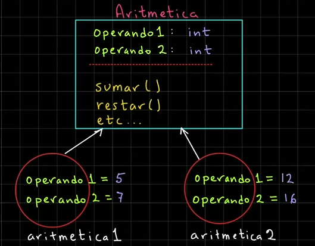

**📄 Código :**

```python
class Aritmetica:
    def __init__(self, operando1, operando2):
        self.operando1 = operando1
        self.operando2 = operando2

    def sumar(self):
        resultado = self.operando1 + self.operando2
        print(f"Resultado de la suma: {resultado}")

    def restar(self):
        resultado = self.operando1 - self.operando2
        print(f"Resultado de la resta: {resultado}")

    def multiplicar(self):
        resultado = self.operando1 * self.operando2
        print(f"Resultado de la multiplicación: {resultado}")

    def dividir(self):
        resultado = self.operando1 / self.operando2
        print(f"Resultado de la división: {resultado}")


# Programa principal
if __name__ == "__main__":
    print("*** Ejemplo clase Aritmética ***")
    aritmetica1 = Aritmetica(5, 7)
    aritmetica1.sumar()
    aritmetica1.restar()
    aritmetica1.multiplicar()
    aritmetica1.dividir()
    # Segundo objeto
    aritmetica2 = Aritmetica(12, 16)
    print()
    aritmetica2.sumar()
    aritmetica2.restar()

```

**🟢 Ejecutar:**

```console
*** Ejemplo clase Aritmética ***
Resultado de la suma: 12
Resultado de la resta: -2
Resultado de la multiplicación: 35
Resultado de la división: 0.7142857142857143

Resultado de la suma: 28
Resultado de la resta: -4
```

### Flexibilidad de Constructores

**📄 Código :**

```python
class Aritmetica:
    # Python Solamente toma el ultimo constructor
    # def __init__(self, operando1):
    #     self.operando1 = operando1

    def __init__(self, operando1=None, operando2=None):
        self.operando1 = operando1
        self.operando2 = operando2

    def sumar(self):
        resultado = self.operando1 + self.operando2
        print(f"Resultado de la suma: {resultado}")

    def restar(self):
        resultado = self.operando1 - self.operando2
        print(f"Resultado de la resta: {resultado}")

    def multiplicar(self):
        resultado = self.operando1 * self.operando2
        print(f"Resultado de la multiplicación: {resultado}")

    def dividir(self):
        resultado = self.operando1 / self.operando2
        print(f"Resultado de la división: {resultado}")


# Programa principal
if __name__ == "__main__":
    print("*** Ejemplo clase Aritmética ***")
    # Primer objeto
    print("Primer objeto")
    aritmetica1 = Aritmetica(5, 7)
    aritmetica1.sumar()
    aritmetica1.restar()
    aritmetica1.multiplicar()
    aritmetica1.dividir()
    # Segundo objeto
    print()
    print("Segundo objeto")
    aritmetica2 = Aritmetica(12, 16)
    aritmetica2.sumar()
    aritmetica2.restar()
    # Tercer Objeto
    print("Tercer Objeto")
    aritmetica3 = Aritmetica(7)
    aritmetica3.operando2 = 9
    aritmetica3.sumar()
    # Cuarto objeto
    print("Cuarto objeto")
    aritmetica4 = Aritmetica()
    aritmetica4.operando1 = 2
    aritmetica4.operando2 = 8
    aritmetica4.sumar()
    # Quinto objeto
    print("Quinto objeto")
    aritmetica5 = Aritmetica(operando2=4, operando1=3)
    aritmetica5.sumar()

```

**🟢 Ejecutar:**

```console
*** Ejemplo clase Aritmética ***
Primer objeto
Resultado de la suma: 12
Resultado de la resta: -2
Resultado de la multiplicación: 35
Resultado de la división: 0.7142857142857143

Segundo objeto
Resultado de la suma: 28
Resultado de la resta: -4
Tercer Objeto
Resultado de la suma: 16
Cuarto objeto
Resultado de la suma: 10
Quinto objeto
Resultado de la suma: 7
```

### Encapsulamiento

El encapsulamiento nos permite ocultar la información que almacena un objeto, también conocido como el estado del
objeto.

Para aplicar el concepto de encapsulamiento se deben aplicar dos características:

1. **Atributos protegidos o privados**

    ````python
    self._nombre # Atributo protegido
    self.__apellido # Atributo privado
    ````

2. **Crear los métodos conocidos como `get` (leer) y `set` (modificar)**

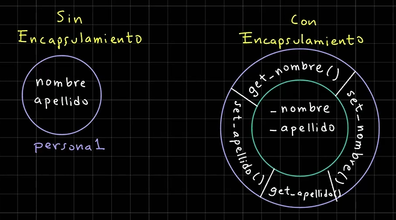

**📄 Código :**

```python
# Definimos la clase coche
class Coche:
    def __init__(self, marca, modelo, color):
        self.marca = marca  # atributo publico
        self._modelo = modelo  # Atributo Protegido
        self.__color = color  # Atributo Privado

    def conducir(self):
        print(
            f"""Conduciendo el coche:
        Marca: {self.marca}
        Modelo: {self._modelo}
        Color: {self.__color}"""
        )


# Programa principal
if __name__ == "__main__":
    print("*** Encapsulamiento ***")
    # Creación de un primer objeto coche
    coche1 = Coche("Toyota", "Yaris", "Azul")
    coche1.conducir()
    coche1.marca = "Toyota 2"
    coche1._modelo = "Yaris 2"  # Esto no es una buena práctica
    coche1.__color = "Azul 2"  # Ignoro la modificación
    coche1._Coche__color = "Azul 3"  # Es una mala práctica
    coche1.conducir()

```

**🟢 Ejecutar:**

```console
*** Encapsulamiento ***
Conduciendo el coche:
        Marca: Toyota
        Modelo: Yaris
        Color: Azul
Conduciendo el coche:
        Marca: Toyota 2
        Modelo: Yaris 2
        Color: Azul 3
```

### Métodos get y set

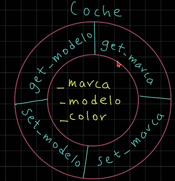

**📄 Código :**

```python
# Definimos la clase coche
class Coche:
    def __init__(self, marca, modelo, color):
        self._marca = marca  # atributo publico
        self._modelo = modelo  # Atributo Protegido
        self._color = color  # Atributo Privado

    def conducir(self):
        print(
            f"""Conduciendo el coche:
        Marca: {self._marca}
        Modelo: {self._modelo}
        Color: {self._color}"""
        )

    def get_marca(self):
        return self._marca

    def set_marca(self, marca):
        self._marca = marca

    def get_modelo(self):
        return self._modelo

    def set_modelo(self, modelo):
        self._modelo = modelo

    def get_color(self):
        return self._color

    def set_color(self, color):
        self._color = color


# Programa principal
if __name__ == "__main__":
    print("*** Métodos get y set ***")
    # Creación de un primer objeto coche
    coche1 = Coche("Toyota", "Yaris", "Azul")
    coche1.conducir()
    # No deberiamos acceder a los atributos que no sean públicos
    coche1.set_marca("Toyota 2")
    coche1.set_modelo("Yaris 2")
    coche1.set_color("Azul 2")
    coche1.conducir()

```

**🟢 Ejecutar:**

```console
*** Métodos get y set ***
Conduciendo el coche:
        Marca: Toyota
        Modelo: Yaris
        Color: Azul
Conduciendo el coche:
        Marca: Toyota 2
        Modelo: Yaris 2
        Color: Azul 2
```

### Mejora de Encapsulamiento

**📄 Código :**

```python
# Definimos la clase coche
class Coche:
    def __init__(self, marca, modelo, color):
        self._marca = marca  # atributo publico
        self._modelo = modelo  # Atributo Protegido
        self._color = color  # Atributo Privado

    def conducir(self):
        print(
            f"""Conduciendo el coche:
        Marca: {self._marca}
        Modelo: {self._modelo}
        Color: {self._color}"""
        )

    # def get_marca(self):
    #     return self._marca
    @property  # Definir el método get de manera más pythonica
    def marca(self):
        return self._marca

    @marca.setter
    def marca(self, marca):
        self._marca = marca

    @property
    def modelo(self):
        return self._modelo

    @modelo.setter
    def modelo(self, modelo):
        self._modelo = modelo

    @property
    def color(self):
        return self._color

    @color.setter
    def color(self, color):
        self._color = color


# Programa principal
if __name__ == "__main__":
    print("*** Mejora de Encapsulamiento ***")
    # Creación de un primer objeto coche
    coche1 = Coche("Toyota", "Yaris", "Azul")
    coche1.conducir()
    # No deberíamos acceder a los atributos que no sean públicos
    coche1.marca = "Toyota 2"
    coche1.modelo = "Yaris 2"
    coche1.color = "Azul 2"
    coche1.conducir()
    # Atributo de marca del coche1
    coche1.marca = "Toyota 3"
    print(f"Atributo marcha coche1: {coche1.marca}")

```

**🟢 Ejecutar:**

```console
*** Mejora de Encapsulamiento ***
Conduciendo el coche:
        Marca: Toyota
        Modelo: Yaris
        Color: Azul
Conduciendo el coche:
        Marca: Toyota 2
        Modelo: Yaris 2
        Color: Azul 2
Atributo marcha coche1: Toyota 3
```

### Atributos dinámicos

**📄 Código :**

```python
# Definimos la clase coche
class Coche:
    def __init__(self, marca, modelo, color):
        self._marca = marca  # atributo publico
        self._modelo = modelo  # Atributo Protegido
        self._color = color  # Atributo Privado

    def conducir(self):
        print(
            f"""Conduciendo el coche:
        Marca: {self._marca}
        Modelo: {self._modelo}
        Color: {self._color}"""
        )

    # def get_marca(self):
    #     return self._marca
    @property  # Definir el método get de manera más pythonica
    def marca(self):
        return self._marca

    @marca.setter
    def marca(self, marca):
        self._marca = marca

    @property
    def modelo(self):
        return self._modelo

    @modelo.setter
    def modelo(self, modelo):
        self._modelo = modelo

    @property
    def color(self):
        return self._color

    @color.setter
    def color(self, color):
        self._color = color


# Programa principal
if __name__ == "__main__":
    print("*** Atributos dinámicos ***")
    # Creación de un primer objeto coche
    coche1 = Coche("Toyota", "Yaris", "Azul")
    coche1.conducir()
    # No deberíamos acceder a los atributos que no sean públicos
    coche1.marca = "Toyota 2"
    coche1.modelo = "Yaris 2"
    coche1.color = "Azul 2"
    coche1.conducir()
    # Intentar agregar un nuevo atributo
    setattr(coche1, "nuevo_atributo", "valor nuevo atributo")
    coche1.nuevo_atributo2 = "Valor nuevo atributo 2"
    print(f"Atributo del coche1: {coche1.__dict__}")
    coche1.conducir()
    print(coche1.nuevo_atributo)
    print(f"Nuevo atributo coche1 {coche1.nuevo_atributo2}")
    # segundo objeto
    coche2 = Coche("Chevrolet", "Trax", "Blanco")
    coche2.conducir()
    print(f"Atributo del coche2: {coche2.__dict__}")
    # print(f"Nuevo atributo coche2 {coche2.nuevo_atributo}")
    # print(f"Nuevo atributo 2 coche2 {coche2.nuevo_atributo2}")

```

**🟢 Ejecutar:**

```console
*** Atributos dinámicos ***
Conduciendo el coche:
        Marca: Toyota
        Modelo: Yaris
        Color: Azul
Conduciendo el coche:
        Marca: Toyota 2
        Modelo: Yaris 2
        Color: Azul 2
Atributo del coche1: {'_marca': 'Toyota 2', '_modelo': 'Yaris 2', '_color': 'Azul 2', 'nuevo_atributo': 'valor nuevo atributo', 'nuevo_atributo2': 'Valor nuevo atributo 2'}
Conduciendo el coche:
        Marca: Toyota 2
        Modelo: Yaris 2
        Color: Azul 2
valor nuevo atributo
Nuevo atributo coche1 Valor nuevo atributo 2
Conduciendo el coche:
        Marca: Chevrolet
        Modelo: Trax
        Color: Blanco
Atributo del coche2: {'_marca': 'Chevrolet', '_modelo': 'Trax', '_color': 'Blanco'}

```

### Encapsulamiento de clase Aritmética

**📄 Código :**

```python
class Aritmetica:
    def __init__(self, operando1, operando2):
        self._operando1 = operando1
        self._operando2 = operando2

    def sumar(self):
        resultado = self._operando1 + self._operando2
        print(f"Resultado de la suma: {resultado}")

    def restar(self):
        resultado = self._operando1 - self._operando2
        print(f"Resultado de la resta: {resultado}")

    def multiplicar(self):
        resultado = self._operando1 * self._operando2
        print(f"Resultado de la multiplicación: {resultado}")

    def dividir(self):
        resultado = self._operando1 / self._operando2
        print(f"Resultado de la división: {resultado}")

    @property
    def operando1(self):
        return self._operando1

    @operando1.setter
    def operando1(self, operando1):
        self._operando1 = operando1

    @property
    def operando2(self):
        return self._operando2

    @operando2.setter
    def operando2(self, operando2):
        self._operando2 = operando2


# Programa principal
if __name__ == "__main__":
    print("*** Encapsulamiento de clase Aritmética ***")
    aritmetica1 = Aritmetica(5, 7)
    print("Primer objeto")
    print(f"Valor operando1 del objeto aritmética1: {aritmetica1.operando1}")
    print(f"Valor operando2 del objeto aritmética1: {aritmetica1.operando2}")
    aritmetica1.sumar()
    aritmetica1.restar()
    aritmetica1.operando1 = 9
    aritmetica1._operando2 = 15
    print(f"Valor operando1 del objeto aritmética1: {aritmetica1.operando1}")
    print(f"Valor operando2 del objeto aritmética1: {aritmetica1.operando2}")

    # Segundo objeto
    aritmetica2 = Aritmetica(12, 16)
    print("Primer objeto")
    print(f"Valor operando1 del objeto aritmética2: {aritmetica2.operando1}")
    print(f"Valor operando2 del objeto aritmética2: {aritmetica2.operando2}")
    print()
    aritmetica2.sumar()
    aritmetica2.restar()

```

**🟢 Ejecutar:**

```console
*** Encapsulamiento de clase Aritmética ***
Primer objeto
Valor operando1 del objeto aritmética1: 5
Valor operando2 del objeto aritmética1: 7
Resultado de la suma: 12
Resultado de la resta: -2
Valor operando1 del objeto aritmética1: 9
Valor operando2 del objeto aritmética1: 15
Primer objeto
Valor operando1 del objeto aritmética2: 12
Valor operando2 del objeto aritmética2: 16

Resultado de la suma: 28
Resultado de la resta: -4
```

#### Atributos de Clase

Persona:

````python
atributo_clase = 0
atributo_instancia = 0
````

Objetos:

````python
# persona1
atributo_instancia = 0
# persona2
atributo_instancia = 0
````

**📄 Código :**

```python
class Persona:
    atributo_clase = 0

    def __init__(self, atributo_instancia):
        self.atributo_instancia = atributo_instancia


#  Programa principal
if __name__ == "__main__":
    print(f"*** Atributo de Clase ***")
    print(f"Atributo de Clase: {Persona.atributo_clase}")
    # Modificamos el atributo de clase
    Persona.atributo_clase = 10
    print(f"Atributo de Clase: {Persona.atributo_clase}")

    # Creamos un objeto persona1
    persona1 = Persona(15)
    print(f"Atributo de Clase desde persona1:  {persona1.atributo_clase}")
    print(f"Atributo de Instancia desde persona1:  {persona1.atributo_instancia}")

    # Creamos un objeto persona2
    persona2 = Persona(30)
    print(f"Atributo de Clase desde persona2:  {persona2.atributo_clase}")
    print(f"Atributo de Instancia desde persona2:  {persona2.atributo_instancia}")

```

**🟢 Ejecutar:**

```console
*** Atributo de Clase ***
Atributo de Clase: 0
Atributo de Clase: 10
Atributo de Clase desde persona1:  10
Atributo de Instancia desde persona1:  15
Atributo de Clase desde persona2:  10
Atributo de Instancia desde persona2:  30
```

### Ejemplo Contador de Objetos de tipo Persona

**Persona:**

````python
contador_persona = 0
id
nombre
apellido
````

**persona1:**

````python
id = 1
nombre = 'Gerado'
apellido = 'Perez'
````

**persona2:**

````python
id = 2
nombre = 'Daniel'
apellido = 'Sanchez'
````

**📄 Código :**

```python
class Persona:
    # Atributo clase
    contador_personas = 0

    def __init__(self, nombre, apellido):
        # Incrementamos el valor del atributo de clase
        Persona.contador_personas += 1
        self.id = Persona.contador_personas
        self.nombre = nombre
        self.apellido = apellido

    def mostrar_persona(self):
        print(f"Persona: {self.id}, {self.nombre}, {self.apellido}")


if __name__ == "__main__":
    print("*** Ejemplo Contador de objetos de tipo Persona ***")
    # Primer objeto
    persona1 = Persona("Gerardo", "Perez")
    persona1.mostrar_persona()

    # Segundo objeto
    persona2 = Persona("Daniel", "Sanchez")
    persona2.mostrar_persona()

    # Imprimir el valor del contador de objetos de Personas
    print(f"Contador objetos Persona: {Persona.contador_personas}")

```

**🟢 Ejecutar:**

```console
*** Ejemplo Contador de objetos de tipo Persona ***
Persona: 1, Gerardo, Perez
Persona: 2, Daniel, Sanchez
Contador objetos Persona: 2
```

### Métodos de Clase

Métodos de clases en Python
Los métodos en Python son una forma de definir funciones en las clases. Los métodos en Python se utilizan para
implementar el comportamiento y la lógica general de un objeto, así como también para modificarlo.
Algunos ejemplos de cómo usar métodos en Python:

1. Métodos de Clase:
   Las clases en Python tienen sus propias funciones (métodos) que se usan para construir objetos y realizar acciones
   sobre los mismos. Se utiliza el método `__init__()` para inicializar un objeto, y el método `__str__()` para
   mostrar su representación en pantalla.

   ```python
   class Persona:
       def __init__(self, nombre, edad):
           self.nombre = nombre
           self.edad = edad
   
       def __str__(self):
           return f"Nombre: {self.nombre}, Edad: {self.edad}"
   ```

2. Métodos Heredados de Clase:
   Los métodos heredados (encapsulación) son funciones que se usan en otras clases. Son utilizadas para agregar
   propiedades y métodos únicos a una clase.

   ```python
   class Alumno(Persona):
       def __init__(self, nombre, edad, institucion):
           self.institucion = institucion
   
       def get_institucion(self):
           return self.__institucion__
   ```

3. Métodos Definidos:
   Métodos definidos (no heredados) son funciones que se usan directamente en una clase. No tienen un objeto
   asociado.

   ```python
   class CajaElectrica:
       def __init__(self, marca):
           self.marca = marca
   
       def mostrar(self):
           return "La caja está encendida."
   
   
   class CajaElectricaSinPantalla(CajaElectrica):
       pass
   
   
   print(CajaElectricaSinPantalla("Huawei"))
   ```

Estos ejemplos son solo un par de ejemplos que pueden ayudarte a entender los métodos en Python. Algunas formas
más comunes de usar métodos en Python incluyen:

1. Crear funciones y métodos directamente dentro de la clase
2. Utilizar los métodos heredados o definidos en otras clases
3. Utilizar las propiedades, listas, y diccionarios como métodos

Es importante tener en cuenta que aunque se pueden usar métodos en Python, no todos los objetos deben ser
declarados con métodos. También es útil conocer cómo usar métodos cuando necesites implementar lógica o
comportamiento personalizado para tus clases.

**📄 Código :**

```python
class Persona:
    # Atributo clase
    contador_personas = 0

    def __init__(self, nombre, apellido):
        # Incrementamos el valor del atributo de clase
        Persona.contador_personas += 1
        self.id = Persona.contador_personas
        self.nombre = nombre
        self.apellido = apellido

    def mostrar_persona(self):
        print(f"Persona: {self.id}, {self.nombre}, {self.apellido}")

    @staticmethod
    def get_contador_personas_estatico():
        print("Método estático")
        return Persona.contador_personas

    @classmethod
    def get_contador_personas_clase(cls):
        print("Método de clase")
        return cls.contador_personas


if __name__ == "__main__":
    print("*** Métodos de Clase ***")
    # Primer objeto
    persona1 = Persona("Gerardo", "Perez")
    persona1.mostrar_persona()

    # Segundo objeto
    persona2 = Persona("Daniel", "Sanchez")
    persona2.mostrar_persona()

    # Imprimir el valor del contador de objetos de Personas
    print(f"Contador objetos Persona: {Persona.contador_personas}")
    print(f"Contador objetos Persona (persona1): {persona1.contador_personas}")
    print(
        f"Contador objetos Persona (static): {Persona.get_contador_personas_estatico()}"
    )
    print(f"Contador objetos Persona (clase): {Persona.get_contador_personas_clase()}")

```

**🟢 Ejecutar:**

```console
*** Métodos de Clase ***
Persona: 1, Gerardo, Perez
Persona: 2, Daniel, Sanchez
Contador objetos Persona: 2
Contador objetos Persona (persona1): 2
Método estático
Contador objetos Persona (static): 2
Método de clase
Contador objetos Persona (clase): 2
```

### Sistema de Empleados

Crea un sistema de manejo de empleados de una empresa, aplicando la programación orientada a objetos.

La empresa desea saber el total de empleadas así como el total de empleados de un departamento en particular.

Se debe crear la clase de Empleados y Empresa en archivos por separados, así como la creación de objetos en un archivo
por separado.

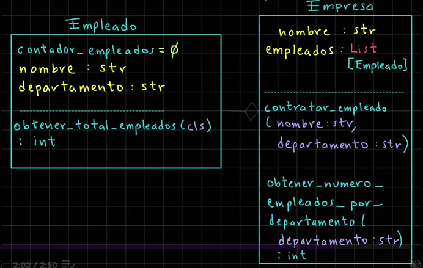

**📄 Código :**

**Empleado:**

```python
class Empleado:
    contador_empleados = 0

    def __init__(self, nombre, departamento):
        self.nombre = nombre
        self.departamento = departamento
        Empleado.contador_empleados += 1
        self.id = Empleado.contador_empleados

    @classmethod
    def obtener_total_empleados(cls):
        return cls.contador_empleados

```

**Empresa:**

```python
from Empleado import Empleado


class Empresa:
    def __init__(self, nombre):
        self.nombre = nombre
        self.empleados = []

    def contratar_empleado(self, nombre, departamento):
        empleado = Empleado(nombre, departamento)
        self.empleados.append(empleado)

    def obtener_numero_empleados_departamento(self, departameto):
        contador_empleados_por_departamento = 0
        for empleado in self.empleados:
            if empleado.departamento == departameto:
                contador_empleados_por_departamento += 1
        return contador_empleados_por_departamento

    def obtener_total_empleados(self):
        print(f"\nTotal de Empleados para la empresa: {self.nombre}")
        for empleado in self.empleados:
            print(
                f"""Empleado {empleado.id}
            Nombre: {empleado.nombre}
            Departamento: {empleado.departamento}"""
            )

```

**sistema_empleados_app:**

```python
from Empresa import Empresa
from Empleado import Empleado

print("*** Sistema de Empleados ***")

# Crear una instancia de una empresa
empresa1 = Empresa("Global Mentoring")

# Contratar algunos empleados
empresa1.contratar_empleado("Juan", "Ventas")
empresa1.contratar_empleado("María", "Marketing")
empresa1.contratar_empleado("Pedro", "Ventas")
empresa1.contratar_empleado("Ana", "Recursos Humanos")

# Obtener el total de objetos de tipo empleado
print(f"Total de empleados: {Empleado.obtener_total_empleados()}")

# Obtener el número de empleados en el departamento de venta
print(
    f"Empleados en el departamento de Ventas: "
    f"{empresa1.obtener_numero_empleados_departamento("Ventas")}"
)

print("\n", "-" * 50)
# Mostrar todos los empleados de la empresa
empresa1.obtener_total_empleados()

```

**🟢 Ejecutar:**

```console
*** Sistema de Empleados ***
Total de empleados: 4
Empleados en el departamento de Ventas: 2

 --------------------------------------------------

Total de Empleados para la empresa: Global Mentoring
Empleado 1
            Nombre: Juan
            Departamento: Ventas
Empleado 2
            Nombre: María
            Departamento: Marketing
Empleado 3
            Nombre: Pedro
            Departamento: Ventas
Empleado 4
            Nombre: Ana
            Departamento: Recursos Humanos
```

### Sistema Biblioteca

Se les deja crear el siguiente sistema de bibliotecas y cada objeto de biblioteca almacena libros.

Se debe aplicar la programación orientada a objetos para resolver este problema.

Un libro tiene los atributos de título, auto y género. Debe aplicar el concepto de encapsulamiento.

Por otro lado, una biblioteca contiene un nombre, así como una lista de libros.

Además, tiene los siguientes métodos para administrar los libros.

- Agregar libros
- Buscar libros por autor
- Buscar libros por género
- Mostrar todos los libros
- Mostrar un libro

Además, debe aplicar encapsulamiento.

Por último, se debe crear un script para poner a prueba las clases creadas.

A continuación veremos un ejemplo:

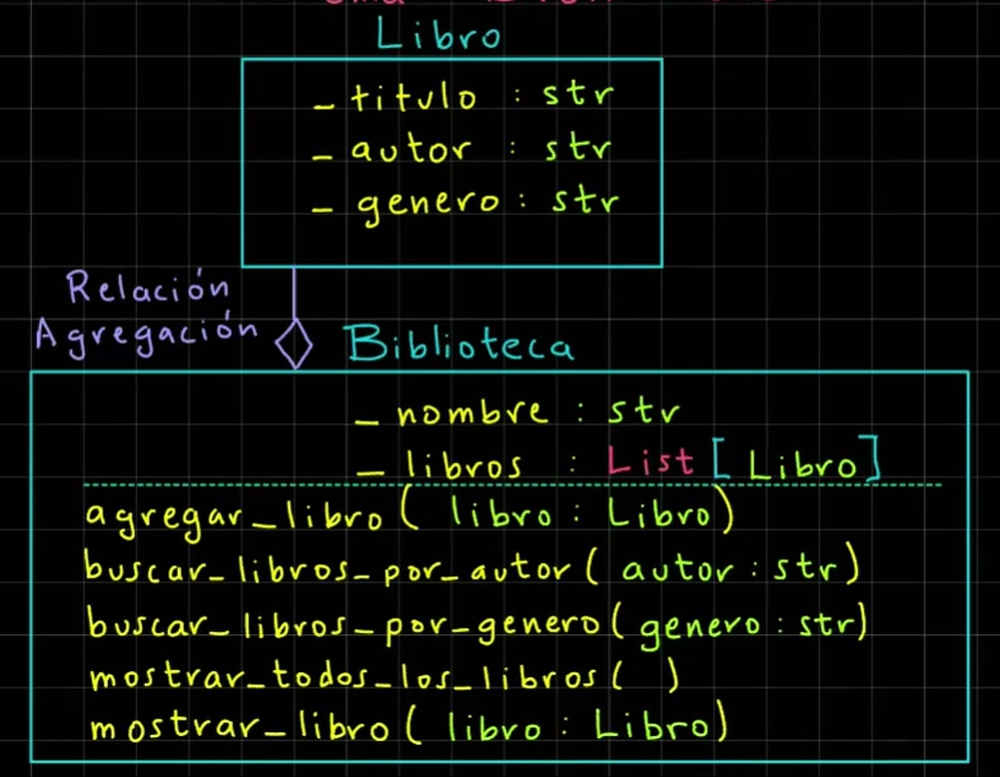

**📄 Código :**

**Libro:**

```python
class Libro:
    def __init__(self, titulo: str, autor: str, genero: str):
        self._titulo = titulo
        self._autor = autor
        self._genero = genero

    @property
    def titulo(self):
        return self._titulo

    @property
    def autor(self):
        return self._autor

    @property
    def genero(self):
        return self._genero

```

**Biblioteca:**

```python
class Biblioteca:
    def __init__(self, nombre):
        self._nombre = nombre
        self._libros = []

    def agregar_libro(self, libro):
        self._libros.append(libro)

    def buscar_libros_por_autor(self, autor):
        for libro in self._libros:
            if libro.autor.lower() == autor.lower():
                self.mostrar_libros(libro)

    def buscar_libros_por_genero(self, genero):
        for libro in self._libros:
            if libro.genero.lower() == genero.lower():
                self.mostrar_libros(libro)

    def mostrar_todos_los_libros(self):
        print(f"\nTodos los libros de la biblioteca: {self._nombre}")
        for libro in self._libros:
            self.mostrar_libros(libro)

    @staticmethod
    def mostrar_libros(libro):
        print(
            f"""{('-' * 50)}
        Libro -> Título: {libro.titulo}
        Autor: {libro.autor}
        Género: {libro.genero}"""
        )

    @property
    def nombre(self):
        return self._nombre

    @nombre.setter
    def nombre(self, nombre):
        self._nombre = nombre

```

**Sistema de Bibliotecas App:**

```python
from biblioteca import Biblioteca
from libro import Libro

biblioteca_nacional = Biblioteca("Biblioteca Nacional")
print(f"*** Bienvenido a la {biblioteca_nacional.nombre} ***")

# Definición de libros
libro1 = Libro("Cien años de soledad", "Gabriel García Márquez", "Ficción")
libro2 = Libro("Don Quijote de la Mancha", "Miguel de Cervantes", "Comedia")
libro3 = Libro("El amor en los tiempos del cólera", "Gabriel García Márquez", "Ficción")
libro4 = Libro("Pedro Páramo", "Juan Rulfo", "Ficción")
libro5 = Libro("Pantaleón y las visitadores", "Mario Vargas Llosa", "Comedia")

# Agrega los libros a la biblioteca
libros_lista = [libro1, libro2, libro3, libro4, libro5]
for libro in libros_lista:
    biblioteca_nacional.agregar_libro(libro)

# Buscar libros por autor
autor = "Gabriel García Márquez"
print(f"\nLibros de: {autor}")
biblioteca_nacional.buscar_libros_por_autor(autor)

# Buscar libros por género
genero = "Ficción"
print(f"\nLibros de {genero}")
biblioteca_nacional.buscar_libros_por_genero(genero)

# Mostrar todos los libros de la biblioteca
biblioteca_nacional.mostrar_todos_los_libros()

```

**🟢 Ejecutar:**

```console
*** Bienvenido a la Biblioteca Nacional ***

Libros de: Gabriel García Márquez
--------------------------------------------------
        Libro -> Título: Cien años de soledad
        Autor: Gabriel García Márquez
        Género: Ficción
--------------------------------------------------
        Libro -> Título: El amor en los tiempos del cólera
        Autor: Gabriel García Márquez
        Género: Ficción

Libros de Ficción
--------------------------------------------------
        Libro -> Título: Cien años de soledad
        Autor: Gabriel García Márquez
        Género: Ficción
--------------------------------------------------
        Libro -> Título: El amor en los tiempos del cólera
        Autor: Gabriel García Márquez
        Género: Ficción
--------------------------------------------------
        Libro -> Título: Pedro Páramo
        Autor: Juan Rulfo
        Género: Ficción

Todos los libros de la biblioteca: Biblioteca Nacional
--------------------------------------------------
        Libro -> Título: Cien años de soledad
        Autor: Gabriel García Márquez
        Género: Ficción
--------------------------------------------------
        Libro -> Título: Don Quijote de la Mancha
        Autor: Miguel de Cervantes
        Género: Comedia
--------------------------------------------------
        Libro -> Título: El amor en los tiempos del cólera
        Autor: Gabriel García Márquez
        Género: Ficción
--------------------------------------------------
        Libro -> Título: Pedro Páramo
        Autor: Juan Rulfo
        Género: Ficción
--------------------------------------------------
        Libro -> Título: Pantaleón y las visitadores
        Autor: Mario Vargas Llosa
        Género: Comedia
```

## Programación Orientada a Objetos (POO)

La **Programación Orientada a Objetos (POO)** es un paradigma de programación que organiza el código en estructuras
llamadas **objetos**, los cuales contienen **atributos** (datos) y **métodos** (funciones). Python es un lenguaje que
soporta POO de manera nativa.

### Herencia en Python

La **herencia** en Python es un concepto de la Programación Orientada a Objetos (POO) que permite que una clase (llamada
**clase hija** o **subclase**) herede atributos y métodos de otra clase (llamada **clase padre** o **superclase**). Esto
facilita la reutilización de código y la creación de jerarquías de clases.

- **Clase padre:** Contiene los atributos y métodos compartidos.
- **Clase hija:** Hereda de la clase padre y puede agregar o modificar funcionalidades específicas.
- **Sintaxis:**

  ```python
  class ClasePadre:
    pass
  
  class ClaseHija(ClasePadre):
    pass
  ```

- Permite extender o especializar comportamientos sin duplicar código.

**📄 Código :**

```python
class Animal:
    def comer(self):
        print("Como muchas veces el día")

    def dormir(self):
        print("Duermo muchas horas")


class Perro(Animal):
    def hacer_sonido(self):
        print("Puedo lagdrar")


# Programa Principal
print("*** Ejemplo de Herencia en Python ***")
print("Clase Padre, soy un Animal")

animal1 = Animal()
animal1.comer()
animal1.dormir()

print("\nClase Hija, soy un Perro")
perro1 = Perro()
perro1.hacer_sonido()
perro1.dormir()
perro1.comer()

```

**🟢 Ejecutar:**

```console
*** Ejemplo de Herencia en Python ***
Clase Padre, soy un Animal
Como muchas veces el día
Duermo muchas horas

Clase Hija, soy un Perro
Puedo lagdrar
Duermo muchas horas
Como muchas veces el día
```

### Sobreescritura en Python

La **sobreescritura de métodos** en Python permite que una subclase proporcione una implementación específica de un
método que ya está definido en su superclase. Esto es fundamental en la programación orientada a objetos para
personalizar o extender comportamientos heredados.

**Conceptos Clave:**

- **Definición:** La sobreescritura ocurre cuando una subclase define un método con el mismo nombre que uno en su
  superclase, alterando o ampliando su funcionalidad.

- **Uso del método `super()`:** Dentro de la subclase, se puede invocar el método de la superclase utilizando
  `super().metodo()`. Esto es útil para mantener el comportamiento original y añadir nuevas funcionalidades.

**Ejemplo Práctico:**

```python
class Animal:
    def mover(self):
        print("El animal se mueve")


class Pajaro(Animal):
    def mover(self):
        super().mover()
        print("El pájaro vuela")


# Crear instancia de Pajaro
ave = Pajaro()
ave.mover()
```

**Salida:**

```
El animal se mueve
El pájaro vuela
```

En este ejemplo, la clase `Pajaro` hereda de `Animal` y sobreescribe el método `mover`. Al llamar a `mover` desde una
instancia de `Pajaro`, primero se ejecuta el método de la superclase gracias a `super().mover()`, y luego la
implementación específica de `Pajaro`.

**Consideraciones:**

- **Acceso al método original:** Si no se utiliza `super()`, la implementación de la superclase no se ejecutará cuando
  se llame al método sobreescrito desde la subclase.

- **Compatibilidad:** Es recomendable que la firma del método sobreescrito en la subclase coincida con la de la
  superclase para evitar errores y mantener la coherencia.

La sobreescritura de métodos es esencial para adaptar y extender comportamientos en jerarquías de clases, permitiendo
que las subclases implementen funcionalidades específicas sin alterar el código de las superclases.


**📄 Código :**

```python
class Animal:
    def comer(self):
        print("Como muchas veces el día")

    def dormir(self):
        print("Duermo muchas horas")


class Perro(Animal):
    def hacer_sonido(self):
        print("Puedo lagdrar")

    # Sobreescritura del metodo dormir
    def dormir(self):
        print("Duermo 15 Horas al día")


# Programa Principal
print("*** Ejemplo de Sobreescritura en Python ***")
print("Clase Padre, soy un Animal")

animal1 = Animal()
animal1.comer()
animal1.dormir()

print("\nClase Hija, soy un Perro")
perro1 = Perro()
perro1.hacer_sonido()
perro1.dormir()  # Se llama el método sobreescrito  de la clase hija
perro1.comer()

```

**🟢 Ejecutar:**

```console
*** Ejemplo de Sobreescritura en Python ***
Clase Padre, soy un Animal
Como muchas veces el día
Duermo muchas horas

Clase Hija, soy un Perro
Puedo lagdrar
Duermo 15 Horas al día
Como muchas veces el día
```

### Polimorfismo

El polimorfismo es un concepto fundamental en la Programación Orientada a Objetos (POO) que permite que una misma
interfaz o función se comporte de diferentes maneras según el objeto que la invoque. En Python, el polimorfismo se
manifiesta a través de la capacidad de usar un mismo método o función en distintos objetos, obteniendo resultados
específicos según la clase a la que pertenezcan.

**Ejemplos de polimorfismo en Python:**

- **Funciones incorporadas polimórficas:**
  - La función `len()` puede aplicarse tanto a cadenas como a listas, devolviendo la longitud correspondiente en cada
      caso.
    - `len("Hola")` devuelve `4`.
    - `len([1, 2, 3])` devuelve `3`.

- **Operadores polimórficos:**
  - El operador `+` se utiliza para sumar números y para concatenar cadenas.
    - `5 + 3` resulta en `8`.
    - `"Hola" + " Mundo"` resulta en `"Hola Mundo"`.

**Polimorfismo con métodos de clase:**

En Python, diferentes clases pueden tener métodos con el mismo nombre, y la ejecución del método dependerá del objeto
que lo invoque.

```python
class Perro:
    def hacer_sonido(self):
        print("Guau")


class Gato:
    def hacer_sonido(self):
        print("Miau")


def emitir_sonido(animal):
    animal.hacer_sonido()


perro = Perro()
gato = Gato()

emitir_sonido(perro)  # Salida: Guau
emitir_sonido(gato)  # Salida: Miau
```

En este ejemplo, la función `emitir_sonido` acepta cualquier objeto que tenga un método `hacer_sonido`, demostrando el
polimorfismo al invocar el método correspondiente según el objeto proporcionado.

**Polimorfismo y herencia:**

El polimorfismo también se relaciona con la herencia, donde una clase derivada puede sobrescribir métodos de su clase
base.

```python
class Ave:
    def volar(self):
        print("La mayoría de las aves pueden volar")


class Pinguino(Ave):
    def volar(self):
        print("Los pingüinos no pueden volar")


def describir_vuelo(ave):
    ave.volar()


ave = Ave()
pinguino = Pinguino()

describir_vuelo(ave)  # Salida: La mayoría de las aves pueden volar
describir_vuelo(pinguino)  # Salida: Los pingüinos no pueden volar
```

Aquí, la clase `Pinguino` sobrescribe el método `volar` de la clase `Ave`, y la función `describir_vuelo` demuestra el
polimorfismo al llamar al método adecuado según el objeto.

El polimorfismo en Python permite escribir código más flexible y reutilizable, facilitando la interacción con diferentes
tipos de objetos de manera uniforme.


**📄 Código :**

```python
# Polimorfismo


class Animal:
    def hacer_sonido(self):
        print("Hago un pitido")


class Perro(Animal):
    def hacer_sonido(self):
        print("Puedo ladrar")


class Gato(Animal):
    def hacer_sonido(self):
        print("Puedo maullar")


# Programa principal
print("*** Ejemplo Polimorfismo ***")

# Definimos un objeto de la clase Animal
print("Clase Padre - Animal:")
animal1 = Animal()
animal1.hacer_sonido()

# Definimos un objeto de la clase Perro
print("\nClase hija - Perro:")
perro1 = Perro()
perro1.hacer_sonido()  # Polimorfismo

# Definimos un objeto de la clase Gato
print("\nClase hija - Gato:")
gato1 = Gato()
gato1.hacer_sonido()  # Polimorfismo

```

**🟢 Ejecutar:**

```console
*** Ejemplo Polimorfismo ***
Clase Padre - Animal:
Hago un pitido

Clase hija - Perro:
Puedo ladrar

Clase hija - Gato:
Puedo maullar
```

### Duck Typing en Python

El **Duck Typing** es un concepto fundamental en Python que se basa en la idea de que el tipo o la clase de un objeto es
menos importante que los métodos o atributos que posee. Esta filosofía se resume en la expresión: "Si algo camina como
un pato y suena como un pato, entonces probablemente sea un pato".

**Características principales:**

- **Tipado dinámico:** Python no requiere la declaración explícita de tipos; el intérprete determina el tipo de las
  variables en tiempo de ejecución.

- **Enfoque en comportamientos:** Lo relevante es si un objeto puede realizar ciertas acciones, independientemente de su
  tipo específico.

**Ejemplo de Duck Typing:**

```python
class Pato:
    def hablar(self):
        print("Cuac, cuac")


class Ganso:
    def hablar(self):
        print("Honk, honk")


def hacer_sonar(ave):
    ave.hablar()


pato = Pato()
ganso = Ganso()

hacer_sonar(pato)  # Imprime "Cuac, cuac"
hacer_sonar(ganso)  # Imprime "Honk, honk"
```

En este ejemplo, la función `hacer_sonar` acepta cualquier objeto que tenga un método `hablar`, sin importar su clase.
Esto demuestra cómo Python utiliza el Duck Typing para permitir una programación más flexible y genérica.

**Ventajas del Duck Typing:**

- **Flexibilidad:** Permite escribir código que puede trabajar con diferentes tipos de objetos, siempre que estos
  implementen los métodos o atributos esperados.

- **Menor acoplamiento:** Reduce la dependencia de tipos específicos, facilitando la reutilización y mantenimiento del
  código.

- **Código más limpio:** Al no requerir comprobaciones explícitas de tipos, el código es más legible y conciso.

**Consideraciones:**

- **Manejo de errores:** Es importante asegurarse de que los objetos pasados a funciones o métodos posean los métodos o
  atributos necesarios para evitar errores en tiempo de ejecución.

- **Legibilidad:** Aunque el Duck Typing ofrece flexibilidad, se debe tener cuidado para mantener la claridad y
  comprensión del código, especialmente en proyectos grandes o colaborativos.

En resumen, el Duck Typing es una característica poderosa de Python que promueve la escritura de código flexible y
reutilizable, centrándose en los comportamientos de los objetos más que en sus tipos específicos.

**📄 Código :**

```python
# Polimorfismo


class Animal:
    def hacer_sonido(self):
        print("Hago un pitido")


class Perro(Animal):
    def hacer_sonido(self):
        print("Puedo ladrar")


class Gato(Animal):
    def hacer_sonido(self):
        print("Puedo maullar")


# Función polimorfismo (Duck Typing)
def hacer_sonido_anima(animal):  # DuckTyping
    animal.hacer_sonido()


# Programa principal
print("*** Ejemplo DuckTyping ***")

# Definimos un objeto de la clase Animal
print("Clase Padre - Animal:")
animal1 = Animal()
hacer_sonido_anima(animal1)  # DuckTyping

# Definimos un objeto de la clase Perro
print("\nClase hija - Perro:")
perro1 = Perro()
hacer_sonido_anima(perro1)  # DuckTyping

# Definimos un objeto de la clase Gato
print("\nClase hija - Gato:")
gato1 = Gato()
hacer_sonido_anima(gato1)  # DuckTyping

```

**🟢 Ejecutar:**

```console
*** Ejemplo DuckTyping ***
Clase Padre - Animal:
Hago un pitido

Clase hija - Perro:
Puedo ladrar

Clase hija - Gato:
Puedo maullar
```

### Clase `Object` en Python

En Python, la clase **`object`** es la clase base de todas las clases. Todas las clases en Python heredan directa o
indirectamente de `object`, lo que significa que es la raíz de la jerarquía de herencia. Proporciona métodos y
comportamientos básicos que están disponibles en todos los objetos.

#### Características Principales

1. **Clase Base Universal**: Si no se especifica una clase base al definir una clase, Python automáticamente hereda de
   `object`.

   ```python
   class MiClase:  # Equivalente a: class MiClase(object):
       pass
   ```

2. **Métodos Integrados**: La clase `object` define métodos comunes que pueden ser sobrescritos o utilizados por otras
   clases. Algunos de los más importantes son:
    - `__init__`: Constructor de la clase.
    - `__str__`: Devuelve una representación legible del objeto (usado por `print()`).
    - `__repr__`: Devuelve una representación formal del objeto (usado en la consola).
    - `__eq__`: Define el comportamiento de igualdad (`==`).
    - `__hash__`: Devuelve un valor hash para el objeto (usado en diccionarios y conjuntos).

3. **Herencia Implícita**: Incluso si no se especifica, todas las clases heredan de `object`.

   ```python
   class MiClase:
       pass

   print(issubclass(MiClase, object))  # Salida: True
   ```

#### Métodos Comunes de `object`

- **`__str__`**: Devuelve una cadena legible para humanos.

  ```python
  class MiClase:
      def __str__(self):
          return "Soy una instancia de MiClase"

  obj = MiClase()
  print(obj)  # Salida: Soy una instancia de MiClase
  ```

- **`__repr__`**: Devuelve una cadena que representa el objeto de manera formal.

  ```python
  class MiClase:
      def __repr__(self):
          return "MiClase()"

  obj = MiClase()
  print(repr(obj))  # Salida: MiClase()
  ```

- **`__eq__`**: Define cómo se comparan dos objetos.

  ```python
  class MiClase:
      def __init__(self, valor):
          self.valor = valor

      def __eq__(self, otro):
          return self.valor == otro.valor

  obj1 = MiClase(10)
  obj2 = MiClase(10)
  print(obj1 == obj2)  # Salida: True
  ```

- **`__hash__`**: Devuelve un valor hash para el objeto.

  ```python
  class MiClase:
      def __init__(self, valor):
          self.valor = valor

      def __hash__(self):
          return hash(self.valor)

  obj = MiClase(10)
  print(hash(obj))  # Salida: Valor hash de 10
  ```

#### Importancia de `object`

- **Base de la Jerarquía**: Todas las clases heredan de `object`, lo que garantiza que tengan métodos básicos.
- **Compatibilidad**: Proporciona una interfaz común para todos los objetos en Python.
- **Extensibilidad**: Permite personalizar el comportamiento de los objetos sobrescribiendo sus métodos.

#### Ejemplo de Uso

```python
class MiClase:
    def __init__(self, nombre):
        self.nombre = nombre

    def __str__(self):
        return f"Objeto: {self.nombre}"


obj = MiClase("Ejemplo")
print(obj)  # Salida: Objeto: Ejemplo
```

En resumen, la clase `object` es la base de todo en Python y proporciona funcionalidades esenciales que pueden ser
extendidas o modificadas según sea necesario.

**📄 Código :**

```python
class Persona:
    def __init__(self, nombre, apellido):
        self.nombre = nombre
        self.apellido = apellido

    # Sobrescribir el metodo __str__
    def __str__(self):
        return f"""Persona:
        Nombre = {self.nombre}
        Apellido = {self.apellido}
        Dir. mem. {super.__str__(self)}"""


# Programa principal
print("*** Clase Object ***")
persona1 = Persona("Ana", "Martinez")
print(persona1)  # El metodo __str__ se llama automaticamente desde print
# print(persona1.__str__()) # Esto es opcional

```

**🟢 Ejecutar:**

```console
*** Clase Object ***
Persona:
        Nombre = Ana
        Apellido = Martinez
        Dir. mem. <__main__.Persona object at 0x000002849C324EC0>
```

### Mundo PC

La imagen representa un diagrama de clases en Programación Orientada a Objetos (POO) con Python. Se observan varias
clases relacionadas con la gestión de computadoras y sus componentes, organizadas mediante relaciones de agregación y
herencia.

### **Análisis del Diagrama**

1. **Clases principales**
    - `Computadora`: Contiene atributos como `id_computadora`, `nombre`, `monitor`, `teclado` y `raton`. Está
      relacionada con `Monitor`, `Teclado` y `Raton` mediante agregación.
    - `Orden`: Contiene un `id_ordenes` y una lista de `Computadoras`, con un método `agregar_computadora()`.

2. **Componentes de la Computadora**
    - `Monitor`: Tiene atributos `id_monitor`, `marca` y `tamaño`, y métodos `__init__()` y `__str__()`.
    - `Raton` y `Teclado` heredan de `DispositivoEntrada`, que define atributos `marca` y `tipo_entrada`.

3. **Relaciones**
    - **Agregación**: `Computadora` se compone de `Monitor`, `Teclado` y `Raton`, lo que indica que estos objetos pueden
      existir independientemente.
    - **Herencia**: `Raton` y `Teclado` heredan de `DispositivoEntrada`, lo que sugiere reutilización de código.

Este diagrama representa una implementación de POO en Python para modelar un sistema de gestión de computadoras, con
clases bien estructuradas y relaciones claras.


**📄 Código :**

**Dispositivo Entrada:**

```python
class DispositivoEntrada:
    # Constructor
    def __init__(self, marca, tipo_entrada):
        self.marca = marca
        self.tipo_entrada = tipo_entrada

```

**Clase Ratón:**

```python
from dispositivo_entrada import DispositivoEntrada


class Raton(DispositivoEntrada):
    contador_ratones = 0

    def __init__(self, marca, tipo_entrada):
        Raton.contador_ratones += 1
        self.id_raton = Raton.contador_ratones
        # self.marca = marca
        # self.tipo_entrada = tipo_entrada
        super().__init__(marca, tipo_entrada)

    def __str__(self):
        return f"Id: {self.id_raton}, Marca: {self.marca}, Tipo Entrada: {self.tipo_entrada}"


# Codigo principal
if __name__ == "__main__":
    raton1 = Raton("HP", "USB")
    print(raton1)
    raton2 = Raton("Acer", "Bluetooth")
    print(raton2)

```

**Clase Teclado:**

```python
from dispositivo_entrada import DispositivoEntrada


class Teclado(DispositivoEntrada):
    contador_teclados = 0

    def __init__(self, marca, tipo_entrada):
        Teclado.contador_teclados += 1
        self.id_teclado = Teclado.contador_teclados
        super().__init__(marca, tipo_entrada)

    def __str__(self):
        return f"ID: {self.id_teclado}, Marca: {self.marca}, Tipo Entrada: {self.tipo_entrada}"


# Código principal
if __name__ == "__main__":
    teclado1 = Teclado("HP", "Bluetooth")
    print(teclado1)
    teclado2 = Teclado("Gamer", "USB")

```

**Clase Monitor:**

```python
class Monitor:
    contador_monitores = 0

    def __init__(self, marca, tamanio):
        Monitor.contador_monitores += 1
        self.id_monitor = Monitor.contador_monitores
        self.marca = marca
        self.tamanio = tamanio

    def __str__(self):
        return f"ID: {self.id_monitor}, Marca: {self.marca}, Tamaño: {self.tamanio}"


if __name__ == "__main__":
    monitor1 = Monitor("HP", 15)
    print(monitor1)
    monitor2 = Monitor("Dell", 27)
    print(monitor2)

```

**Clase Computadora:**

```python
from teclado import Teclado
from monitor import Monitor
from raton import Raton


class Computadora:
    contador_computadoras = 0

    def __init__(self, nombre, monitor, teclado, raton):
        Computadora.contador_computadoras += 1
        self.id_computadora = Computadora.contador_computadoras
        self.nombre = nombre
        self.monitor = monitor
        self.teclado = teclado
        self.raton = raton

    def __str__(self):
        return f"""{self.nombre}: {self.id_computadora}
        Monitor: {self.monitor}
        Teclado: {self.teclado}
        Ratón: {self.raton}
        """


if __name__ == "__main__":
    teclado1 = Teclado("HP", "USB")
    raton1 = Raton("HP", "USB")
    monitor1 = Monitor("HP", 27)
    computadora1 = Computadora("HP", monitor1, teclado1, raton1)
    print(computadora1)

    teclado2 = Teclado("Gamer", "Bluetooth")
    raton2 = Raton("Gamer", "Bluetooth")
    monitor2 = Monitor("Gamer", 34)
    computadora2 = Computadora("Gamer", monitor2, teclado2, raton2)
    print(computadora2)

```

**Clase Orden:**

```python
class Orden:
    contador_ordenes = 0

    def __init__(self, computadoras):
        Orden.contador_ordenes += 1
        self.id_orden = Orden.contador_ordenes
        # Recibimos la lista de objetos de tipo computadora
        self.computadoras = computadoras

    def agregar_computadora(self, computadora):
        self.computadoras.append(computadora)

    def __str__(self):
        computadoras_str = ""
        for computadora in self.computadoras:
            computadoras_str += "\n" + computadora.__str__()
        return f"""Orden: {self.id_orden}
        Computadoras: {computadoras_str}"""

```

**Mundo PC *App*:**

```python
from computadora import Computadora
from monitor import Monitor
from teclado import Teclado
from raton import Raton
from orden import Orden

print("*** Mundo PC ***")

# Computadora 1

teclado1 = Teclado("HP", "USB")
raton1 = Raton("HP", "USB")
monitor1 = Monitor("HP", 27)
computadora1 = Computadora("HP", monitor1, teclado1, raton1)

# Computadora 2
teclado2 = Teclado("Gamer", "Bluetooth")
raton2 = Raton("Gamer", "Bluetooth")
monitor2 = Monitor("Gamer", 34)
computadora2 = Computadora("Gamer", monitor2, teclado2, raton2)

# crear la lista de computadora
computadoras1 = [computadora1, computadora2]
orden1 = Orden(computadoras1)
# print(orden1)

# Computadora 3
teclado3 = Teclado("Dell", "Bluetooth")
raton3 = Raton("Dell", "Bluetooth")
monitor3 = Monitor("Dell", 27)
computadora3 = Computadora("Dell", monitor3, teclado3, raton3)
orden1.agregar_computadora(computadora3)
print(orden1)

```

**🟢 Ejecutar:**

```console

*** Mundo PC ***
Orden: 1
        Computadoras: 
HP: 1
        Monitor: ID: 1, Marca: HP, Tamaño: 27
        Teclado: ID: 1, Marca: HP, Tipo Entrada: USB
        Ratón: Id: 1, Marca: HP, Tipo Entrada: USB
        
Gamer: 2
        Monitor: ID: 2, Marca: Gamer, Tamaño: 34
        Teclado: ID: 2, Marca: Gamer, Tipo Entrada: Bluetooth
        Ratón: Id: 2, Marca: Gamer, Tipo Entrada: Bluetooth
        
Dell: 3
        Monitor: ID: 3, Marca: Dell, Tamaño: 27
        Teclado: ID: 3, Marca: Dell, Tipo Entrada: Bluetooth
        Ratón: Id: 3, Marca: Dell, Tipo Entrada: Bluetooth
```

## Herencia Múltiple

La **herencia múltiple** en Python es un mecanismo que permite a una clase heredar atributos y métodos de más de una clase base. Esto significa que una clase derivada puede tener múltiples clases padre, combinando así sus funcionalidades.

#### Ejemplo básico

```python
class ClaseA:
    def metodo_a(self):
        print("Método de Clase A")

class ClaseB:
    def metodo_b(self):
        print("Método de Clase B")

class ClaseC(ClaseA, ClaseB):  # Herencia múltiple
    def metodo_c(self):
        print("Método de Clase C")

objeto = ClaseC()
objeto.metodo_a()  # Salida: Método de Clase A
objeto.metodo_b()  # Salida: Método de Clase B
objeto.metodo_c()  # Salida: Método de Clase C
```

En este ejemplo, `ClaseC` hereda de `ClaseA` y `ClaseB`, por lo que puede acceder a los métodos de ambas clases.

#### Orden de resolución de métodos (MRO)

Cuando una clase hereda de múltiples clases, Python utiliza el **MRO (Method Resolution Order)** para determinar el orden en que se buscan los métodos y atributos. El MRO sigue el algoritmo **C3 Linearization**, que garantiza un orden consistente y evita ambigüedades.

Puedes ver el MRO de una clase usando el método `mro()` o el atributo `__mro__`:

```python
print(ClaseC.mro())
# Salida: [<class '__main__.ClaseC'>, <class '__main__.ClaseA'>, <class '__main__.ClaseB'>, <class 'object'>]
```

#### Consideraciones

1. **Conflictos de nombres**: Si dos clases base tienen métodos o atributos con el mismo nombre, el MRO determina cuál se usará. Por ejemplo, si `ClaseA` y `ClaseB` tienen un método llamado `metodo`, se usará el de `ClaseA` porque aparece primero en el MRO.

2. **Complejidad**: El uso excesivo de herencia múltiple puede hacer que el código sea difícil de entender y mantener. Es recomendable usarla con cuidado.

3. **Alternativas**: En muchos casos, es preferible usar **composición** (incluir objetos de otras clases como atributos) en lugar de herencia múltiple.

#### Ejemplo con conflicto de nombres

```python
class ClaseA:
    def metodo(self):
        print("Método de Clase A")

class ClaseB:
    def metodo(self):
        print("Método de Clase B")

class ClaseC(ClaseA, ClaseB):
    pass

objeto = ClaseC()
objeto.metodo()  # Salida: Método de Clase A (porque ClaseA aparece primero en el MRO)
```

En resumen, la herencia múltiple es una herramienta poderosa en Python, pero debe usarse con precaución para evitar complicaciones en el diseño del código.


**📄 Código :**

**FiguraGeometrica:**

```python
class FiguraGeometrica:
    def __init__(self, ancho, alto):
        self.ancho = ancho
        self.alto = alto
```

**Color:**

```python
class Color:
    def __init__(self, color):
        self.color = color
```

**Cuadrado:**

```python
from FiguraGeometrica import FiguraGeometrica
from Color import Color

class Cuadrado(FiguraGeometrica, Color):
    def __init__(self,lado,color):
        # super().__init__(lado)
        FiguraGeometrica.__init__(self, lado, lado)
        Color.__init__(self, color)

    def calcular_area(self):
        return self.alto * self.ancho
```

**test_figura_geometrica:**

```python
from Cuadrado import Cuadrado

cuadrado1 = Cuadrado(5, 'Rojo')
print(f'Calculo área cuadrado: {cuadrado1.calcular_area()}')
```

**🟢 Ejecutar:**

```console
Calculo área cuadrado: 25
```

### MRO (Method Resolution Order)

El **MRO (Method Resolution Order)** en Python es el orden en el que el intérprete de Python busca métodos y atributos en una jerarquía de clases, especialmente en casos de herencia múltiple. El MRO determina cuál método o atributo se ejecuta o se accede cuando hay ambigüedades debido a que una clase hereda de varias clases base.

#### ¿Por qué es importante el MRO?

En Python, una clase puede heredar de múltiples clases (herencia múltiple). Esto puede llevar a situaciones en las que dos o más clases base define un método o atributo con el mismo nombre. El MRO resuelve este problema definiendo un orden claro y predecible para buscar métodos y atributos.

#### ¿Cómo funciona el MRO?

Python utiliza un algoritmo llamado **C3 Linearización** para calcular el MRO. Este algoritmo garantiza que:

1. El orden sea consistente y predecible.
2. Se respecte el orden de herencia definido por el programador.
3. No haya ciclos en la jerarquía de herencia.

El MRO sigue estos principios:

- Una clase siempre tiene prioridad sobre sus clases base.
- Si una clase hereda de múltiples clases, el orden en que se específican las clases base importa.
- Se respecta el orden de herencia de izquierda a derecha.

**Ejemplo básico de MRO:**

````python
class A:
    def metodo(self):
        print("Método de A")

class B(A):
    def metodo(self):
        print("Método de B")

class C(A):
    def metodo(self):
        print("Método de C")

class D(B, C):
    pass

objeto = D()
objeto.metodo()  # ¿Qué método se ejecuta?
````

En este caso, el MRO de la clase `D` se calcula como:

1. `D` (la clase actual).
2. `B` (la primera clase base).
3. `C` (la segunda clase base).
4. `A` (la clase base común).
5. `object` (la clase base de todas las clases en Python).

Puedes ver el MRO usando el método `mro()` o el atributo `__mro__`:

```python
print(D.mro())
# Salida: [<class '__main__.D'>, <class '__main__.B'>, <class '__main__.C'>, <class '__main__.A'>, <class 'object'>]
```

En este ejemplo, cuando llamas a `objeto.metodo()`, Python sigue el MRO y ejecuta el método de la clase `B`, porque `B` aparece antes que `C` en el orden de herencia.

**📄 Código :**

**FiguraGeometrica:**

```python
class FiguraGeometrica:
    def __init__(self, ancho, alto):
        self.ancho = ancho
        self.alto = alto
```

**Color:**

```python
class Color:
    def __init__(self, color):
        self.color = color
```

**Cuadrado:**

```python
from FiguraGeometrica import FiguraGeometrica
from Color import Color

class Cuadrado(FiguraGeometrica, Color):
    def __init__(self,lado,color):
        # super().__init__(lado)
        FiguraGeometrica.__init__(self, lado, lado)
        Color.__init__(self, color)

    def calcular_area(self):
        return self.alto * self.ancho
```

**test_figura_geometrica:**

```python
from Cuadrado import Cuadrado

cuadrado1 = Cuadrado(5, 'Rojo')
print(f'Calculo área cuadrado: {cuadrado1.calcular_area()}')

# MRO - Method Resolution Order
print(Cuadrado.mro())
```

**🟢 Ejecutar:**

```console
Calculo área cuadrado: 25
[<class 'Cuadrado.Cuadrado'>, <class 'FiguraGeometrica.FiguraGeometrica'>, <class 'Color.Color'>, <class 'object'>]
```

### Laboratorio Figura Geométrica


**📄 Código :**

**FiguraGeometrica:**

```python
class FiguraGeometrica:
    def __init__(self, alto, ancho):
        if self._validar_valor(ancho):
            self._ancho = ancho
        else:
            self._ancho = 0
            print(f"Valor erroneo ancho: {ancho}")
        if self._validar_valor(alto):
            self._alto = alto
        else:
            self._alto = 0
            print(f"Valor erroneo alto: {alto}")

    @property
    def alto(self):
        return self._alto

    @alto.setter
    def alto(self, alto):
        if self._validar_valor(alto):
            self._alto = alto
        else:
            self._alto = 0
        print(f"Valor erroneo alto: {alto}")

    @property
    def ancho(self):
        return self._ancho

    @ancho.setter
    def ancho(self, ancho):
        if self._validar_valor(ancho):
            self._ancho = ancho
        else:
            self._ancho = 0
            print(f"Valor erroneo ancho: {ancho}")

    def __str__(self):
        return f"FiguraGeometrica [ Alto: {self.alto}, Ancho: {self.ancho} ]"

    def _validar_valor(self, valor):
        return True if 0 < valor < 10 else False

```

**Color:**

```python
class Color:
    def __init__(self, color):
        self._color = color

    @property
    def color(self):
        return self._color

    @color.setter
    def color(self, color):
        self._color = color

    def __str__(self):
        return f"Color [ color: {self._color} ]"

```

**Cuadrado:**

```python
from FiguraGeometrica import FiguraGeometrica
from Color import Color


class Cuadrado(FiguraGeometrica, Color):
    def __init__(self, lado, color):
        FiguraGeometrica.__init__(self, lado, lado)
        Color.__init__(self, color)

    def calcular_area(self):
        return self.alto * self.ancho

    def __str__(self):
        return f"{FiguraGeometrica.__str__(self)} - {Color.__str__(self)}"

```

**Rectangulo:**

```python
from FiguraGeometrica import FiguraGeometrica
from Color import Color


class Rectangulo(FiguraGeometrica, Color):
    def __init__(self, alto, ancho, color):
        FiguraGeometrica.__init__(self, alto, ancho)
        Color.__init__(self, color)

    def calcular_area(self):
        return self.alto * self.ancho

    def __str__(self):
        return f"{FiguraGeometrica.__str__(self)} - {Color.__str__(self)}"

```

**test_figura_geometrica:**

```python
from Cuadrado import Cuadrado
from Rectangulo import Rectangulo


print("Creación Objeto Cuadrado".center(50, "-"))
cuadrado1 = Cuadrado(lado=5, color="rojo")
cuadrado1.alto = 9
cuadrado1.ancho = 9
print(f"Calculo área cuadrado: {cuadrado1.calcular_area()}")
print(cuadrado1)

print("Creación Objeto Rectangulo".center(50, "-"))
rectangulo1 = Rectangulo(alto=2, ancho=8, color="verde")
rectangulo1.ancho = 9
rectangulo1.alto = 8

print(f"Calculo área rectangulo: {rectangulo1.calcular_area()}")
print(rectangulo1)

```

**🟢 Ejecutar:**

```console
-------------Creación Objeto Cuadrado-------------
Valor erroneo alto: 9
Calculo área cuadrado: 81
FiguraGeometrica [ Alto: 9, Ancho: 9 ] - Color [ color: rojo ]
------------Creación Objeto Rectangulo------------
Valor erroneo alto: 8
Calculo área rectangulo: 72
FiguraGeometrica [ Alto: 8, Ancho: 9 ] - Color [ color: verde ]
```

## Clases Abstractas

Las **clases abstractas** en Python son clases que no pueden ser instancias directamente, sino que qe están diseñadas para ser heredadas por otras clases. Su propósito principal es definir una interfaz común o un conjunto de métodos que las subclases deben implementar. Las clases abstractas son útiles para garantizar que ciertos métodos estén presentes en las clases derivadas, lo que promueve un diseño más estructurado y coherente.

#### Características de las clases abstractas

1. **No se pueden instanciar:** No puedes crear un objeto directamente de una clase abstracta.
2. **Definen métodos abstractos:** Pueden declarar métodos que deben ser implementados por las subclases.
3. **Pueden tener métodos concretos:** También pueden incluir métodos con implementación predeterminada que las subclases pueden usar o sobreescribir.

#### Módulo `abc`

Python proporciona el módulo `abc` (Abstract Base Classes) para trabajar con clases abstractas. Este módulo incluye herramientas para definir clases abstractas y métodos abstractos.

- **`ABC`:** Una clase base para definir clases abstractas.
- **`abstractmethod:`** Un decorador para declarar métodos abstractos.

#### Ejemplo básico de una clase abstracta

```python
from abc import ABC, abstractmethod

# Definimos una clase abstracta.
class Animal(ABC):
    @abstractmethod
    def hacer_sonido(self):
        pass # Las subclases deben implementar este método

    def dormir(self):
        print("Zzz...") # Método concreto (opcional)

# subclase que implemente la clase abstracta
class Perro(Animal):
    def hacer_sonido(self):
        print("¡Guau!")

# Subclase que implementa la clase abstracta
class Gato(Animal):
    def hacer_sonido(self):
        print("¡Miau!")

# Uso
perro = Perro()
perro.hacer_sonido()    # Salida: ¡Guau!
perro.dormir()          # Salida:  Zzz...

gato = Gato()
gato.hacer_sonido()     # Salida: ¡Miau!

# Esto daría un error, ya que no se puede instanciar una clase abstracta
# animal = Animal()
```

#### Explicación del ejemplo

1. **Clase abstracta `Animal`:**
   - Tiene un método abstracto `hacer_sonido()`, que debe ser implementado por las subclases.
   - También tiene un método concreto `dormir()`, que las subclases pueden usar directamente o sobreescribir.
2. **Subclase `Perro` y `Gato`:**
   - Implementan el método abstracto `hacer_sonido()`.
   - Heredan el método concreto `dormir()`.
3. **Instanciación:**
   - No se puede crear un objeto de la clase `Animal` porque es abstracta.
   - Solo se pueden crear objetos de las subclases que implementan todos los métodos abstractos.

#### Métodos abstractos y concretos

- **Métodos abstractos:** Son declarados con el decorador `@abstractmethod` y no tienen implementación en la clase abstracta. Las subclases deben proporcionar una implementación.
- **Métodos concretos:** Tienen una implementación en la clase abstracta y pueden ser usados directamente por las subclases o sobreescribir.

#### ¿Por qué usar clases abstractas?

1. **Forzar la implementación de métodos:** Asegura que todas las subclases implementen ciertos métodos.
2. **Definir una interfaz común:** Proporciona un contrato que las subclases deben cumplir.
3. **Evitar in instanciación directa:** Impide que se creen objetos de una clase que no está diseñada para ser usada directamente.
4. **Promover la reutilización de código:** Los métodos concretos pueden ser reutilizados por las subclases.

#### Ejemplo avanzado: Clase abstracta con propiedades

Las clases abstractas también pueden definir propiedades abstractas usando el decorador `@abstractmethod` junto con `@property`.

```python
from abc import ABC, abstractmethod

class Figura(ABC):
    @property
    @abstractmethod
    def area(self):
        pass  # Las subclases deben implementar esta propiedad

    @property
    @abstractmethod
    def perimetro(self):
        pass  # Las subclases deben implementar esta propiedad

class Cuadrado(Figura):
    def __init__(self, lado):
        self.lado = lado

    @property
    def area(self):
        return self.lado * self.lado

    @property
    def perimetro(self):
        return 4 * self.lado

# Uso
cuadrado = Cuadrado(5)
print(cuadrado.area)      # Salida: 25
print(cuadrado.perimetro) # Salida: 20
```

#### Resumen

- Las clases abstractas son clases que no se pueden instanciar directamente.
- Se usan para definir una interfaz común y garantizar que las subclases implementen ciertos métodos.
- En Python, se implementan usando el módulo `abc` y los decoradores `@abstractmethod` y `ABC`.
- Son útiles para diseñar jerarquías de clases bien estructuradas y evitar la duplicación de código.


## Sobrecarga de Operadores

La **sobrecarga de operadores** en Python es la capacidad de definir o cambiar el comportamiento de los operadores (como `+`, `-`, `*`, `/`, `==`, etc.) para objetos de una clase. Esto se logra implementando métodos especiales (también conocidos como "métodos mágicos" o "dunder methods") en la clase. Estos métodos tienen nombres que comienzan y terminan con doble guion bajo (`__`), como `__add__`, `__sub__`, `__eq__`, entre otros.

#### ¿Por qué es útil la sobrecarga de operadores?

La sobrecarga de operadores permite que los objetos de una clase se comporten de manera intuitiva cuando se usan con operadores estándar. Por ejemplo, puedes definir qué significa sumar dos objetos de una clase o compararlos usando `==`.

---

#### Métodos especiales comunes para sobrecarga de operadores

Aquí hay algunos de los métodos especiales más utilizados para sobrecargar operadores:

| Operador | Método especial       | Descripción                                  |
|----------|-----------------------|----------------------------------------------|
| `+`      | `__add__(self, other)`| Define el comportamiento de la suma (`+`).   |
| `-`      | `__sub__(self, other)`| Define el comportamiento de la resta (`-`).  |
| `*`      | `__mul__(self, other)`| Define el comportamiento de la multiplicación (`*`). |
| `/`      | `__truediv__(self, other)`| Define el comportamiento de la división (`/`). |
| `==`     | `__eq__(self, other)` | Define el comportamiento de la igualdad (`==`). |
| `!=`     | `__ne__(self, other)` | Define el comportamiento de la desigualdad (`!=`). |
| `<`      | `__lt__(self, other)` | Define el comportamiento de "menor que" (`<`). |
| `>`      | `__gt__(self, other)` | Define el comportamiento de "mayor que" (`>`). |
| `<=`     | `__le__(self, other)` | Define el comportamiento de "menor o igual que" (`<=`). |
| `>=`     | `__ge__(self, other)` | Define el comportamiento de "mayor o igual que" (`>=`). |
| `str()`  | `__str__(self)`       | Define la representación en cadena del objeto. |
| `len()`  | `__len__(self)`       | Define el comportamiento de la función `len()`. |

---

#### Ejemplo básico: Sobrecarga del operador `+`

Supongamos que tienes una clase `Punto` que representa un punto en un plano 2D. Puedes sobrecargar el operador `+` para sumar dos puntos:

```python
class Punto:
    def __init__(self, x, y):
        self.x = x
        self.y = y

    # Sobrecarga del operador +
    def __add__(self, otro):
        nuevo_x = self.x + otro.x
        nuevo_y = self.y + otro.y
        return Punto(nuevo_x, nuevo_y)

    # Representación en cadena del objeto
    def __str__(self):
        return f"Punto({self.x}, {self.y})"

# Uso
p1 = Punto(1, 2)
p2 = Punto(3, 4)
p3 = p1 + p2  # Llama a __add__
print(p3)    # Salida: Punto(4, 6)
```

---

#### Ejemplo: Sobrecarga del operador `==`

Puedes sobrecargar el operador `==` para comparar dos objetos de la clase `Punto`:

```python
class Punto:
    def __init__(self, x, y):
        self.x = x
        self.y = y

    # Sobrecarga del operador ==
    def __eq__(self, otro):
        return self.x == otro.x and self.y == otro.y

# Uso
p1 = Punto(1, 2)
p2 = Punto(1, 2)
p3 = Punto(3, 4)

print(p1 == p2)  # Salida: True
print(p1 == p3)  # Salida: False
```

---

#### Ejemplo: Sobrecarga del operador `*`

Puedes sobrecargar el operador `*` para multiplicar un punto por un escalar:

```python
class Punto:
    def __init__(self, x, y):
        self.x = x
        self.y = y

    # Sobrecarga del operador *
    def __mul__(self, escalar):
        return Punto(self.x * escalar, self.y * escalar)

    # Representación en cadena del objeto
    def __str__(self):
        return f"Punto({self.x}, {self.y})"

# Uso
p1 = Punto(2, 3)
p2 = p1 * 3  # Llama a __mul__
print(p2)    # Salida: Punto(6, 9)
```

---

#### Ejemplo: Sobrecarga de `__str__`

El método `__str__` define cómo se representa un objeto como una cadena cuando se usa `print()` o `str()`:

```python
class Punto:
    def __init__(self, x, y):
        self.x = x
        self.y = y

    # Representación en cadena del objeto
    def __str__(self):
        return f"Punto({self.x}, {self.y})"

# Uso
p = Punto(5, 10)
print(p)  # Salida: Punto(5, 10)
```

---

#### Ejemplo: Sobrecarga de `__len__`

El método `__len__` define el comportamiento de la función `len()`:

```python
class MiLista:
    def __init__(self, elementos):
        self.elementos = elementos

    # Sobrecarga de len()
    def __len__(self):
        return len(self.elementos)

# Uso
lista = MiLista([1, 2, 3, 4, 5])
print(len(lista))  # Salida: 5
```

---

#### Resumen

- La **sobrecarga de operadores** permite definir el comportamiento de los operadores para objetos de una clase.
- Se implementa usando métodos especiales (como `__add__`, `__eq__`, `__str__`, etc.).
- Es útil para hacer que los objetos de una clase se comporten de manera intuitiva con operadores estándar.
- Algunos métodos comunes incluyen `__add__` para `+`, `__eq__` para `==`, `__str__` para `str()`, y `__len__` para `len()`.

La sobrecarga de operadores es una característica poderosa que hace que el código sea más legible y expresivo, especialmente cuando trabajas con clases que representan conceptos matemáticos o estructuras de datos.


**📄 Código :**

```python
class Persona:
    def __init__(self, nombre, edad):
        self.nombre = nombre
        self.edad = edad

    def __add__(self, otro):
        return f"{self.nombre} {otro.nombre}"

    def __sub__(self, otro):
        return self.edad - otro.edad


# obj1 + obj2
# obj1.__add__(obj2)
persona1 = Persona("Juan", 28)
persona2 = Persona("Carlos", 20)
print(persona1 + persona2)
print(persona1 - persona2)

```

**🟢 Ejecutar:**

```console
Juan Carlos
8
```

