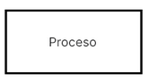
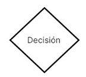
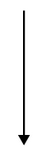
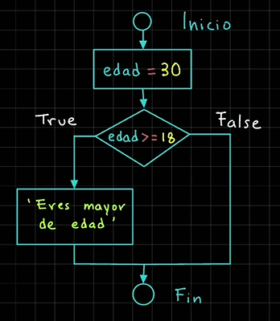
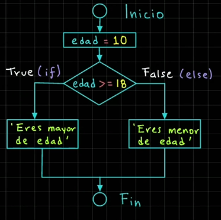
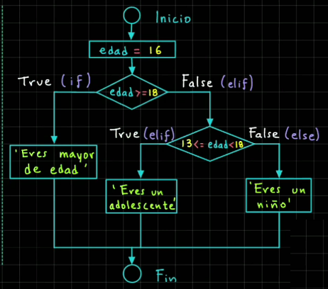
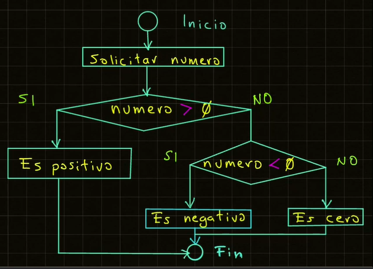

# Sentencias de decisión

Las sentencias de decisión nos permiten controlar el flujo de ejecución de un programa.

Las estructuras que podemos usar son: `if`, `else`, y `elif`

- La sentencia `if` permite ejecutar un bloque de código si la condición a evaluar es verdadera. Una condición es una expresión que evaluar a  `True` o `False`, Ej: `edad >= 18`
  
```python
# Sintaxis sentencias if
if condicion:
  # Bloque de código que se
  # Ejecuta si la condición es True
```

```python
# Ejemplo Sentencia fi
edad = 30
if edad >= 18:
  print("Eres mayor de edad.")
```

## Diagrama de Flujo

Un programa de flujo es una representación gráfica de los pasos a ejecutar para lograr un resultado específico.

Se utilizan símbolos estandarizados para representar distintos tipos de acciones:

- Un óvalo  representa el inicio o fin de un proceso:

- Un rectángulo muestra instrucciones o acciones a ejecutar

- Un rombo o diamante indica decisiones, con múltiples flujos dependiendo si la respuesta es verdadera o falsa

- Las fechas dirigen el flujo del proceso, mostrando la dirección en que se mueven la secuencia de acciones.


## Diagrama de Flujo Sentencia `if`

Dado el código siguiente, vamos a crear su diagram de flujo equivalente:

```python
# Ejemplo Sentencia if
edad = 30
if edad >= 18:
  print("Eres mayor de edad.")
```



**📄 Código :**

```python
print("*** Sentencia IF ***")

edad = 30
if edad >= 18:
    print(f"Eres mayor de edad. Tienes {edad} años")
#     print()
#     print()
# print()
# print()
```

**🟢 Ejecutar:**

```console
*** Sentencia IF ***
Eres mayor de edad. Tienes 30 años
```

## Sentencia if else

- La sentencia `else` se usa para ejecutar un bloque de código cuando la condición del `if` es falsa.

```python
# Sintaxis sentecia if else
if condicion:
  # Bloque de código que se ejecuta
  # si la condición es verdadera
else:
  # Bloque de código que se ejecuta
  # Si la condición es falsa
```

```python
# Ejemplo Sentencia if else
edad = 10
if edad >= 18:
  print("Eres mayor de edad.")
else:
  print("Eres menor de edad.")
```

### Diagrama de Flujo sentencia `if else`

Dado el siguiente código, vamos a crear el diagrama de flujo equivalente:

```python
# Ejemplo Sentencia if else
edad = 10
if edad >= 18:
  print("Eres mayor de edad.")
else:
  print("Eres menor de edad.")
```



**📄 Código :**

```python
print("*** Sentencia IF ***")

edad = 10
if edad >= 18:
    print(f"Eres mayor de edad. Tienes {edad} años")
else:
    print(f"Eres menor de edad. Tienes {edad} años")
```

**🟢 Ejecutar:**

```console
*** Sentencia IF ***
Eres menor de edad. Tienes 10 años
```

## Sentencia `if` `elif` `else`

La sentencia `elif` es una abreviatura de `else if`, y se utiliza cuando necesitamos verificar múltiples condiciones, una tras otra.

Se pueden agregar tantas nuevas condiciones de tipo `elif` como necesitemos, pero deben después de un `if` y antes de un `else`.

```python
# Sintaxis sentencia if else
if condicion1:
  # Bloque de código condicion1 True
elif condicion2:
  # Bloque de código condicion2 True
else:
  # Bloque de código condiciones False
```

```python
# Ejemplo sintaxis if elif else
edad = 16
if edad >= 18:
  print("Eres mayor de edad.")
elif 13 <= edad < 18:
  print("Eres un adolescente.")
else:
  print("Eres un niño.")
```



**📄 Código :**

```python
print("*** Sentencia IF ***")

edad = 9
if edad >= 18:
    print(f"Eres mayor de edad. Tienes {edad} años")
elif 13 <= edad < 18:
    print(f"Eres un adolescente. Tienes {edad} años")
else:
    print(f"Eres un niño. Tienes {edad} años")
```

**🟢 Ejecutar:**

```console
*** Sentencia IF ***
Eres un niño. Tienes 9 años
```

## Ejemplo Valor Positivo



**📄 Código :**

```python
print("*** Ejemplo Valor Positivo ***")

numero = int(input("Proporciona un número positivo: "))

if numero > 0:
    print(f"Número es positivo: {numero}")
elif numero < 0:
    print(f"Número es negativo: {numero}")
else:
    print(f"Número es cero: {numero}")
```

**🟢 Ejecutar:**

```console
*** Ejemplo Valor Positivo ***
Proporciona un número positivo: -3
Número es negativo: -3
```

## Tienda en línea

Crear un sistema que ofrezca descuentos dependiendo del monto de la compra, o si es miembro de la tienda.

Se deben revisar las siguientes condiciones:

1. Si ha comprado más de $1,000 y es miembro -> descuento de 10%
2. Si sólo es miembro de la tienda -> Descuento del 5%
3. Si no es miembro mi compro más de $1,000 -> Descuento del 0%

**📄 Código :**

```python
print("*** Sistema Tienda en Línea con Descuentos ***")

# condiciones
MONTO_COMPRA_DESC = 1000

monto_compra = float(input("¿Cuál fue el monto de tu compra?: "))
es_miembro = input("¿Eres miembro de la tienda (Si/No)?: ")

descuento = 0
# verificar cada case, con los datos proporcionados
if monto_compra >= MONTO_COMPRA_DESC and es_miembro.strip().lower() == "si":
    descuento = 0.1  # Descuento del 10%
elif es_miembro.strip().lower() == "si":
    descuento = 0.05  # Descuento del 5%
elif monto_compra >= MONTO_COMPRA_DESC:
    descuento = 0.03  # Descuento del 3%
else:
    descuento = 0

# Hacemos los cálculos respectivos para obtener el monto final
if descuento != 0:
    monto_descuento = monto_compra * descuento
    monto_final = monto_compra - monto_descuento
    print(
        f"""
Felicidades, has obtenido un descuento del {descuento * 100:.0f}%
Monto de la compra: ${monto_compra:.2f}
Monto del descuento: ${monto_descuento:.2f}
Monto final de la compra con descuento: ${monto_final:.2f}
          """
    )
else:
    print(
        f"""
No obtuviste ningún tipo de descuento
Te invitamos a hacerte miembro de la tienda
Monto final de la compra: ${monto_compra:.2f}
          """
    )

```

**🟢 Ejecutar:**

```console
*** Sistema Tienda en Línea con Descuentos ***
¿Cuál fue el monto de tu compra?: 1500 
¿Eres miembro de la tienda (Si/No)?: si

Felicidades, has obtenido un descuento del 10%
Monto de la compra: $1500.00
Monto del descuento: $150.00
Monto final de la compra con descuento: $1350.00
```

## Sistema de Bancario

Considerando que estamos dentro de un sistema bancario, se solicita preguntar al usuario si desea continuar dentro del sistema.

Utilizando el operador `not` para aplicar una lógica inversa se debe programar las siguientes condiciones:

- Si NO deseamos salir del sistema, imprimir: continuamos dentro del sistema.
- De lo contrario, imprimimos: Saliendo del sistema.

**📄 Código :**

```python
print("*** Bienvenidos al sistema bancario ***")

salir_sistema_txt = input("¿Deseas salir del sistema (Si/No)? ")
salir_sistema = salir_sistema_txt.strip().lower() == "si"

if not salir_sistema:
    print("Continuamos dentro del sistema")
else:
    print("Salimos del sistema")
```

**🟢 Ejecutar:**

```console
*** Bienvenidos al sistema bancario ***
¿Deseas salir del sistema (Si/No)? si
Salimos del sistema
```

## Casa de los Espejos


Supón que estás en un parque de diversiones y quieres entrar a la case de los espejos.

Sin embargo, debes cumplir con algunas condiciones.

1. Debes tener más de años
2. No debe darte miedo la oscuridad

Si se cumplen los condiciones anteriores puedes entrar.

Para realizar este ejemplos vamos utilizar el operador `not` para aplicar una lógica inversa.

**📄 Código :**

```python
print("*** Bienvenido a la casa de los espejos ***")

edad = int(input("¿Cuál es tu edad?: "))
tienes_miedo_oscuridad = input("¿Tienes miedo a la oscuridad (Si/No)?: ")
tienes_miedo_oscuridad = tienes_miedo_oscuridad.strip().lower() == "si"

if not tienes_miedo_oscuridad and edad >= 10:
    print("Puedes entrar a la casa de los espejos")
else:
    print("Lo siento, la casa de los espejos podría darte miedo")
```

**🟢 Ejecutar:**

```console
*** Bienvenido a la casa de los espejos ***
¿Cuál es tu edad?: 13
¿Tienes miedo a la oscuridad (Si/No)?: no
Puedes entrar a la casa de los espejos
```

## Operador Ternario

El operador ternario en Python es una forma compacto del agregar una condición, y el objetivo es asignar una valor a una variable dependiendo del valor de la condición.

```python
# Sintaxis Operador Ternario
resultado = valor_si_verdadero if condicion else valor_si_falso
```

```python
# Ejemplo Operador Ternario
edad = 18
es_adulto = "Sí" if edad >= 18 else "No"
print(es_adulto)
```

**📄 Código :**

```python
print("*** Operador Ternario ***")

edad = int(input("¿Cuál es tu edad?: "))

es_adulto = "Si" if edad >= 18 else "No"

print(f"¿Es un adulto?: {es_adulto}")
```

**🟢 Ejecutar:**

```console
*** Operador Ternario ***
¿Cuál es tu edad?: 12
¿Es un adulto?: No
```

## Aplicación de Salud y Fitness

Si solicita crear una aplicación de salud y fitness que solicite lo siguiente:

- Nombre del usuario
- Paso Caminados en el día

Además, definiremos las siguientes constantes:

```python
META_PASOS_DIARIO = 10000
CALORIAS_POR_PASO = 0.04 # Valor aproximado en kilocalorias
```

Con los valores anteriores debemos calcular las calorías quemadas según los pasos caminados

```python
calorias_quemadas = pasos_diarios * CALORIAS_POR_PASO
```

y Verificaremos si se cumplió la meta de paso diarios

```python
meta_alcanzada = pasos_diarios >= META_PASOS_DIARIOS
```

**📄 Código :**

```python
print("*** Aplicación de Salud y Fitness ***")

# Constantes
META_PASOS_DIARIO = 1000
CALORIAS_POR_PASO = 0.04  # Valor aproximado, son kilocalorias

# Pedimos los valores al usuario
nombre_usuario = input("¿Cuál es tu nombre?: ")
pasos_diarios = int(input("¿Cuántos pasos has caminado hoy?: "))

# Verificar si el usuario alcanzó la meta de pasos diarios
meta_alcanzada = pasos_diarios >= META_PASOS_DIARIO
meta_alcanzada_txt = "Si" if meta_alcanzada else "No"
# Calculamos las calorías quemadas
calorias_quemada = pasos_diarios * CALORIAS_POR_PASO

# Mostramos la información
print(
    f"""
Usuario: {nombre_usuario}
Pasos dados hoy: {pasos_diarios}
Calorías quemadas: {calorias_quemada} kcal
Meta de pasos diarios alcanzada: {meta_alcanzada_txt}
La meta de pasos diarios es de: {META_PASOS_DIARIO} pasos
"""
)
```

**🟢 Ejecutar:**

```console
*** Aplicación de Salud y Fitness ***
¿Cuál es tu nombre?: Sergio
¿Cuántos pasos has caminado hoy?: 15000

Usuario: Sergio
Pasos dados hoy: 15000
Calorías quemadas: 600.0 kcal
Meta de pasos diarios alcanzada: Si
La meta de pasos diarios es de: 1000 pasos
```

## Sistema Reserva Hotel

Se solicita crear un sistema de Reservación de un Hotel se debe pedir la siguiente información al usuario:

- Nombre del Usuario
- Días de estadía en el hotel
- Cuarto con vista al mar?

El hotel tiene las siguientes tarifas:

- Cuarto sin vista al mar: $150.50 por día
- Cuarto con vista al mar: $190.50 por día

El sistema debe calcular el costo total de la estadía dependiendo si escogió un cuarto con vista al mar o no. Además de indicar si escogió un cuarto con vista al mar o no.

**📄 Código :**

```python
print("*** Sistema Reserva Hotel ***")

# Variables del hotel
TARIFA_DIARIA_SIN_VISTA_MAR = 150.50
TARIFA_DIARIA_CON_VISTA_MAR = 190.50

# Pedimos la información al usuario
nombre_cliente = input("Ingresa el nombre de cliente: ")
dias_estadia = int(input("Ingresa el número de los días de estadía: "))
vista_al_mar_txt = input("Ingresa con vista al mar (Si/No): ")
vista_al_mar = vista_al_mar_txt.strip().lower == "si"

# Cálculo del costo total de la estancia
costo_total = (
    dias_estadia * TARIFA_DIARIA_CON_VISTA_MAR
    if vista_al_mar
    else dias_estadia * TARIFA_DIARIA_SIN_VISTA_MAR
)

# Mostramos los detalles de la reserva
print(
    f"""
{'-' * 10} Detalles de la Reservación {'-' * 10}
Cliente: {nombre_cliente}
Días de estandía: {dias_estadia}
Costo total: ${costo_total:.2f}
Habitación con vista al mar: {'Sí' if vista_al_mar else 'No'}
"""
)
```

**🟢 Ejecutar:**

```console
*** Sistema Reserva Hotel ***
¿Cuál es tu nombre del cliente?: Susana
¿Cuántos son tus días de estadía?: 3
¿Deseas al cuarto con vista al mar (Si/No)?: no

---------- Detalle de la Reservación ----------
Cliente: Susana
Días de estadía: 3
Costo total: $451.50
Habitación con Vista al mar: No
```

## El mayor de 2 números

crear un programa para indicar cual es el mayor de dos números
El programa debe pedir al usuario dos números enteros.
Posteriormente se deben comparar y mandar a imprimir el número mayor.

**📄 Código :**

```python
print("*** El mayor  de dos números ***")

numero1 = int(input("Ingresa un primer número entero: "))
numero2 = int(input("Ingresa un segundo número entero: "))

numero_mayor = (
    "El primer numero es mayor." if numero1 > numero2 else "El segundo numero es mayor."
)

print(
    f"El primer es: {numero1}\nEl segundo es: {numero2}\n Resultado: *** {numero_mayor} ***"
)
```

**🟢 Ejecutar:**

```console
*** El mayor  de dos números ***
Ingresa un primer número entero: 4
Ingresa un segundo número entero: -1
El primer es: 4
El segundo es: -1
 Resultado: *** El primer numero es mayor. ***
```

## Identifica la estación del año

Se solicita proporcionar el valor de un mes (valor numérico entre 1 y 12), e indicar la estación del año según lo siguiente:

meses 1, 2 o 12 -> Invierno
meses 3, 4 o 5 -> Primavera
meses 6, 7 o 8 -> Verano
meses 9, 10 o 11 -> Otoño
Cualquier otro valor -> Estación desconocida.

**📄 Código :**

```python
print("*** La estación del Año ***")

numero_mes = int(input("Introduce el número de mes entre 1 y 12: "))
mensaje = ""

match numero_mes:
    case 1 | 2 | 12:
        mensaje = "Es Invierno"
    case 3 | 4 | 5:
        mensaje = "Es Primavera"
    case 6 | 7 | 8:
        mensaje = "Es Verano"
    case 9 | 10 | 11:
        mensaje = "Es Otoño"
    case _:
        mensaje = "Introdujiste es un inválido"

print(
    f"""{'-' * 10} Estación del Año {'-' * 10}
Esta la estación: {mensaje}
"""
)
```

**🟢 Ejecutar:**

```console
*** La estación del Año ***
Introduce el número de mes entre 1 y 12: 9
---------- Estación del Año ----------
Esta la estación: Es Otoño
```
