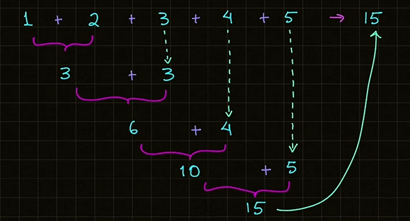

# Ciclos

## Ciclos en Python

### Ciclo while

Los ciclos en Python son estructuras de control que repitan una serie de instrucciones hasta que se cumple una condición específica.

En Python tenemos dos tipos de estructuras para ejecutar ciclos: Ciclo `while` y ciclo `for`. Comencemos con el ciclo `while`.

El ciclo `while` repite una serie de instrucciones mientras la condición a evaluar sea verdadera.

```python
# Sintaxis ciclo while:
while condicion:
  # Bloque de código a ejecutar
```

```python
# Ejemplo ciclo while:
# Imprimir de 1 a 3
contador = 1
while contador <= 3:
  print(contador)
  contador += 1
```

#### Diagrama de Flujo Ciclo `while`

Dado el siguiente código, veamos el diagrama de flujo asociado:


Valor contador = ~~1~~ 2

Resultado Condición:

`1 <= 3 -> True`

Salida a Consola

```console
1
2
3
```

**📄 Código :**

```python
print("*** Ciclo while ***")

# Imprimir los valores del 1 al 5
contador = 1
while contador <= 5:
    print(contador, end=" ")
    contador += 1  # contador = contador + 1
```

**🟢 Ejecutar:**

```console
*** Ciclo while ***
1 2 3 4 5
```

### Ciclo for

El ciclo `for` itera o recorre una secuencia de valores, por ejemplo los caracteres de una cadena, una lista, etc. y ejecuta bloque de código por cada elemento de la secuencia.

```python
# Sintaxis ciclo for
for variable in secuencia:
  # Bloque de código a ejecutar
```

```python
# Ejemplo ciclo for
cadena = 'Hola Mundo'
for letra in cadena:
  print(letra, end=' ')
```

Salida a consola:

```console
H o l a  M u n d o
```

**📄 Código :**

```python
print("*** Ciclo for ***")

print("Recorremos los caracteres de una cadena")
cadena = "Hola Mundo"
# Iteramos los caracteres
for letra in cadena:
    print(letra, end=" ")

print("\n\nRecorremos la lista de frutas:")
frutas = ["Plátano", "Fresa", "Mango", "Uva", "Manzana", "Pera", "Naranja"]
for fruta in frutas:
    print(fruta, end=" ")
```

**🟢 Ejecutar:**

```console
*** Ciclo for ***
Recorremos los caracteres de una cadena
H o l a   M u n d o

Recorremos la lista de frutas:
Plátano Fresa Mango Uva Manzana Pera Naranja
```

### Ejercicio Acumulador Suma en Ciclo

Realizar la suma de los primeros 5 números utilizando un ciclo while



**📄 Código :**

```python
print('*** Suma Acumulativa "while" ***')

# Sumar los primeros 5 números
MAXIMO = 5
numero = 1
acumulador_suma = 0

# Empezamos a iterar
while numero <= MAXIMO:
    # Imprimir lo que se va a sumar
    print(f"(acumulador_suma + numer) -> {acumulador_suma} + {numero}")
    acumulador_suma += numero
    numero += 1

    # Imprimir el resultado de la suma parcial
    print(f"Suma parcial acumulada: {acumulador_suma}")

print(f"\nResultado suma acumulado: {acumulador_suma}")
```

**🟢 Ejecutar:**

```console
*** Suma Acumulativa "while" ***
(acumulador_suma + numer) -> 0 + 1
Suma parcial acumulada: 1
(acumulador_suma + numer) -> 1 + 2
Suma parcial acumulada: 3
(acumulador_suma + numer) -> 3 + 3
Suma parcial acumulada: 6
(acumulador_suma + numer) -> 6 + 4
Suma parcial acumulada: 10
(acumulador_suma + numer) -> 10 + 5
Suma parcial acumulada: 15

Resultado suma acumulado: 15
```

### Menú Iterativo

**📄 Código :**

```python
print("*** Sistema de Administración de Cuenta ***")

salir = False
while not salir:
    print(
        f"""Menú:
          1. Crear cuenta
          2. Eliminar cuenta
          3. Salir"""
    )
    opcion = int(input("Escoge una opción: "))
    match opcion:
        case 1:
            print("Creando tu cuenta... \n")
        case 2:
            print("Eliminado tu cuenta... \n")
        case 3:
            print("Salimos del sistema. Hasta pronto!\n")
            salir = True
        case _:
            print("Opción inválida, proporciona otra opción...\n")
else:
    print("Terminando el sistema de Administración de Cuentas")
```

**🟢 Ejecutar:**

```console
*** Sistema de Administración de Cuenta ***
Menú:
          1. Crear cuenta
          2. Eliminar cuenta
          3. Salir
Escoge una opción: 1
Creando tu cuenta... 

Menú:
          1. Crear cuenta
          2. Eliminar cuenta
          3. Salir
Escoge una opción: 5
Opción inválida, proporciona otra opción...

Menú:
          1. Crear cuenta
          2. Eliminar cuenta
          3. Salir
Escoge una opción: 3
Salimos del sistema. Hasta pronto!

Terminando el sistema de Administración de Cuentas
```

### Reto - Cajero Automático

**Aplicación Cajero Automático:**

Se les deja crear la aplicación de cajero automático.
Las funciones principales de un cajero automático son: depositar, retirar y consultar el saldo.

El saldo puede tener un valor inicial por ejemplo $1,000.00

Si haces un retiro se resta de tu saldo. Y si haces un depósito se suma a tu saldo.

**📄 Código :**

```python
print("*** Aplicación de Cajero Automático ***")

salir = False
saldo = 1000.00

while not salir:
    print(
        """Operaciones que puedes realizar:
          1. Consultar Saldo
          2. Retirar
          3. Depositar
          4. Salir."""
    )
    opcion = int(input("Escoge un número de opción: "))

    match opcion:
        case 1:
            print(f"\nTu saldo actual es: {saldo:.2f}\n")
        case 2:
            monto_retirar = float(input("Ingresa el monto a retirar: "))
            if monto_retirar <= saldo:
                saldo -= monto_retirar
                print(f"\nTu nuevo saldo es: ${saldo:.2f}\n")
            else:
                print(
                    f"\nNo cuentas con el saldo suficiente. Tu saldo actual: ${saldo:.2f}\n"
                )
        case 3:
            monto_depositar = float(input("Ingresa el monto a depositar: "))
            saldo += monto_depositar
            print(f"\nTu nuevo saldo es: ${saldo:.2f}\n")
        case 4:
            salir = True
        case _:
            print(
                "\nLa opción es inválida. Ingresa de nuevo debe ser un número entero de opción...\n"
            )
else:
    print("\nSaliendo del cajero automático. ¡Hasta Pronto!")
```

**🟢 Ejecutar:**

```console
*** Aplicación de Cajero Automático ***
Operaciones que puedes realizar:
          1. Consultar Saldo
          2. Retirar
          3. Depositar
          4. Salir.
Escoge un número de opción: 2
Ingresa el monto a retirar: 3000

No cuentas con el saldo suficiente. Saldo actual: $1000.00

Operaciones que puedes realizar:
          1. Consultar Saldo
          2. Retirar
          3. Depositar
          4. Salir.
Escoge un número de opción: 3
Ingresa el monto a depositar: 5000

Tu nuevo saldo es: $6000.00

Operaciones que puedes realizar:
          1. Consultar Saldo
          2. Retirar
          3. Depositar
          4. Salir.
Escoge un número de opción: 4

Saliendo del cajero automático. ¡Hasta Pronto!
```

### Aplicación Calculadora

Crear una aplicación de calculadora con las opciones de:

1. Suma
2. Resta
3. Multiplicación
4. División

El programa debe mostrar un menú con cada opción, y debe solicitar los valores de operando 1 y operando 2 para realizar la operación seleccionada.

**📄 Código :**

```python
print("*** Calculadora en Python ***")

salir = False
operadores = ["Suma", "Resta", "Multiplicación", "División"]
num1 = num2 = resultado = 0

while not salir:
    print(
        f"""Operaciones que puedes realizar:
        1. {operadores[0]}
        2. {operadores[1]}
        3. {operadores[2]}
        4. {operadores[3]}
        5. Salir"""
    )
    opcion = int(input("Escoge una opción con número: "))

    match opcion:
        case 1:
            print("-" * 5, f"{operadores[0]}", "-" * 5)
            num1 = float(input("Ingresa el primer número: "))
            num2 = float(input("Ingresa el segundo número: "))
            resultado = num1 + num2
            print(f"\nEl resultado de la {operadores[0]} es: {resultado}\n")
        case 2:
            print("-" * 5, f"{operadores[1]}", "-" * 5)
            num1 = float(input("Ingresa el primer número: "))
            num2 = float(input("Ingresa el segundo número: "))
            resultado = num1 - num2
            print(f"\nEl resultado de la {operadores[1]} es: {resultado}\n")
        case 3:
            print("-" * 5, f"{operadores[2]}", "-" * 5)
            num1 = float(input("Ingresa el primer número: "))
            num2 = float(input("Ingresa el segundo número: "))
            resultado = num1 * num2
            print(f"\nEl resultado de la {operadores[2]} es: {resultado}\n")
        case 4:
            print("-" * 5, f"{operadores[3]}", "-" * 5)
            num1 = float(input("Ingresa el primer número: "))
            num2 = float(input("Ingresa el segundo número: "))
            if num1 == 0 or num2 == 0:
                print("Error. Debes ingresar números sin cero.\n")
            else:
                resultado = num1 / num2
                print(f"\nEl resultado de la {operadores[3]} es: {resultado}\n")
        case 5:
            print("Saliendo del aplicación calculadora. ¡Hasta pronto!")
            salir = True
        case _:
            print("Opción inválida. Debe ingresar correctamente a la opción...")
```

**🟢 Ejecutar:**

```console
*** Calculadora en Python ***
Operaciones que puedes realizar:
        1. Suma
        2. Resta
        3. Multiplicación
        4. División
        5. Salir
Escoge una opción con número: 2
----- Resta -----
Ingresa el primer número: -5
Ingresa el segundo número: 6

El resultado de la Resta es: -11.0

Operaciones que puedes realizar:
        1. Suma
        2. Resta
        3. Multiplicación
        4. División
        5. Salir
Escoge una opción con número: 3
----- Multiplicación -----
Ingresa el primer número: 4
Ingresa el segundo número: 6

El resultado de la Multiplicación es: 24.0

Operaciones que puedes realizar:
        1. Suma
        2. Resta
        3. Multiplicación
        4. División
        5. Salir
Escoge una opción con número: 3
----- Multiplicación -----
Ingresa el primer número: 3.2
Ingresa el segundo número: 2.5

El resultado de la Multiplicación es: 8.0

Operaciones que puedes realizar:
        1. Suma
        2. Resta
        3. Multiplicación
        4. División
        5. Salir
Escoge una opción con número: 4
----- División -----
Ingresa el primer número: 6
Ingresa el segundo número: 3

El resultado de la División es: 2.0

Operaciones que puedes realizar:
        1. Suma
        2. Resta
        3. Multiplicación
        4. División
        5. Salir
Escoge una opción con número: 4
----- División -----
Ingresa el primer número: 7
Ingresa el segundo número: 3

El resultado de la División es: 2.3333333333333335

Operaciones que puedes realizar:
        1. Suma
        2. Resta
        3. Multiplicación
        4. División
        5. Salir
Escoge una opción con número: 5
Saliendo del aplicación calculadora. ¡Hasta pronto!
```
