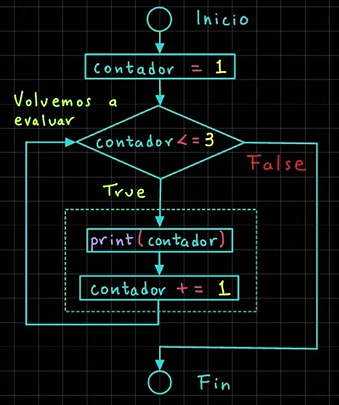

# Ciclos

## Ciclos en Python

### Ciclo while

Los ciclos en Python son estructuras de control que repitan una serie de instrucciones hasta que se cumple una condición específica.

En Python tenemos dos tipos de estructuras para ejecutar ciclos: Ciclo `while` y ciclo `for`. Comencemos con el ciclo `while`.

El ciclo `while` repite una serie de instrucciones mientras la condición a evaluar sea verdadera.

```python
# Sintaxis ciclo while:
while condicion:
  # Bloque de código a ejecutar
```

```python
# Ejemplo ciclo while:
# Imprimir de 1 a 3
contador = 1
while contador <= 3:
  print(contador)
  contador += 1
```

#### Diagrama de Flujo Ciclo `while`

Dado el siguiente código, veamos el diagrama de flujo asociado:



Valor contador = ~~1~~ 2

Resultado Condición:

`1 <= 3 -> True`

Salida a Consola

```console
1
2
3
```

**📄 Código :**

```python
print("*** Ciclo while ***")

# Imprimir los valores del 1 al 5
contador = 1
while contador <= 5:
    print(contador, end=" ")
    contador += 1  # contador = contador + 1
```

**🟢 Ejecutar:**

```console
*** Ciclo while ***
1 2 3 4 5
```

