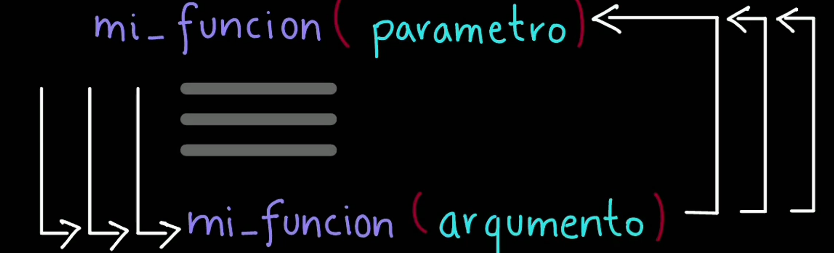
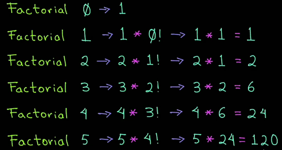
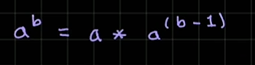
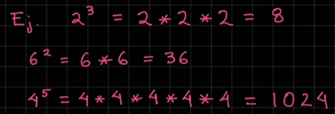

# Funciones

## Funciones en Python

Las funciones son bloque de código para realizar una tarea en particular.

Las funciones se pueden reutilizar en diferentes partes de un programa.

````python
# sintaxis definición de una función
# 1. Definición de la función (verbo o accion)
def nombre_de_la_funcion(parametro1, parametro2):
    # 2. Cuerpo de la función
    resultado = parametro1 + parametro2
    return resultado  # Devuelve un valor # 8
````

````python
# Llamada a la función
resultado_final = nombre_de_la_funcion(5, 3)
print(resultado_final)  # Imprime 8
````

### Ventajas de las funciones

- **Modularidad:** Las funciones permiten dividir un programa en partes más pequeñas y manejables. Cada función puede
  ser desarrollada por separado e incluso por distintos programadores, creando al final programas más complejos.
- **Reutilización:** Una vez creada la función, podemos utilizarla tantas veces como necesitemos. Esto evita duplicación
  de código y minimiza los errores.
- **Mantenimiento:** Modificar un programa que usa funciones es más fácil. Podemos localizar los errores más rápidamente
  y corregirlos. Esto reduce el riesgo de efectos no deseados en otras partes del programa.
- **Parametrización:** Las funciones pueden ser diseñadas para aceptar parámetro, lo que hace más flexibles nuestros
  programas.
- **Colaboración:** En proyectos grandes, el uso de módulos (archivos con múltiples funciones) se hace imprescindible,
  al colaborar varios programadores

**📄 Código :**

```python
print("*** Funciones en Python ***")


# Definir una función para mandar a saludar
def saludar():  # Firma del método
    # Cuerpo de la función
    print("Saludos desde una función...")


# Programa principal, llamamos a la función
saludar()
saludar()
saludar()
```

**🟢 Ejecutar:**

```console
*** Funciones en Python ***
Saludos desde una función...
Saludos desde una función...
Saludos desde una función...
```

### Manejo de Parámetros en una función

**📄 Código :**

```python
print("*** Funciones en Python ***")


# Definir una función para mandar a saludar
# Definir un parámetro y puede ser (mensaje:str) es variable estática
def saludar(mensaje):  # Firma del método
    # Cuerpo de la función
    print(f"Mensaje Recibido: {mensaje}")


# Programa principal, llamamos a la función
saludar("Hola a todos")
```

**🟢 Ejecutar:**

```console
*** Funciones en Python ***
Mensaje Recibido: Hola a todos
```

### Función Suma

**📄 Código :**

```python
print("*** Función suma ***")


# Definimos la función
def sumar(a, b):
    resultado_suma = a + b
    return resultado_suma


# Llamar a la función
resultado_funcion = sumar(8, 5)
print(f"Resultado función Suma: {resultado_funcion}")

resultado_funcion = sumar(9, 15)
print(f"Resultado función Suma: {resultado_funcion}")
```

**🟢 Ejecutar:**

```console
*** Función suma ***
Resultado función Suma: 13
Resultado función Suma: 24
```

### Módulos en Funciones

**📄 Código :**

```python
from py_03_sumar import sumar

print("*** Módulo Función Suma ***")

# Llamar a la función
if __name__ == "__main__":
    resultado_funcion = sumar(8, 5)
    print(f"Resultado función Suma: {resultado_funcion}")
```

**🟢 Ejecutar:**

```console
*** Módulo Función Suma ***
Resultado función Suma: 13
```

### Argumentos por nombres en una función

**📄 Código :**

```python
print("*** Función con argumentos por nombre ***")


def imprimir_persona(nombre, apellido="", edad=0):
    print(f"Persona: nombre = {nombre}, apellido = {apellido}, edad = {edad}")


# Primero llamamos la función pasando los argumentos de manera posicional
imprimir_persona("Ricardo", "Quintana", 32)
# Llamar la función usando argumentos por nombre, pero intercambiando el orden
imprimir_persona(edad=28, apellido="Rojas", nombre="Carlos")
# Argumentos con valor por default
imprimir_persona(nombre="Carlos")
imprimir_persona(nombre="Carlos", apellido="Rojas")
imprimir_persona(edad=28, nombre="Carlos")
```

**🟢 Ejecutar:**

```console
*** Función con argumentos por nombre ***
Persona: nombre = Ricardo, apellido = Quintana, edad = 32
Persona: nombre = Carlos, apellido = Rojas, edad = 28
Persona: nombre = Carlos, apellido = , edad = 0
Persona: nombre = Carlos, apellido = Rojas, edad = 0
Persona: nombre = Carlos, apellido = , edad = 28
```

### Regresar una tupla de valores desde una función

**📄 Código :**

```python
print("*** Regresar una tupla de valores desde una función ***")


# Definición de la función
def persona_mayusculas(nombre, apellido, edad):
    print(f"Esta función regresa varios valores (tuplas)")
    return nombre.upper(), apellido.upper(), edad


# Programa Principal
nombre, apellido, edad = persona_mayusculas("Sandra", "Jimenez", 42)
print(f"Resultado Persona: Nombre = {nombre}, apellido = {apellido}, edad = {edad}")
```

**🟢 Ejecutar:**

```console
*** Regresar una tupla de valores desde una función ***
Esta función regresa varios valores (tuplas)
Resultado Persona: Nombre = SANDRA, apellido = JIMENEZ, edad = 42
```

### Coordenadas en una función de Tuplas

**📄 Código :**

```python
print("*** Obtener coordenadas ***")


def obtener_coordenadas():
    x, y, z = 10, 20, 30
    return x, y, z


# Llama la función
resultado = obtener_coordenadas()
print(resultado)

# Unpacking de la tupla
x1, y1, z1 = resultado
print(f"Coordenada x = {x1}, Coordenada y = {y1}, Coordenada z = {z1}")
```

**🟢 Ejecutar:**

```console
*** Obtener coordenadas ***
(10, 20, 30)
Coordenada x = 10, Coordenada y = 20, Coordenada z = 30
```

### Alcance de Variables

Las variables pueden tener un alcance global o local dependiendo de dónde y cómo se declaren

Las variables globales son aquellos que están disponibles a lo largo de todo el programa

Mientras que las variables locales sólo están disponibles dentro del bloque de código o la función donde fueron
declaradas.

**📄 Código :**

```python
print("*** Alcance de Variables ***")

# Variable global
contador_global: int = 0


def incrementar_contador():
    # Declaramos una variable local
    contador_local = 0
    # usar la variable global
    global contador_global
    # Incrementamos la variable global
    contador_global += 1
    # Incrementamos la variable local
    contador_local += 1
    # Imprimimos ambos contadores
    print("Contador local:", contador_local)
    print("Contador global:", contador_global, "\n")


#  Llamamos varias veces la función
incrementar_contador()
incrementar_contador()
incrementar_contador()

# Terminando el programa
print("Valor variable global:", contador_global)
```

**🟢 Ejecutar:**

```console
*** Alcance de Variables ***
Contador local: 1
Contador global: 1 

Contador local: 1
Contador global: 2 

Contador local: 1
Contador global: 3 

Valor variable global: 3
```

### Argumentos variables *args

En Python, los argumentos variables permiten que una función acepte un número arbitrario de elementos. Hay dos tipos
principales

1. **Argumentos posicionales variables `*args`:** Permite pasar múltiples argumentos posicionales a una función,
   recibiéndolos como una tupla dentro de la función.
2. **Argumentos con Palabra Clave `**kwargs`:** Recibe los argumentos en forma de diccionario (llave - valor o key -
   value).

**📄 Código :**

```python
print("*** Argumentos Variables ***")


def superheroe_superpoderes(superheroe, nombre, *args):
    print(f"Superheroe: {superheroe} - {nombre} - {args}")
    for superporder in args:
        print(f"\tSuperpoder: {superporder}")


# Llama la función
superheroe_superpoderes("Spiderman", "Peter Parker", "Instinto Arácnido", "Teleraña")
superheroe_superpoderes("Ironman", "Tony Stark", "Armadura", "Playboy", "Millonario")

# Es opcional enviar argumentos variables
superheroe_superpoderes("Mi vecino", "Juan Perez")

```

**🟢 Ejecutar:**

```console
*** Argumentos Variables ***
Superheroe: Spiderman - Peter Parker - ('Instinto Arácnido', 'Teleraña')
	Superpoder: Instinto Arácnido
	Superpoder: Teleraña
Superheroe: Ironman - Tony Stark - ('Armadura', 'Playboy', 'Millonario')
	Superpoder: Armadura
	Superpoder: Playboy
	Superpoder: Millonario
Superheroe: Mi vecino - Juan Perez - ()
```

### Argumentos variables **kwargs

**📄 Código :**

```python
# *args -> argumentos = tuplas
# **kwargs -> keyword argumentos (key, value) como un dict

print("*** Argumentos Variables en forma de dict ***")


def superheroe_superpoderes(nombre, *args, **kwargs):
    print(f"Superheroe: {nombre} - {args} - Más info: {kwargs}")


# Llama la función
superheroe_superpoderes("Spiderman", "Instinto Arácnido", edad=17, empresa="Marvel")
superheroe_superpoderes("Ironman", "Armadura", "Playboy", edad=45)

# Es opcional enviar argumentos variables
superheroe_superpoderes("Mi vecino", personalidad="Buena onda!")

```

**🟢 Ejecutar:**

```console
*** Argumentos Variables en forma de dict ***
Superheroe: Spiderman - ('Instinto Arácnido',) - Más info: {'edad': 17, 'empresa': 'Marvel'}
Superheroe: Ironman - ('Armadura', 'Playboy') - Más info: {'edad': 45}
Superheroe: Mi vecino - () - Más info: {'personalidad': 'Buena onda!'}
```

### Suma con Argumentos Variables

**📄 Código :**

```python
print("*** Suma con Argumentos Variables ***")


# Función sumar que acepta argumentos variables
def sumar(*args):
    total = 0
    for numero in args:
        total += numero
    return total


# Llamamos a la función sumar
resultado = sumar(1, 2, 3, 4, 5, 6, 7, 8, 9, 10)
print("Resultado de la suma:", resultado)

```

**🟢 Ejecutar:**

```console
*** Suma con Argumentos Variables ***
Resultado de la suma: 55
```

### con kwargs - Detalle de Persona

**📄 Código :**

```python
print("*** Imprimir detalles de una persona usando kwargs ***")


# Función que acepta argumentos variables en forma de llave-valor dict
def imprimir_detalle_persona(**kwargs):
    print("\nValores recibidos:")
    for llave, valor in kwargs.items():
        print(f"{llave}:{valor}")


imprimir_detalle_persona(nombre="Karla", edad=30, ciudad="México")
imprimir_detalle_persona(nombre="Carlos", edad=28, ciudad="Colombia", puesto="Gerente")

```

**🟢 Ejecutar:**

```console
*** Imprimir detalles de una persona usando kwargs ***

Valores recibidos:
nombre:Karla
edad:30
ciudad:México

Valores recibidos:
nombre:Carlos
edad:28
ciudad:Colombia
puesto:Gerente
```

### Función de pares

**📄 Código :**

```python
print("*** Función par ***")


# Función para saber si un número es par o no
def es_par(numero):
    if numero % 2 == 0:
        return True
    else:
        return False


# LLamamos a la función
if __name__ == "__main__":
    numero = int(input("Proporciona un valor numérico: "))
    print("¿Número par?:", es_par(numero))

```

**🟢 Ejecutar:**

```console
*** Función par ***
Proporciona un valor numérico: 3
¿Número par?: False
```

### Funciones Recursivas



#### Reglas Funciones Recursivas

1. Una función que se llama a sí misma
   
2. Debe avanzar hacia un caso base, de lo contrario caemos en ciclos infinitos.

````text
# Con cada llamada recursiva nos acercamos al caso base
mi_funcion(n)
    Si n == 1 Entonces
        regresa n
    SiNo
        mi_funcion(n - 1)
````

**📄 Código :**

```python
print("*** Imprimir del 1 al 5 de forma recursiva ***")


# Definir la función recursiva
def funcion_recursiva(numero):
    # Caso Base
    if numero == 1:
        print(numero, end=" ")  # 1
    else:
        funcion_recursiva(numero - 1)
        print(numero, end=" ")  # 1


# Programa Principal
funcion_recursiva(5)

```

**🟢 Ejecutar:**

```console
*** Imprimir del 1 al 5 de forma recursiva ***
1 2 3 4 5 
```

### Factorial de un Número con Recursividad



**📄 Código :**

```python
print("*** Factorial de un Número con Recursividad ***")


# Definimos la función factorial recursiva
def factorial_recursiva(numero):
    # Caso Base, factorial 0! = 1, 1! = 1
    if numero == 0 or numero == 1:
        print(f"Resultado factorial parcial {numero} es: 1")
        return 1
    else:  # Caso Recursivo
        factorial_parcial = numero * factorial_recursiva(numero - 1)
        print(f"Resultado factorial parcial {numero} es: {factorial_parcial}")
        return factorial_parcial


numero = 5
resultado = factorial_recursiva(numero)
print(f"El factorial de {numero} es: {resultado}")
```

**🟢 Ejecutar:**

```console
*** Factorial de un Número con Recursividad ***
Resultado factorial parcial 1 es: 1
Resultado factorial parcial 2 es: 2
Resultado factorial parcial 3 es: 6
Resultado factorial parcial 4 es: 24
Resultado factorial parcial 5 es: 120
El factorial de 5 es: 120
```

### Potencia de un Número usando funciones recursivas

Calcular la potencia de un número usando una función recursiva la fórmula es:



Donde "a" es la base y "b" es la potencia, lo que significa multiplicar a por sí mismo 'b' veces



El caso base, exponente == 0 -> 1

**📄 Código :**

```python
print("*** Potencia de un Número usando funciones recursivas ***")


def potencia(base, exponente):
    # Caso  Base
    if exponente == 0:
        return 1
    else:  # Caso recursivo
        return base * potencia(base, exponente - 1)


print(f"2 elevado a la 3: {potencia(2, 3)}")
print(f"5 elevado a la 0: {potencia(5, 0)}")
print(f"4 elevado a la 5: {potencia(4, 5)}")

```

**🟢 Ejecutar:**

```console
*** Potencia de un Número usando funciones recursivas ***
2 elevado a la 3: 8
5 elevado a la 0: 1
4 elevado a la 5: 1024
```

### Sistema de Inventario

Crear un sistema de inventario que tenga las siguientes opciones:

Mostrar un menú:

1. Mostrar inventario
2. Agregar nuevo producto
3. Buscar producto por ID
4. Salir

Detalle de un Producto

- ID
- Nombre
- Precio
- Cantidad

**📄 Código :**

```python
print("*** Sistema de Inventarios (con funciones) ***")

# Inventario del almacén
inventario = []
titulo = ["Menú", "Mostar", "Agregar", "Buscar", "Salir", "¡Error!"]
id_add = 0


def barrar_titulo(numero: int):
    return "-" * 20 + titulo[numero] + "-" * 20


def mostrar_inventario():
    print(barrar_titulo(1))
    if not inventario:
        print(barrar_titulo(5))
        print(
            "El inventario ha sido vacío."
            "\nDebes ingresar agregado un nuevo producto en 2 punto de opción..."
        )
        return
    for producto in inventario:
        print(
            f"ID: {producto.get('id')}, Nombre: {producto.get('nombre')}, "
            f"Precio: ${producto.get('precio')}, Cantidad: {producto.get('cantidad')}"
        )


def agregar_producto():
    print(barrar_titulo(2))
    global id_add
    print("Proporciona nuevo producto:")
    nombre = input("Nombre: ")
    precio = float(input("Precio: "))
    cantidad = int(input("Cantidad: "))
    nuevo_producto = {
        "id": id_add,
        "nombre": nombre,
        "precio": precio,
        "cantidad": cantidad,
    }
    inventario.append(nuevo_producto)
    id_add += 1
    print("Producto agregado al inventario")


def buscar_producto_por_id():
    print(barrar_titulo(3))
    if not inventario:
        print(barrar_titulo(5))
        print(
            "El inventario ha sido vacío."
            "\nDebes ingresar agregado un nuevo producto en 2 punto de opción..."
        )
        return
    print("Buscar Producto por ID")
    id_buscar = int(input("Ingresa el ID a buscar: "))
    for producto in inventario:
        if producto.get("id") == id_buscar:
            print("-" * 5, "Información del Producto encontrado:", "" * 5)
            print(
                f"ID: {producto.get('id')}, "
                f"Nombre: {producto.get('nombre')}, "
                f"Precio: ${producto.get('precio')}, "
                f"Cantidad: {producto.get('cantidad')}"
            )
            return
    print("Producto NO encontrado.")


def salir():
    print(barrar_titulo(4))
    print("Has salido el sistema de inventario")


# Programa Principal
if __name__ == "__main__":
    while True:
        print(barrar_titulo(1))
        print("\t1. Mostrar inventario")
        print("\t2. Agregar nuevo producto")
        print("\t3. Buscar producto por ID ")
        print("\t4. Salir")
        try:
            option: int = int(input("Proporciona una opción (1-4): "))
            match option:
                case 1:  # Mostrar un inventario
                    mostrar_inventario()
                case 2:  # Agregar nuevo producto
                    agregar_producto()
                case 3:  # Buscar producto por ID
                    buscar_producto_por_id()
                case 4:  # Salir
                    salir()
                    break

        except ValueError:
            print(barrar_titulo(5))
            print("Entrada no válida. Debes ingresar un número entero.")

```

**🟢 Ejecutar:**

```console
*** Sistema de Inventarios (con funciones) ***
--------------------Mostar--------------------
	1. Mostrar inventario
	2. Agregar nuevo producto
	3. Buscar producto por ID 
	4. Salir
Proporciona una opción (1-4): 2
--------------------Agregar--------------------
Proporciona nuevo producto:
Nombre: Camiseta
Precio: 43.99
Cantidad: 34
Producto agregado al inventario
--------------------Mostar--------------------
	1. Mostrar inventario
	2. Agregar nuevo producto
	3. Buscar producto por ID 
	4. Salir
Proporciona una opción (1-4): 1
--------------------Mostar--------------------
ID: 0, Nombre: Camiseta, Precio: $43.99, Cantidad: 34
--------------------Mostar--------------------
	1. Mostrar inventario
	2. Agregar nuevo producto
	3. Buscar producto por ID 
	4. Salir
Proporciona una opción (1-4): 2
--------------------Agregar--------------------
Proporciona nuevo producto:
Nombre: Pantalon
Precio: 60.99
Cantidad: 30
Producto agregado al inventario
--------------------Mostar--------------------
	1. Mostrar inventario
	2. Agregar nuevo producto
	3. Buscar producto por ID 
	4. Salir
Proporciona una opción (1-4): 1
--------------------Mostar--------------------
ID: 0, Nombre: Camiseta, Precio: $43.99, Cantidad: 34
ID: 1, Nombre: Pantalon, Precio: $60.99, Cantidad: 30
--------------------Mostar--------------------
	1. Mostrar inventario
	2. Agregar nuevo producto
	3. Buscar producto por ID 
	4. Salir
Proporciona una opción (1-4): 3
--------------------Buscar--------------------
Buscar Producto por ID
Ingresa el ID a buscar: 1
----- Información del Producto encontrado: 
ID: 1, Nombre: Pantalon, Precio: $60.99, Cantidad: 30
--------------------Mostar--------------------
	1. Mostrar inventario
	2. Agregar nuevo producto
	3. Buscar producto por ID 
	4. Salir
Proporciona una opción (1-4): 4
--------------------Salir--------------------
Has salido el sistema de inventario
```

### Máquina de Snacks

Crea un programa donde podrás comprar snack de una lista inicial

Cada snack tiene su id, nombre y precio

Para comprar un snack se debe indicar el ID del snack a comprar y se agregará a una lista de productos comprados

Además, se debe mostrar el ticket de venta final con el total de productos y el total de la venta.

**📄 Código :**

```python
print("*** Máquina de Snacks ***")

# Definimos la lista de snacks inicial
snacks = [
    {"id": 1, "nombre": "Papas", "precio": 30},
    {"id": 2, "nombre": "Refresco", "precio": 50},
    {"id": 3, "nombre": "Sandwich", "precio": 120},
]

# Lista de productos (vacíos). Son los snacks ya comprados
productos = []


def mostrar_snacks():
    print("-" * 15, "Snacks Disponibles", "-" * 15)
    for snack in snacks:
        print(
            f"\tID: {snack.get('id')} -> {snack.get('nombre')} - ${snack.get('precio')}"
        )


def buscar_snack_por_id(id_buscar):
    for snack in snacks:
        if snack.get("id") == id_buscar:
            return snack
    # Si llegamos al final y no se encontró el snack regresa None
    return None


def comprar_snacks():
    print(f"{'-' * 15} Comprar Snacks {'-' * 15}")
    id_snack = int(input("¿Qué snack quieres comprar (id): "))
    snack_encontrado = buscar_snack_por_id(id_snack)
    if snack_encontrado is not None:
        productos.append(snack_encontrado)
        print(f"Snack agregado: {snack_encontrado}")
    else:
        print(f"Snack NO encontrado con el ID: {id_snack}")


def mostrar_ticket():
    ticket = f"\t{10 * '-'} Ticket de Venta {10 * '-'}"
    total = 0
    for producto in productos:
        ticket += f"\n\t- {producto.get('nombre')} - ${producto.get('precio')}"
        total += producto.get("precio")
    ticket += f"\n\tTotal: ${total}"
    print(ticket)


# Programa Principal
if __name__ == "__main__":
    # Creamos el menú
    while True:
        print("-" * 15, "Menú", "-" * 15)
        print("\t1. Mostrar Snacks")
        print("\t2. Comprar Snack")
        print("\t3. Mostrar Ticket")
        print("\t4. Salir")

        option = int(input("Escoge una opción: "))
        if option == 1:
            mostrar_snacks()
        elif option == 2:
            comprar_snacks()
        elif option == 3:
            mostrar_ticket()
        elif option == 4:
            print("-" * 15, "Salir", "-" * 15)
            print("¡Regresa Pronto!")
            break
        else:
            print("-" * 15, "Opción inválida", "-" * 15)
            print("Proporciona otra opción.")

```

**🟢 Ejecutar:**

```console
*** Máquina de Snacks ***
--------------- Menú ---------------
	1. Mostrar Snacks
	2. Comprar Snack
	3. Mostrar Ticket
	4. Salir
Escoge una opción: 1
--------------- Snacks Disponibles ---------------
	ID: 1 -> Papas - $30
	ID: 2 -> Refresco - $50
	ID: 3 -> Sandwich - $120
--------------- Menú ---------------
	1. Mostrar Snacks
	2. Comprar Snack
	3. Mostrar Ticket
	4. Salir
Escoge una opción: 2
--------------- Comprar Snacks ---------------
¿Qué snack quieres comprar (id): 2
Snack agregado: {'id': 2, 'nombre': 'Refresco', 'precio': 50}
--------------- Menú ---------------
	1. Mostrar Snacks
	2. Comprar Snack
	3. Mostrar Ticket
	4. Salir
Escoge una opción: 2
--------------- Comprar Snacks ---------------
¿Qué snack quieres comprar (id): 3
Snack agregado: {'id': 3, 'nombre': 'Sandwich', 'precio': 120}
--------------- Menú ---------------
	1. Mostrar Snacks
	2. Comprar Snack
	3. Mostrar Ticket
	4. Salir
Escoge una opción: 3
	---------- Ticket de Venta ----------
	- Refresco - $50
	- Sandwich - $120
	Total: $170
--------------- Menú ---------------
	1. Mostrar Snacks
	2. Comprar Snack
	3. Mostrar Ticket
	4. Salir
Escoge una opción: 4
--------------- Salir ---------------
¡Regresa Pronto!
```

### Calculadora (Con Funciones)

Crear un programa para agregar las operaciones básicas de una calculadora.

Las operaciones que debe poder realizar son:

1. Sumar
2. Restar
3. Multiplicar
4. Dividir

Se debe agregar un menú para mostrar cada opción.

**📄 Código :**

```python
print("*** Calculadora con Funciones ***")


def mostrar_menu():
    print(
        """Operaciones que puedes realizar:
    1. Suma
    2. Resta
    3. Multiplicación
    4. División
    5. Salir"""
    )
    return int(input("Escoge una opción: "))


def pedir_valores():
    operacion1 = float(input("Dame el valor 1: "))
    operacion2 = float(input("Dame el valor 2: "))
    return operacion1, operacion2


# Método de ejecutar la operación
def ejecutar_operacion(option, salir):
    # Solicitar los valores de los operaciones
    if 1 <= option <= 4:
        operacion1, operacion2 = pedir_valores()
    resultado = 0
    match option:
        case 1:
            resultado = operacion1 + operacion2
            print(f"El resultado de la suma es: {resultado}")
        case 2:
            resultado = operacion1 - operacion2
            print(f"El resultado de la resta es: {resultado}")
        case 3:
            resultado = operacion1 * operacion2
            print(f"El resultado de la multiplicación es: {resultado}")
        case 4:
            resultado = operacion1 / operacion2
            print(f"El resultado de la división es: {resultado}")
        case 5:
            print("Saliendo del programa de calculadora, ¡Hasta pronto!")
            salir = True
        case _:
            print("Opción Inválida.\nDebes escoger correctamente la opción.")
    return salir


# Programa principal
if __name__ == "__main__":
    salir = False
    while not salir:
        option = mostrar_menu()
        salir = ejecutar_operacion(option, salir)

```

**🟢 Ejecutar:**

```console
*** Calculadora con Funciones ***
Operaciones que puedes realizar:
    1. Suma
    2. Resta
    3. Multiplicación
    4. División
    5. Salir
Escoge una opción: 1
Dame el valor 1: 4
Dame el valor 2: 5
El resultado de la suma es: 9.0
Operaciones que puedes realizar:
    1. Suma
    2. Resta
    3. Multiplicación
    4. División
    5. Salir
Escoge una opción: 4
Dame el valor 1: 4
Dame el valor 2: 2
El resultado de la división es: 2.0
Operaciones que puedes realizar:
    1. Suma
    2. Resta
    3. Multiplicación
    4. División
    5. Salir
Escoge una opción: 7
Opción Inválida.
Debes escoger correctamente la opción.
Operaciones que puedes realizar:
    1. Suma
    2. Resta
    3. Multiplicación
    4. División
    5. Salir
Escoge una opción: 5
Saliendo del programa de calculadora, ¡Hasta pronto!
```

### Ejercicio: Calculadora de Impuestos

Crear una función para calcular el total de un pago un impuesto aplicado.

**Formula:** `pago_total = pago_sin_impuesto + pago_sin_impuesto * (impuesto/100)`

**📄 Código :**

```python
# Ejercicio: Calculadora de impuesto

print("*** Calculadora de Impuestos")


# Función que calcula el total de un pago incluyendo el impuesto
def calcular_total_pago(pago_sin_impuesto, impuesto):
    pago_total: float = pago_sin_impuesto + pago_sin_impuesto * (impuesto / 100)
    return pago_total


# Programa Principal
if __name__ == "__main__":
    pago_sin_impuesto = float(input("Proporcione el pago sin impuesto: "))
    impuesto = float(input("Proporcione el monto del impuesto: "))
    pago_con_impuesto = calcular_total_pago(pago_sin_impuesto, impuesto)
    print(f"Pago con impuesto: {pago_con_impuesto}")

```

**🟢 Ejecutar:**

```console
*** Calculadora de Impuestos
Proporcione el pago sin impuesto: 1000
Proporcione el monto del impuesto: 16
Pago con impuesto: 1160.0
```
