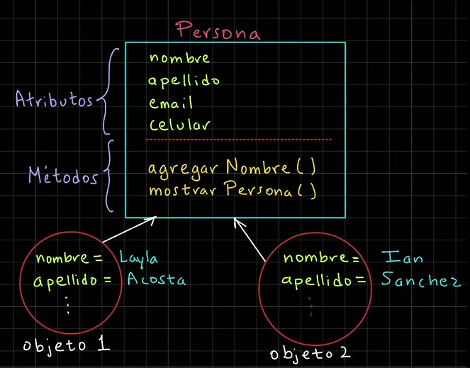
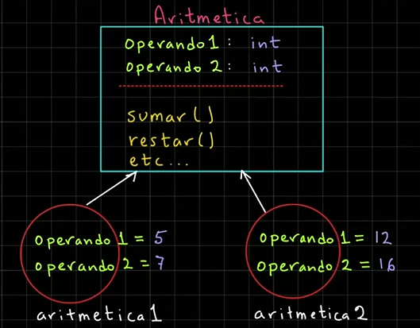
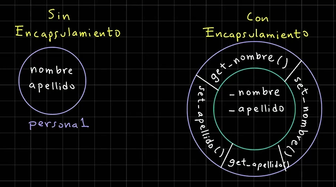
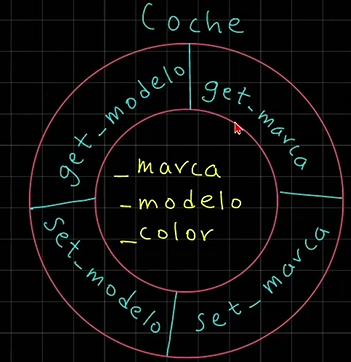

# Clases y Objetos

## Clases y Objetos

Python es un lenguaje orientado a objetos.
Un objeto es una representación de una entidad de la vida real en nuestro programa.
Para crear un objeto primero necesitamos crear una clase o plantilla.
Una clase representa las características en común de nuestros objetos. Es una abstracción.
Por ejemplo, si queremos construir un edificio, primero necesitamos su plano, es decir, una clase o plantilla, y a
partir de ese plano, podemos generar muchos edificios similares, es decir, los objetos

### Elementos de una Clase

Una clase se compone de atributos y métodos.
Los atributos son las características de nuestros objetos.

Los métodos son las acciones que pueden realizar nuestros objetos. En sí, estas acciones son funciones, pero cuando se
asocian con una clase se les llama métodos.

Una vez que hemos definido nuestra clase, podemos crear objetos, a esto se le llama instancia una clase.



**📄 Código :**

```python
# Definición de una clase
class Persona:
    def inicializar_persona(self, nombre, apellido):
        # Creamos los atributos de la clase
        self.nombre = nombre
        self.apellido = apellido

    def mostrar_persona(self):
        print(
            f"""Persona:
    Nombre: {self.nombre}
    Apellido: {self.apellido}"""
        )


# Creación de objetos
if __name__ == "__main__":
    # Creación de un primer objeto
    persona1 = Persona()  # Crea un objeto vacio en memoria
    persona1.inicializar_persona("Layla", "Acosta")
    persona1.mostrar_persona()

    # Creamos un segundo objeto
    persona2 = Persona()  # Crea un objeto vacío en memoria
    persona2.inicializar_persona("Ian", "Sánchez")
    persona2.mostrar_persona()

```

**🟢 Ejecutar:**

```console
Persona:
    Nombre: Layla
    Apellido: Acosta
Persona:
    Nombre: Ian
    Apellido: Sánchez
```

### Constructores

Un constructor es un método especial y se utiliza para crear un objeto, o instancia una clase.

Además, nos puede servir para crear e inicializar los atributos de un nuevo objeto.

````python
# Sintaxis de un constructor
class NombreDeLaClase:
    # __init()__ -> El método init se conoce como un método mágico o de tipo dunder (double underscore)
    def __init__(self, parametro1, parametro2):
        self.parametro1 = parametro1
        self.parametro2 = parametro2
````

````python
# Ejemplo de un contructor
class Persona:
    def __init__(self, nombre, apellido):
        self.nombre = nombre
        self.apellido = apellido
````

**📄 Código :**

```python
# Definición de una clase
class Persona:
    def __init__(self, nombre, apellido):
        # Creamos los atributos de la clase
        self.nombre = nombre
        self.apellido = apellido

    def mostrar_persona(self):
        print(
            f"""Persona:
    Nombre: {self.nombre}
    Apellido: {self.apellido}"""
        )


# Creación de objetos
if __name__ == "__main__":
    # Creación de un primer objeto
    persona1 = Persona("Layla", "Acosta")  # Crea un objeto vacio en memoria
    # persona1.inicializar_persona("Layla", "Acosta")
    persona1.mostrar_persona()

    # Creamos un segundo objeto
    persona2 = Persona("Ian", "Sánchez")  # Crea un objeto vacío en memoria
    # persona2.inicializar_persona("Ian", "Sánchez")
    persona2.mostrar_persona()

```

**🟢 Ejecutar:**

```console
Persona:
    Nombre: Layla
    Apellido: Acosta
Persona:
    Nombre: Ian
    Apellido: Sánchez
```

### Dirección de Memoria de Objetos

La dirección de memoria de un objeto en Python es un identificador único que permite acceder y gestionar su ubicación en
la memoria.

**📄 Código :**

```python
# Definición de una clase
class Persona:
    def __init__(self, nombre, apellido):
        # Creamos los atributos de la clase
        self.nombre = nombre
        self.apellido = apellido

    def mostrar_persona(self):
        print(
            f"""Persona:
    Nombre: {self.nombre}
    Apellido: {self.apellido}"""
        )
        print(f"Dir. mem self: {id(self)}")
        print(f"Dir. mem hex self: {hex(id(self))}")


# Creación de objetos
if __name__ == "__main__":
    # Creación de un primer objeto
    persona1 = Persona("Layla", "Acosta")  # Crea un objeto vacio en memoria
    persona1.mostrar_persona()
    print(f"Dir. mem persona1: {id(persona1)}")
    print(f"Dir. mem hex persona1: {hex(id(persona1))}")

    # Creamos un segundo objeto
    persona2 = Persona("Ian", "Sánchez")  # Crea un objeto vacío en memoria
    persona2.mostrar_persona()
    print(f"Dir. mem persona2: {id(persona2)}")
    print(f"Dir. mem hex persona2: {hex(id(persona2))}")

```

**🟢 Ejecutar:**

```console
Persona:
    Nombre: Layla
    Apellido: Acosta
Dir. mem self: 2035009539776
Dir. mem hex self: 0x1d9d0054ec0
Dir. mem persona1: 2035009539776
Dir. mem hex persona1: 0x1d9d0054ec0
Persona:
    Nombre: Ian
    Apellido: Sánchez
Dir. mem self: 2035036933008
Dir. mem hex self: 0x1d9d1a74b90
Dir. mem persona2: 2035036933008
Dir. mem hex persona2: 0x1d9d1a74b90
```

### Clase Aritmética



**📄 Código :**

```python
class Aritmetica:
    def __init__(self, operando1, operando2):
        self.operando1 = operando1
        self.operando2 = operando2

    def sumar(self):
        resultado = self.operando1 + self.operando2
        print(f"Resultado de la suma: {resultado}")

    def restar(self):
        resultado = self.operando1 - self.operando2
        print(f"Resultado de la resta: {resultado}")

    def multiplicar(self):
        resultado = self.operando1 * self.operando2
        print(f"Resultado de la multiplicación: {resultado}")

    def dividir(self):
        resultado = self.operando1 / self.operando2
        print(f"Resultado de la división: {resultado}")


# Programa principal
if __name__ == "__main__":
    print("*** Ejemplo clase Aritmética ***")
    aritmetica1 = Aritmetica(5, 7)
    aritmetica1.sumar()
    aritmetica1.restar()
    aritmetica1.multiplicar()
    aritmetica1.dividir()
    # Segundo objeto
    aritmetica2 = Aritmetica(12, 16)
    print()
    aritmetica2.sumar()
    aritmetica2.restar()

```

**🟢 Ejecutar:**

```console
*** Ejemplo clase Aritmética ***
Resultado de la suma: 12
Resultado de la resta: -2
Resultado de la multiplicación: 35
Resultado de la división: 0.7142857142857143

Resultado de la suma: 28
Resultado de la resta: -4
```

### Flexibilidad de Constructores

**📄 Código :**

```python
class Aritmetica:
    # Python Solamente toma el ultimo constructor
    # def __init__(self, operando1):
    #     self.operando1 = operando1

    def __init__(self, operando1=None, operando2=None):
        self.operando1 = operando1
        self.operando2 = operando2

    def sumar(self):
        resultado = self.operando1 + self.operando2
        print(f"Resultado de la suma: {resultado}")

    def restar(self):
        resultado = self.operando1 - self.operando2
        print(f"Resultado de la resta: {resultado}")

    def multiplicar(self):
        resultado = self.operando1 * self.operando2
        print(f"Resultado de la multiplicación: {resultado}")

    def dividir(self):
        resultado = self.operando1 / self.operando2
        print(f"Resultado de la división: {resultado}")


# Programa principal
if __name__ == "__main__":
    print("*** Ejemplo clase Aritmética ***")
    # Primer objeto
    print("Primer objeto")
    aritmetica1 = Aritmetica(5, 7)
    aritmetica1.sumar()
    aritmetica1.restar()
    aritmetica1.multiplicar()
    aritmetica1.dividir()
    # Segundo objeto
    print()
    print("Segundo objeto")
    aritmetica2 = Aritmetica(12, 16)
    aritmetica2.sumar()
    aritmetica2.restar()
    # Tercer Objeto
    print("Tercer Objeto")
    aritmetica3 = Aritmetica(7)
    aritmetica3.operando2 = 9
    aritmetica3.sumar()
    # Cuarto objeto
    print("Cuarto objeto")
    aritmetica4 = Aritmetica()
    aritmetica4.operando1 = 2
    aritmetica4.operando2 = 8
    aritmetica4.sumar()
    # Quinto objeto
    print("Quinto objeto")
    aritmetica5 = Aritmetica(operando2=4, operando1=3)
    aritmetica5.sumar()

```

**🟢 Ejecutar:**

```console
*** Ejemplo clase Aritmética ***
Primer objeto
Resultado de la suma: 12
Resultado de la resta: -2
Resultado de la multiplicación: 35
Resultado de la división: 0.7142857142857143

Segundo objeto
Resultado de la suma: 28
Resultado de la resta: -4
Tercer Objeto
Resultado de la suma: 16
Cuarto objeto
Resultado de la suma: 10
Quinto objeto
Resultado de la suma: 7
```

### Encapsulamiento

El encapsulamiento nos permite ocultar la información que almacena un objeto, también conocido como el estado del
objeto.

Para aplicar el concepto de encapsulamiento se deben aplicar dos características:

1. **Atributos protegidos o privados**

    ````python
    self._nombre # Atributo protegido
    self.__apellido # Atributo privado
    ````

2. **Crear los métodos conocidos como `get` (leer) y `set` (modificar)**



**📄 Código :**

```python
# Definimos la clase coche
class Coche:
    def __init__(self, marca, modelo, color):
        self.marca = marca  # atributo publico
        self._modelo = modelo  # Atributo Protegido
        self.__color = color  # Atributo Privado

    def conducir(self):
        print(
            f"""Conduciendo el coche:
        Marca: {self.marca}
        Modelo: {self._modelo}
        Color: {self.__color}"""
        )


# Programa principal
if __name__ == "__main__":
    print("*** Encapsulamiento ***")
    # Creación de un primer objeto coche
    coche1 = Coche("Toyota", "Yaris", "Azul")
    coche1.conducir()
    coche1.marca = "Toyota 2"
    coche1._modelo = "Yaris 2"  # Esto no es una buena práctica
    coche1.__color = "Azul 2"  # Ignoro la modificación
    coche1._Coche__color = "Azul 3"  # Es una mala práctica
    coche1.conducir()

```

**🟢 Ejecutar:**

```console
*** Encapsulamiento ***
Conduciendo el coche:
        Marca: Toyota
        Modelo: Yaris
        Color: Azul
Conduciendo el coche:
        Marca: Toyota 2
        Modelo: Yaris 2
        Color: Azul 3
```

### Métodos get y set



**📄 Código :**

```python
# Definimos la clase coche
class Coche:
    def __init__(self, marca, modelo, color):
        self._marca = marca  # atributo publico
        self._modelo = modelo  # Atributo Protegido
        self._color = color  # Atributo Privado

    def conducir(self):
        print(
            f"""Conduciendo el coche:
        Marca: {self._marca}
        Modelo: {self._modelo}
        Color: {self._color}"""
        )

    def get_marca(self):
        return self._marca

    def set_marca(self, marca):
        self._marca = marca

    def get_modelo(self):
        return self._modelo

    def set_modelo(self, modelo):
        self._modelo = modelo

    def get_color(self):
        return self._color

    def set_color(self, color):
        self._color = color


# Programa principal
if __name__ == "__main__":
    print("*** Métodos get y set ***")
    # Creación de un primer objeto coche
    coche1 = Coche("Toyota", "Yaris", "Azul")
    coche1.conducir()
    # No deberiamos acceder a los atributos que no sean públicos
    coche1.set_marca("Toyota 2")
    coche1.set_modelo("Yaris 2")
    coche1.set_color("Azul 2")
    coche1.conducir()

```

**🟢 Ejecutar:**

```console
*** Métodos get y set ***
Conduciendo el coche:
        Marca: Toyota
        Modelo: Yaris
        Color: Azul
Conduciendo el coche:
        Marca: Toyota 2
        Modelo: Yaris 2
        Color: Azul 2
```

### Mejora de Encapsulamiento

**📄 Código :**

```python
# Definimos la clase coche
class Coche:
    def __init__(self, marca, modelo, color):
        self._marca = marca  # atributo publico
        self._modelo = modelo  # Atributo Protegido
        self._color = color  # Atributo Privado

    def conducir(self):
        print(
            f"""Conduciendo el coche:
        Marca: {self._marca}
        Modelo: {self._modelo}
        Color: {self._color}"""
        )

    # def get_marca(self):
    #     return self._marca
    @property  # Definir el método get de manera más pythonica
    def marca(self):
        return self._marca

    @marca.setter
    def marca(self, marca):
        self._marca = marca

    @property
    def modelo(self):
        return self._modelo

    @modelo.setter
    def modelo(self, modelo):
        self._modelo = modelo

    @property
    def color(self):
        return self._color

    @color.setter
    def color(self, color):
        self._color = color


# Programa principal
if __name__ == "__main__":
    print("*** Mejora de Encapsulamiento ***")
    # Creación de un primer objeto coche
    coche1 = Coche("Toyota", "Yaris", "Azul")
    coche1.conducir()
    # No deberíamos acceder a los atributos que no sean públicos
    coche1.marca = "Toyota 2"
    coche1.modelo = "Yaris 2"
    coche1.color = "Azul 2"
    coche1.conducir()
    # Atributo de marca del coche1
    coche1.marca = "Toyota 3"
    print(f"Atributo marcha coche1: {coche1.marca}")

```

**🟢 Ejecutar:**

```console
*** Mejora de Encapsulamiento ***
Conduciendo el coche:
        Marca: Toyota
        Modelo: Yaris
        Color: Azul
Conduciendo el coche:
        Marca: Toyota 2
        Modelo: Yaris 2
        Color: Azul 2
Atributo marcha coche1: Toyota 3
```

### Atributos dinámicos

**📄 Código :**

```python
# Definimos la clase coche
class Coche:
    def __init__(self, marca, modelo, color):
        self._marca = marca  # atributo publico
        self._modelo = modelo  # Atributo Protegido
        self._color = color  # Atributo Privado

    def conducir(self):
        print(
            f"""Conduciendo el coche:
        Marca: {self._marca}
        Modelo: {self._modelo}
        Color: {self._color}"""
        )

    # def get_marca(self):
    #     return self._marca
    @property  # Definir el método get de manera más pythonica
    def marca(self):
        return self._marca

    @marca.setter
    def marca(self, marca):
        self._marca = marca

    @property
    def modelo(self):
        return self._modelo

    @modelo.setter
    def modelo(self, modelo):
        self._modelo = modelo

    @property
    def color(self):
        return self._color

    @color.setter
    def color(self, color):
        self._color = color


# Programa principal
if __name__ == "__main__":
    print("*** Atributos dinámicos ***")
    # Creación de un primer objeto coche
    coche1 = Coche("Toyota", "Yaris", "Azul")
    coche1.conducir()
    # No deberíamos acceder a los atributos que no sean públicos
    coche1.marca = "Toyota 2"
    coche1.modelo = "Yaris 2"
    coche1.color = "Azul 2"
    coche1.conducir()
    # Intentar agregar un nuevo atributo
    setattr(coche1, "nuevo_atributo", "valor nuevo atributo")
    coche1.nuevo_atributo2 = "Valor nuevo atributo 2"
    print(f"Atributo del coche1: {coche1.__dict__}")
    coche1.conducir()
    print(coche1.nuevo_atributo)
    print(f"Nuevo atributo coche1 {coche1.nuevo_atributo2}")
    # segundo objeto
    coche2 = Coche("Chevrolet", "Trax", "Blanco")
    coche2.conducir()
    print(f"Atributo del coche2: {coche2.__dict__}")
    # print(f"Nuevo atributo coche2 {coche2.nuevo_atributo}")
    # print(f"Nuevo atributo 2 coche2 {coche2.nuevo_atributo2}")

```

**🟢 Ejecutar:**

```console
*** Atributos dinámicos ***
Conduciendo el coche:
        Marca: Toyota
        Modelo: Yaris
        Color: Azul
Conduciendo el coche:
        Marca: Toyota 2
        Modelo: Yaris 2
        Color: Azul 2
Atributo del coche1: {'_marca': 'Toyota 2', '_modelo': 'Yaris 2', '_color': 'Azul 2', 'nuevo_atributo': 'valor nuevo atributo', 'nuevo_atributo2': 'Valor nuevo atributo 2'}
Conduciendo el coche:
        Marca: Toyota 2
        Modelo: Yaris 2
        Color: Azul 2
valor nuevo atributo
Nuevo atributo coche1 Valor nuevo atributo 2
Conduciendo el coche:
        Marca: Chevrolet
        Modelo: Trax
        Color: Blanco
Atributo del coche2: {'_marca': 'Chevrolet', '_modelo': 'Trax', '_color': 'Blanco'}

```

### Encapsulamiento de clase Aritmética

**📄 Código :**

```python
class Aritmetica:
    def __init__(self, operando1, operando2):
        self._operando1 = operando1
        self._operando2 = operando2

    def sumar(self):
        resultado = self._operando1 + self._operando2
        print(f"Resultado de la suma: {resultado}")

    def restar(self):
        resultado = self._operando1 - self._operando2
        print(f"Resultado de la resta: {resultado}")

    def multiplicar(self):
        resultado = self._operando1 * self._operando2
        print(f"Resultado de la multiplicación: {resultado}")

    def dividir(self):
        resultado = self._operando1 / self._operando2
        print(f"Resultado de la división: {resultado}")

    @property
    def operando1(self):
        return self._operando1

    @operando1.setter
    def operando1(self, operando1):
        self._operando1 = operando1

    @property
    def operando2(self):
        return self._operando2

    @operando2.setter
    def operando2(self, operando2):
        self._operando2 = operando2


# Programa principal
if __name__ == "__main__":
    print("*** Encapsulamiento de clase Aritmética ***")
    aritmetica1 = Aritmetica(5, 7)
    print("Primer objeto")
    print(f"Valor operando1 del objeto aritmética1: {aritmetica1.operando1}")
    print(f"Valor operando2 del objeto aritmética1: {aritmetica1.operando2}")
    aritmetica1.sumar()
    aritmetica1.restar()
    aritmetica1.operando1 = 9
    aritmetica1._operando2 = 15
    print(f"Valor operando1 del objeto aritmética1: {aritmetica1.operando1}")
    print(f"Valor operando2 del objeto aritmética1: {aritmetica1.operando2}")

    # Segundo objeto
    aritmetica2 = Aritmetica(12, 16)
    print("Primer objeto")
    print(f"Valor operando1 del objeto aritmética2: {aritmetica2.operando1}")
    print(f"Valor operando2 del objeto aritmética2: {aritmetica2.operando2}")
    print()
    aritmetica2.sumar()
    aritmetica2.restar()

```

**🟢 Ejecutar:**

```console
*** Encapsulamiento de clase Aritmética ***
Primer objeto
Valor operando1 del objeto aritmética1: 5
Valor operando2 del objeto aritmética1: 7
Resultado de la suma: 12
Resultado de la resta: -2
Valor operando1 del objeto aritmética1: 9
Valor operando2 del objeto aritmética1: 15
Primer objeto
Valor operando1 del objeto aritmética2: 12
Valor operando2 del objeto aritmética2: 16

Resultado de la suma: 28
Resultado de la resta: -4
```

#### Atributos de Clase

Persona:

````python
atributo_clase = 0
atributo_instancia = 0
````

Objetos:

````python
# persona1
atributo_instancia = 0
# persona2
atributo_instancia = 0
````

**📄 Código :**

```python
class Persona:
    atributo_clase = 0

    def __init__(self, atributo_instancia):
        self.atributo_instancia = atributo_instancia


#  Programa principal
if __name__ == "__main__":
    print(f"*** Atributo de Clase ***")
    print(f"Atributo de Clase: {Persona.atributo_clase}")
    # Modificamos el atributo de clase
    Persona.atributo_clase = 10
    print(f"Atributo de Clase: {Persona.atributo_clase}")

    # Creamos un objeto persona1
    persona1 = Persona(15)
    print(f"Atributo de Clase desde persona1:  {persona1.atributo_clase}")
    print(f"Atributo de Instancia desde persona1:  {persona1.atributo_instancia}")

    # Creamos un objeto persona2
    persona2 = Persona(30)
    print(f"Atributo de Clase desde persona2:  {persona2.atributo_clase}")
    print(f"Atributo de Instancia desde persona2:  {persona2.atributo_instancia}")

```

**🟢 Ejecutar:**

```console
*** Atributo de Clase ***
Atributo de Clase: 0
Atributo de Clase: 10
Atributo de Clase desde persona1:  10
Atributo de Instancia desde persona1:  15
Atributo de Clase desde persona2:  10
Atributo de Instancia desde persona2:  30
```

### Ejemplo Contador de Objetos de tipo Persona

**Persona:**

````python
contador_persona = 0
id
nombre
apellido
````

**persona1:**

````python
id = 1
nombre = 'Gerado'
apellido = 'Perez'
````

**persona2:**

````python
id = 2
nombre = 'Daniel'
apellido = 'Sanchez'
````

**📄 Código :**

```python
class Persona:
    # Atributo clase
    contador_personas = 0

    def __init__(self, nombre, apellido):
        # Incrementamos el valor del atributo de clase
        Persona.contador_personas += 1
        self.id = Persona.contador_personas
        self.nombre = nombre
        self.apellido = apellido

    def mostrar_persona(self):
        print(f"Persona: {self.id}, {self.nombre}, {self.apellido}")


if __name__ == "__main__":
    print("*** Ejemplo Contador de objetos de tipo Persona ***")
    # Primer objeto
    persona1 = Persona("Gerardo", "Perez")
    persona1.mostrar_persona()

    # Segundo objeto
    persona2 = Persona("Daniel", "Sanchez")
    persona2.mostrar_persona()

    # Imprimir el valor del contador de objetos de Personas
    print(f"Contador objetos Persona: {Persona.contador_personas}")

```

**🟢 Ejecutar:**

```console
*** Ejemplo Contador de objetos de tipo Persona ***
Persona: 1, Gerardo, Perez
Persona: 2, Daniel, Sanchez
Contador objetos Persona: 2
```

### Métodos de Clase

Métodos de clases en Python
Los métodos en Python son una forma de definir funciones en las clases. Los métodos en Python se utilizan para
implementar el comportamiento y la lógica general de un objeto, así como también para modificarlo.
Algunos ejemplos de cómo usar métodos en Python:

1. Métodos de Clase:
   Las clases en Python tienen sus propias funciones (métodos) que se usan para construir objetos y realizar acciones
   sobre los mismos. Se utiliza el método `__init__()` para inicializar un objeto, y el método `__str__()` para
   mostrar su representación en pantalla.

   ```python
   class Persona:
       def __init__(self, nombre, edad):
           self.nombre = nombre
           self.edad = edad
   
       def __str__(self):
           return f"Nombre: {self.nombre}, Edad: {self.edad}"
   ```

2. Métodos Heredados de Clase:
   Los métodos heredados (encapsulación) son funciones que se usan en otras clases. Son utilizadas para agregar
   propiedades y métodos únicos a una clase.

   ```python
   class Alumno(Persona):
       def __init__(self, nombre, edad, institucion):
           self.institucion = institucion
   
       def get_institucion(self):
           return self.__institucion__
   ```

3. Métodos Definidos:
   Métodos definidos (no heredados) son funciones que se usan directamente en una clase. No tienen un objeto
   asociado.

   ```python
   class CajaElectrica:
       def __init__(self, marca):
           self.marca = marca
   
       def mostrar(self):
           return "La caja está encendida."
   
   
   class CajaElectricaSinPantalla(CajaElectrica):
       pass
   
   
   print(CajaElectricaSinPantalla("Huawei"))
   ```

Estos ejemplos son solo un par de ejemplos que pueden ayudarte a entender los métodos en Python. Algunas formas
más comunes de usar métodos en Python incluyen:

1. Crear funciones y métodos directamente dentro de la clase
2. Utilizar los métodos heredados o definidos en otras clases
3. Utilizar las propiedades, listas, y diccionarios como métodos

Es importante tener en cuenta que aunque se pueden usar métodos en Python, no todos los objetos deben ser
declarados con métodos. También es útil conocer cómo usar métodos cuando necesites implementar lógica o
comportamiento personalizado para tus clases.

**📄 Código :**

```python
class Persona:
    # Atributo clase
    contador_personas = 0

    def __init__(self, nombre, apellido):
        # Incrementamos el valor del atributo de clase
        Persona.contador_personas += 1
        self.id = Persona.contador_personas
        self.nombre = nombre
        self.apellido = apellido

    def mostrar_persona(self):
        print(f"Persona: {self.id}, {self.nombre}, {self.apellido}")

    @staticmethod
    def get_contador_personas_estatico():
        print("Método estático")
        return Persona.contador_personas

    @classmethod
    def get_contador_personas_clase(cls):
        print("Método de clase")
        return cls.contador_personas


if __name__ == "__main__":
    print("*** Métodos de Clase ***")
    # Primer objeto
    persona1 = Persona("Gerardo", "Perez")
    persona1.mostrar_persona()

    # Segundo objeto
    persona2 = Persona("Daniel", "Sanchez")
    persona2.mostrar_persona()

    # Imprimir el valor del contador de objetos de Personas
    print(f"Contador objetos Persona: {Persona.contador_personas}")
    print(f"Contador objetos Persona (persona1): {persona1.contador_personas}")
    print(
        f"Contador objetos Persona (static): {Persona.get_contador_personas_estatico()}"
    )
    print(f"Contador objetos Persona (clase): {Persona.get_contador_personas_clase()}")

```

**🟢 Ejecutar:**

```console
*** Métodos de Clase ***
Persona: 1, Gerardo, Perez
Persona: 2, Daniel, Sanchez
Contador objetos Persona: 2
Contador objetos Persona (persona1): 2
Método estático
Contador objetos Persona (static): 2
Método de clase
Contador objetos Persona (clase): 2
```
