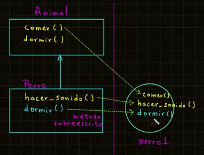

# Programación Orientada a Objetos (POO)

## Programación Orientada a Objetos (POO)

La **Programación Orientada a Objetos (POO)** es un paradigma de programación que organiza el código en estructuras
llamadas **objetos**, los cuales contienen **atributos** (datos) y **métodos** (funciones). Python es un lenguaje que
soporta POO de manera nativa.

### Herencia en Python

La **herencia** en Python es un concepto de la Programación Orientada a Objetos (POO) que permite que una clase (llamada
**clase hija** o **subclase**) herede atributos y métodos de otra clase (llamada **clase padre** o **superclase**). Esto
facilita la reutilización de código y la creación de jerarquías de clases.

- **Clase padre:** Contiene los atributos y métodos compartidos.
- **Clase hija:** Hereda de la clase padre y puede agregar o modificar funcionalidades específicas.
- **Sintaxis:**

  ```python
  class ClasePadre:
    pass
  
  class ClaseHija(ClasePadre):
    pass
  ```

- Permite extender o especializar comportamientos sin duplicar código.

**📄 Código :**

```python
class Animal:
    def comer(self):
        print("Como muchas veces el día")

    def dormir(self):
        print("Duermo muchas horas")


class Perro(Animal):
    def hacer_sonido(self):
        print("Puedo lagdrar")


# Programa Principal
print("*** Ejemplo de Herencia en Python ***")
print("Clase Padre, soy un Animal")

animal1 = Animal()
animal1.comer()
animal1.dormir()

print("\nClase Hija, soy un Perro")
perro1 = Perro()
perro1.hacer_sonido()
perro1.dormir()
perro1.comer()

```

**🟢 Ejecutar:**

```console
*** Ejemplo de Herencia en Python ***
Clase Padre, soy un Animal
Como muchas veces el día
Duermo muchas horas

Clase Hija, soy un Perro
Puedo lagdrar
Duermo muchas horas
Como muchas veces el día
```

### Sobreescritura en Python

La **sobreescritura de métodos** en Python permite que una subclase proporcione una implementación específica de un
método que ya está definido en su superclase. Esto es fundamental en la programación orientada a objetos para
personalizar o extender comportamientos heredados.

**Conceptos Clave:**

- **Definición:** La sobreescritura ocurre cuando una subclase define un método con el mismo nombre que uno en su
  superclase, alterando o ampliando su funcionalidad.

- **Uso del método `super()`:** Dentro de la subclase, se puede invocar el método de la superclase utilizando
  `super().metodo()`. Esto es útil para mantener el comportamiento original y añadir nuevas funcionalidades.

**Ejemplo Práctico:**

```python
class Animal:
    def mover(self):
        print("El animal se mueve")


class Pajaro(Animal):
    def mover(self):
        super().mover()
        print("El pájaro vuela")


# Crear instancia de Pajaro
ave = Pajaro()
ave.mover()
```

**Salida:**

```
El animal se mueve
El pájaro vuela
```

En este ejemplo, la clase `Pajaro` hereda de `Animal` y sobreescribe el método `mover`. Al llamar a `mover` desde una
instancia de `Pajaro`, primero se ejecuta el método de la superclase gracias a `super().mover()`, y luego la
implementación específica de `Pajaro`. citeturn0search2

**Consideraciones:**

- **Acceso al método original:** Si no se utiliza `super()`, la implementación de la superclase no se ejecutará cuando
  se llame al método sobreescrito desde la subclase.

- **Compatibilidad:** Es recomendable que la firma del método sobreescrito en la subclase coincida con la de la
  superclase para evitar errores y mantener la coherencia.

La sobreescritura de métodos es esencial para adaptar y extender comportamientos en jerarquías de clases, permitiendo
que las subclases implementen funcionalidades específicas sin alterar el código de las superclases.



**📄 Código :**

```python
class Animal:
    def comer(self):
        print("Como muchas veces el día")

    def dormir(self):
        print("Duermo muchas horas")


class Perro(Animal):
    def hacer_sonido(self):
        print("Puedo lagdrar")

    # Sobreescritura del metodo dormir
    def dormir(self):
        print("Duermo 15 Horas al día")


# Programa Principal
print("*** Ejemplo de Sobreescritura en Python ***")
print("Clase Padre, soy un Animal")

animal1 = Animal()
animal1.comer()
animal1.dormir()

print("\nClase Hija, soy un Perro")
perro1 = Perro()
perro1.hacer_sonido()
perro1.dormir()  # Se llama el método sobreescrito  de la clase hija
perro1.comer()

```

**🟢 Ejecutar:**

```console
*** Ejemplo de Sobreescritura en Python ***
Clase Padre, soy un Animal
Como muchas veces el día
Duermo muchas horas

Clase Hija, soy un Perro
Puedo lagdrar
Duermo 15 Horas al día
Como muchas veces el día
```

### Polimorfismo

El polimorfismo es un concepto fundamental en la Programación Orientada a Objetos (POO) que permite que una misma
interfaz o función se comporte de diferentes maneras según el objeto que la invoque. En Python, el polimorfismo se
manifiesta a través de la capacidad de usar un mismo método o función en distintos objetos, obteniendo resultados
específicos según la clase a la que pertenezcan.

**Ejemplos de polimorfismo en Python:**

- **Funciones incorporadas polimórficas:**
    - La función `len()` puede aplicarse tanto a cadenas como a listas, devolviendo la longitud correspondiente en cada
      caso.
        - `len("Hola")` devuelve `4`.
        - `len([1, 2, 3])` devuelve `3`.

- **Operadores polimórficos:**
    - El operador `+` se utiliza para sumar números y para concatenar cadenas.
        - `5 + 3` resulta en `8`.
        - `"Hola" + " Mundo"` resulta en `"Hola Mundo"`.

**Polimorfismo con métodos de clase:**

En Python, diferentes clases pueden tener métodos con el mismo nombre, y la ejecución del método dependerá del objeto
que lo invoque.

```python
class Perro:
    def hacer_sonido(self):
        print("Guau")


class Gato:
    def hacer_sonido(self):
        print("Miau")


def emitir_sonido(animal):
    animal.hacer_sonido()


perro = Perro()
gato = Gato()

emitir_sonido(perro)  # Salida: Guau
emitir_sonido(gato)  # Salida: Miau
```

En este ejemplo, la función `emitir_sonido` acepta cualquier objeto que tenga un método `hacer_sonido`, demostrando el
polimorfismo al invocar el método correspondiente según el objeto proporcionado.

**Polimorfismo y herencia:**

El polimorfismo también se relaciona con la herencia, donde una clase derivada puede sobrescribir métodos de su clase
base.

```python
class Ave:
    def volar(self):
        print("La mayoría de las aves pueden volar")


class Pinguino(Ave):
    def volar(self):
        print("Los pingüinos no pueden volar")


def describir_vuelo(ave):
    ave.volar()


ave = Ave()
pinguino = Pinguino()

describir_vuelo(ave)  # Salida: La mayoría de las aves pueden volar
describir_vuelo(pinguino)  # Salida: Los pingüinos no pueden volar
```

Aquí, la clase `Pinguino` sobrescribe el método `volar` de la clase `Ave`, y la función `describir_vuelo` demuestra el
polimorfismo al llamar al método adecuado según el objeto.

El polimorfismo en Python permite escribir código más flexible y reutilizable, facilitando la interacción con diferentes
tipos de objetos de manera uniforme.


**📄 Código :**

```python
# Polimorfismo


class Animal:
    def hacer_sonido(self):
        print("Hago un pitido")


class Perro(Animal):
    def hacer_sonido(self):
        print("Puedo ladrar")


class Gato(Animal):
    def hacer_sonido(self):
        print("Puedo maullar")


# Programa principal
print("*** Ejemplo Polimorfismo ***")

# Definimos un objeto de la clase Animal
print("Clase Padre - Animal:")
animal1 = Animal()
animal1.hacer_sonido()

# Definimos un objeto de la clase Perro
print("\nClase hija - Perro:")
perro1 = Perro()
perro1.hacer_sonido()  # Polimorfismo

# Definimos un objeto de la clase Gato
print("\nClase hija - Gato:")
gato1 = Gato()
gato1.hacer_sonido()  # Polimorfismo

```

**🟢 Ejecutar:**

```console
*** Ejemplo Polimorfismo ***
Clase Padre - Animal:
Hago un pitido

Clase hija - Perro:
Puedo ladrar

Clase hija - Gato:
Puedo maullar
```

### Duck Typing en Python

El **Duck Typing** es un concepto fundamental en Python que se basa en la idea de que el tipo o la clase de un objeto es
menos importante que los métodos o atributos que posee. Esta filosofía se resume en la expresión: "Si algo camina como
un pato y suena como un pato, entonces probablemente sea un pato". citeturn0search0

**Características principales:**

- **Tipado dinámico:** Python no requiere la declaración explícita de tipos; el intérprete determina el tipo de las
  variables en tiempo de ejecución. citeturn0search3

- **Enfoque en comportamientos:** Lo relevante es si un objeto puede realizar ciertas acciones, independientemente de su
  tipo específico. citeturn0search0

**Ejemplo de Duck Typing:**

```python
class Pato:
    def hablar(self):
        print("Cuac, cuac")


class Ganso:
    def hablar(self):
        print("Honk, honk")


def hacer_sonar(ave):
    ave.hablar()


pato = Pato()
ganso = Ganso()

hacer_sonar(pato)  # Imprime "Cuac, cuac"
hacer_sonar(ganso)  # Imprime "Honk, honk"
```

En este ejemplo, la función `hacer_sonar` acepta cualquier objeto que tenga un método `hablar`, sin importar su clase.
Esto demuestra cómo Python utiliza el Duck Typing para permitir una programación más flexible y genérica.
citeturn0search3

**Ventajas del Duck Typing:**

- **Flexibilidad:** Permite escribir código que puede trabajar con diferentes tipos de objetos, siempre que estos
  implementen los métodos o atributos esperados. citeturn0search0

- **Menor acoplamiento:** Reduce la dependencia de tipos específicos, facilitando la reutilización y mantenimiento del
  código. citeturn0search0

- **Código más limpio:** Al no requerir comprobaciones explícitas de tipos, el código es más legible y conciso.
  citeturn0search2

**Consideraciones:**

- **Manejo de errores:** Es importante asegurarse de que los objetos pasados a funciones o métodos posean los métodos o
  atributos necesarios para evitar errores en tiempo de ejecución. citeturn0search2

- **Legibilidad:** Aunque el Duck Typing ofrece flexibilidad, se debe tener cuidado para mantener la claridad y
  comprensión del código, especialmente en proyectos grandes o colaborativos. citeturn0search3

En resumen, el Duck Typing es una característica poderosa de Python que promueve la escritura de código flexible y
reutilizable, centrándose en los comportamientos de los objetos más que en sus tipos específicos.

**📄 Código :**

```python
# Polimorfismo


class Animal:
    def hacer_sonido(self):
        print("Hago un pitido")


class Perro(Animal):
    def hacer_sonido(self):
        print("Puedo ladrar")


class Gato(Animal):
    def hacer_sonido(self):
        print("Puedo maullar")


# Función polimorfismo (Duck Typing)
def hacer_sonido_anima(animal):  # DuckTyping
    animal.hacer_sonido()


# Programa principal
print("*** Ejemplo DuckTyping ***")

# Definimos un objeto de la clase Animal
print("Clase Padre - Animal:")
animal1 = Animal()
hacer_sonido_anima(animal1)  # DuckTyping

# Definimos un objeto de la clase Perro
print("\nClase hija - Perro:")
perro1 = Perro()
hacer_sonido_anima(perro1)  # DuckTyping

# Definimos un objeto de la clase Gato
print("\nClase hija - Gato:")
gato1 = Gato()
hacer_sonido_anima(gato1)  # DuckTyping

```

**🟢 Ejecutar:**

```console
*** Ejemplo DuckTyping ***
Clase Padre - Animal:
Hago un pitido

Clase hija - Perro:
Puedo ladrar

Clase hija - Gato:
Puedo maullar
```
