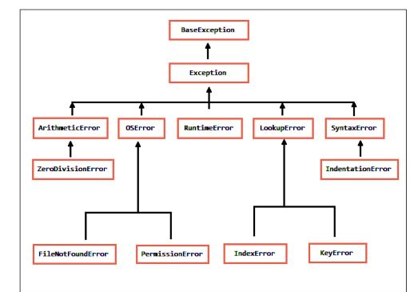

## Manejo de Excepciones en Python

El **manejo de excepciones** en Python es un mecanismo que permite controlar errores o situaciones inesperadas que ocurren durante la ejecución de un programa. En lugar de que el programa se detenga abruptamente, puedes "capturar" estas excepciones y tomar acciones específicas para manejarlas, lo que hace que tu código sea más robusto y confiable.

---

#### ¿Qué es una excepción?
Una **excepción** es un evento que interrumpe el flujo normal de un programa. Ocurre cuando algo sale mal, como:
- Dividir entre cero.
- Intentar acceder a un índice inexistente en una lista.
- Abrir un archivo que no existe.
- Convertir una cadena no numérica a un número.

Si no se manejan, las excepciones detienen la ejecución del programa y muestran un mensaje de error (traceback).

---

#### Estructura básica del manejo de excepciones
En Python, el manejo de excepciones se realiza usando los bloques `try`, `except`, `else` y `finally`.

```python
try:
    # Código que podría generar una excepción
    resultado = 10 / 0
except ZeroDivisionError:
    # Código que se ejecuta si ocurre la excepción
    print("Error: No se puede dividir entre cero.")
else:
    # Código que se ejecuta si NO ocurre ninguna excepción
    print("La división se realizó correctamente.")
finally:
    # Código que se ejecuta SIEMPRE, haya o no excepciones
    print("Fin del bloque try-except.")
```

---

#### Partes del manejo de excepciones

1. **`try`**:
   - Bloque donde se coloca el código que podría generar una excepción.
   - Si ocurre una excepción, el flujo del programa salta al bloque `except`.

2. **`except`**:
   - Bloque que captura y maneja la excepción.
   - Puedes especificar el tipo de excepción que quieres capturar (por ejemplo, `ZeroDivisionError`).
   - Si no se especifica el tipo de excepción, se capturarán todas las excepciones (no es recomendable).

3. **`else`** (opcional):
   - Bloque que se ejecuta si **no** ocurre ninguna excepción en el bloque `try`.

4. **`finally`** (opcional):
   - Bloque que se ejecuta **siempre**, haya o no excepciones.
   - Útil para liberar recursos (como cerrar archivos o conexiones).

---

#### Ejemplos de manejo de excepciones

##### 1. Capturar una excepción específica:
```python
try:
    numero = int(input("Ingresa un número: "))
    resultado = 10 / numero
    print("El resultado es:", resultado)
except ZeroDivisionError:
    print("Error: No se puede dividir entre cero.")
except ValueError:
    print("Error: Debes ingresar un número válido.")
```

##### 2. Capturar múltiples excepciones en un solo bloque:
```python
try:
    numero = int(input("Ingresa un número: "))
    resultado = 10 / numero
    print("El resultado es:", resultado)
except (ZeroDivisionError, ValueError) as e:
    print(f"Ocurrió un error: {e}")
```

##### 3. Usar `else` y `finally`:
```python
try:
    archivo = open("archivo.txt", "r")
    contenido = archivo.read()
    print(contenido)
except FileNotFoundError:
    print("Error: El archivo no existe.")
else:
    print("El archivo se leyó correctamente.")
finally:
    archivo.close()  # Cierra el archivo siempre
    print("Fin del manejo de archivos.")
```

---

#### Excepciones comunes en Python
Algunas excepciones comunes que puedes manejar incluyen:
- **`ZeroDivisionError`**: División entre cero.
- **`ValueError`**: Valor incorrecto (por ejemplo, convertir "abc" a un número).
- **`TypeError`**: Operación con tipos incompatibles (por ejemplo, `"5" + 3`).
- **`IndexError`**: Acceder a un índice fuera de rango en una lista.
- **`KeyError`**: Acceder a una clave inexistente en un diccionario.
- **`FileNotFoundError`**: Intentar abrir un archivo que no existe.

---

#### Crear excepciones personalizadas
Puedes crear tus propias excepciones para manejar situaciones específicas de tu programa. Para ello, defines una clase que herede de `Exception`.

```python
class MiErrorPersonalizado(Exception):
    pass

try:
    edad = int(input("Ingresa tu edad: "))
    if edad < 0:
        raise MiErrorPersonalizado("La edad no puede ser negativa.")
except MiErrorPersonalizado as e:
    print(e)
```

---

#### Resumen
- El **manejo de excepciones** en Python permite controlar errores durante la ejecución de un programa.
- Se usa con los bloques `try`, `except`, `else` y `finally`.
- Puedes capturar excepciones específicas o crear excepciones personalizadas.
- Es una buena práctica usarlo para evitar que el programa se detenga inesperadamente y para manejar errores de manera adecuada.

