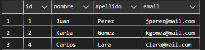
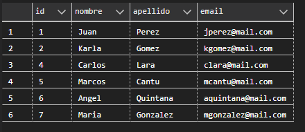
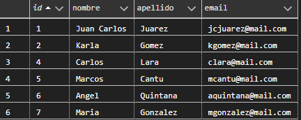

## Uso de Python y Postgresql

El **uso de Python y PostgreSQL** se refiere a la combinación de Python, un lenguaje de programación versátil y popular, con PostgreSQL, un sistema de gestión de bases de datos relacional (RDBMS) robusto y open source. Esta combinación es ampliamente utilizada para desarrollar aplicaciones que requieren almacenamiento, manipulación y consulta de datos de manera eficiente.

---

#### **¿Por qué usar Python con PostgreSQL?**

1. **Flexibilidad de Python**:
   - Python es un lenguaje fácil de aprender y usar, con una sintaxis clara y una gran cantidad de bibliotecas para diversas tareas.
   - Es ideal para el desarrollo rápido de aplicaciones.

2. **Potencia de PostgreSQL**:
   - PostgreSQL es una base de datos relacional avanzada, con soporte para SQL estándar, transacciones ACID, y características avanzadas como triggers, vistas, y procedimientos almacenados.
   - Es altamente escalable y adecuado para aplicaciones de cualquier tamaño.

3. **Integración sencilla**:
   - Python tiene bibliotecas como **`psycopg2`** y **`SQLAlchemy`** que facilitan la conexión y manipulación de datos en PostgreSQL.

4. **Comunidad y soporte**:
   - Tanto Python como PostgreSQL tienen comunidades activas y una gran cantidad de recursos disponibles.

---

#### **Casos de uso comunes**
1. **Aplicaciones web**:
   - Usar Python con frameworks como Django o Flask, que tienen soporte nativo para PostgreSQL.
   - Ejemplo: Un sistema de gestión de contenidos (CMS) o una tienda en línea.

2. **Análisis de datos**:
   - Extraer datos de PostgreSQL y usar bibliotecas de Python como **`pandas`**, **`numpy`**, o **`matplotlib`** para análisis y visualización.

3. **Automatización de tareas**:
   - Escribir scripts en Python para realizar operaciones en la base de datos, como actualizaciones masivas o generación de informes.

4. **Ciencia de datos**:
   - Almacenar grandes volúmenes de datos en PostgreSQL y usar Python para entrenar modelos de machine learning con bibliotecas como **`scikit-learn`** o **`TensorFlow`**.

5. **Backend de aplicaciones**:
   - Usar Python para construir la lógica del backend y PostgreSQL como la base de datos principal.

---

### **Instalar `psycopg2`**
`psycopg2` es la biblioteca más popular para conectar Python con PostgreSQL. Puedes instalarla con:

```bash
pip install psycopg2
```

---

#### **Ventajas de usar Python con PostgreSQL**
1. **Rápido desarrollo**: Python es ideal para prototipos y aplicaciones rápidas.
2. **Escalabilidad**: PostgreSQL maneja grandes volúmenes de datos y es altamente escalable.
3. **Flexibilidad**: Puedes usar SQL directo o un ORM como SQLAlchemy.
4. **Comunidad**: Ambas tecnologías tienen comunidades activas y mucha documentación.

---

#### **Resumen**
- Python y PostgreSQL son una combinación poderosa para aplicaciones que requieren manejo de datos.
- Usa `psycopg2` para conexiones directas o `SQLAlchemy` para un enfoque más orientado a objetos.
- Ideal para aplicaciones web, análisis de datos, ciencia de datos y automatización.

### Conexión de Python a Postgresql

#### **Establecer la conexión**
Aquí tienes un ejemplo básico de cómo conectarse a una base de datos PostgreSQL desde Python:


**📄 Código :**

```python
# Importar la biblioteca psycopg2, que permite la conexión y manipulación de bases de datos PostgreSQL desde Python.
import psycopg2

# Establecer una conexión con la base de datos PostgreSQL.
# Se utilizan los siguientes parámetros:
# - user: El nombre de usuario de la base de datos (en este caso, "postgres").
# - password: La contraseña del usuario (en este caso, "admin").
# - host: La dirección del servidor donde está alojada la base de datos (en este caso, "localhost").
# - port: El puerto en el que PostgreSQL está escuchando (por defecto, 5432).
# - database: El nombre de la base de datos a la que se desea conectar (en este caso, "test_db").
conexion = psycopg2.connect(
    user="postgres", password="admin", host="localhost", port="5432", database="test_db"
)

# Crear un cursor. Un cursor es un objeto que permite ejecutar consultas SQL y recuperar resultados.
cursor = conexion.cursor()

# Definir la consulta SQL que se va a ejecutar.
# En este caso, la consulta selecciona todos los registros de la tabla "persona".
sentencia = "SELECT * FROM persona"

# Ejecutar la consulta SQL definida en la variable `sentencia`.
cursor.execute(sentencia)

# Recuperar todos los registros obtenidos por la consulta SQL.
# `fetchall()` devuelve una lista de tuplas, donde cada tupla representa una fila de la tabla.
registros = cursor.fetchall()

# Imprimir los registros obtenidos.
# Esto mostrará en la consola todas las filas de la tabla "persona".
print(registros)

# Nota: En un programa real, es importante cerrar el cursor y la conexión para liberar recursos.
cursor.close()
conexion.close()
```

**🟢 Ejecutar:**

```console
[(1, 'Juan', 'Perez', 'jperez@mail.com'), (2, 'Karla', 'Gomez', 'kgomez@mail.com')]
```

### Uso de with y psycopg


**📄 Código :**

```python
# Importar la biblioteca psycopg2, que permite la conexión y manipulación de bases de datos PostgreSQL desde Python.
import psycopg2

# Establecer una conexión con la base de datos PostgreSQL.
# Se utilizan los siguientes parámetros:
# - database: El nombre de la base de datos a la que se desea conectar (en este caso, "test_db").
# - user: El nombre de usuario de la base de datos (en este caso, "postgres").
# - password: La contraseña del usuario (en este caso, "admin").
# - host: La dirección del servidor donde está alojada la base de datos (en este caso, "localhost").
# - port: El puerto en el que PostgreSQL está escuchando (por defecto, 5432).
conexion = psycopg2.connect(
    database="test_db", user="postgres", password="admin", host="localhost", port="5432"
)

# Iniciar un bloque try para manejar posibles excepciones (errores) que puedan ocurrir durante la ejecución del código.
try:
    # Usar el bloque 'with' para gestionar la conexión.
    # Esto asegura que la conexión se cierre automáticamente al salir del bloque, incluso si ocurre una excepción.
    with conexion:
        # Usar otro bloque 'with' para gestionar el cursor.
        # Esto asegura que el cursor se cierre automáticamente al salir del bloque.
        with conexion.cursor() as cursor:
            # Definir la consulta SQL que se va a ejecutar.
            # En este caso, la consulta selecciona todos los registros de la tabla "persona".
            sentencia = "SELECT * FROM persona"

            # Ejecutar la consulta SQL definida en la variable `sentencia`.
            cursor.execute(sentencia)

            # Recuperar todos los registros obtenidos por la consulta SQL.
            # `fetchall()` devuelve una lista de tuplas, donde cada tupla representa una fila de la tabla.
            registros = cursor.fetchall()

            # Imprimir los registros obtenidos.
            # Esto mostrará en la consola todas las filas de la tabla "persona".
            print(registros)

# Capturar cualquier excepción que ocurra durante la ejecución del código.
except Exception as e:
    # Imprimir un mensaje de error que incluye la descripción de la excepción.
    print(f"Ocurrió un error: {e}")

# Bloque finally: Este bloque se ejecuta siempre, haya o no ocurrido una excepción.
finally:
    # Cerrar la conexión con la base de datos para liberar recursos.
    conexion.close()

```

**🟢 Ejecutar:**

```console
[(1, 'Juan', 'Perez', 'jperez@mail.com'), (2, 'Karla', 'Gomez', 'kgomez@mail.com')]
```

### Función fetch one en Psycopg


**📄 Código :**

```python
# Importar la biblioteca psycopg2, que permite la conexión y manipulación de bases de datos PostgreSQL desde Python.
import psycopg2

# Establecer una conexión con la base de datos PostgreSQL.
# Se utilizan los siguientes parámetros:
# - database: El nombre de la base de datos a la que se desea conectar (en este caso, "test_db").
# - user: El nombre de usuario de la base de datos (en este caso, "postgres").
# - password: La contraseña del usuario (en este caso, "admin").
# - host: La dirección del servidor donde está alojada la base de datos (en este caso, "localhost").
# - port: El puerto en el que PostgreSQL está escuchando (por defecto, 5432).
conexion = psycopg2.connect(
    database="test_db", user="postgres", password="admin", host="localhost", port="5432"
)

# Iniciar un bloque try para manejar posibles excepciones (errores) que puedan ocurrir durante la ejecución del código.
try:
    # Usar el bloque 'with' para gestionar la conexión.
    # Esto asegura que la conexión se cierre automáticamente al salir del bloque, incluso si ocurre una excepción.
    with conexion:
        # Usar otro bloque 'with' para gestionar el cursor.
        # Esto asegura que el cursor se cierre automáticamente al salir del bloque.
        with conexion.cursor() as cursor:
            # Definir la consulta SQL que se va a ejecutar.
            # En este caso, la consulta selecciona todos los registros de la tabla "persona" donde el campo "id" coincide con un valor proporcionado.
            # El valor se pasa como parámetro para evitar inyecciones SQL.
            sentencia = "SELECT * FROM persona WHERE id = %s"

            # Solicitar al usuario que introduzca el valor de "id_persona".
            # Este valor se usará para buscar un registro específico en la tabla.
            id_persona = input("Introduce el valor de id persona: ")

            # Ejecutar la consulta SQL definida en la variable `sentencia`.
            # El valor de `id_persona` se pasa como una tupla (por eso tiene una coma al final).
            cursor.execute(sentencia, (id_persona,))

            # Recuperar un solo registro obtenido por la consulta SQL.
            # `fetchone()` devuelve una tupla que representa la primera fila que coincide con la consulta.
            # Si no hay coincidencias, devuelve `None`.
            registros = cursor.fetchone()

            # Imprimir el registro obtenido.
            # Esto mostrará en la consola la fila de la tabla "persona" que coincide con el "id" proporcionado.
            print(registros)

# Capturar cualquier excepción que ocurra durante la ejecución del código.
except Exception as e:
    # Imprimir un mensaje de error que incluye la descripción de la excepción.
    print(f"Ocurrió un error: {e}")

# Bloque finally: Este bloque se ejecuta siempre, haya o no ocurrido una excepción.
finally:
    # Cerrar la conexión con la base de datos para liberar recursos.
    conexion.close()
```

**🟢 Ejecutar:**

```console
Introduce el valor de id persona: 2
(2, 'Karla', 'Gomez', 'kgomez@mail.com')
```

### Función fetch all en Psycopg


**📄 Código :**

```python
# Importar la biblioteca psycopg2, que permite la conexión y manipulación de bases de datos PostgreSQL desde Python.
import psycopg2

# Establecer una conexión con la base de datos PostgreSQL.
# Se utilizan los siguientes parámetros:
# - database: El nombre de la base de datos a la que se desea conectar (en este caso, "test_db").
# - user: El nombre de usuario de la base de datos (en este caso, "postgres").
# - password: La contraseña del usuario (en este caso, "admin").
# - host: La dirección del servidor donde está alojada la base de datos (en este caso, "localhost").
# - port: El puerto en el que PostgreSQL está escuchando (por defecto, 5432).
conexion = psycopg2.connect(
    database="test_db", user="postgres", password="admin", host="localhost", port="5432"
)

# Iniciar un bloque try para manejar posibles excepciones (errores) que puedan ocurrir durante la ejecución del código.
try:
    # Usar el bloque 'with' para gestionar la conexión.
    # Esto asegura que la conexión se cierre automáticamente al salir del bloque, incluso si ocurre una excepción.
    with conexion:
        # Usar otro bloque 'with' para gestionar el cursor.
        # Esto asegura que el cursor se cierre automáticamente al salir del bloque.
        with conexion.cursor() as cursor:
            # Definir la consulta SQL que se va a ejecutar.
            # En este caso, la consulta selecciona todos los registros de la tabla "persona" donde el campo "id" coincide con alguno de los valores proporcionados.
            # El operador `IN` permite buscar múltiples valores en una columna.
            sentencia = "SELECT * FROM persona WHERE id IN %s"

            # Solicitar al usuario que introduzca los valores de "id" separados por comas.
            # Por ejemplo, el usuario podría ingresar: "1,2,3".
            entrada = input("Proporciona los id's a buscar (separado por comas): ")

            # Convertir la entrada del usuario en una tupla de tuplas.
            # `entrada.split(",")` divide la cadena en una lista de strings (por ejemplo, ["1", "2", "3"]).
            # `tuple(entrada.split(","))` convierte la lista en una tupla (por ejemplo, ("1", "2", "3")).
            # Luego, se envuelve en otra tupla para cumplir con el formato requerido por `psycopg2` (por ejemplo, (("1", "2", "3"),)).
            llaves_primarias = (tuple(entrada.split(",")),)

            # Ejecutar la consulta SQL definida en la variable `sentencia`.
            # El valor de `llaves_primarias` se pasa como parámetro para evitar inyecciones SQL.
            cursor.execute(sentencia, llaves_primarias)

            # Recuperar todos los registros obtenidos por la consulta SQL.
            # `fetchall()` devuelve una lista de tuplas, donde cada tupla representa una fila de la tabla.
            registros = cursor.fetchall()

            # Iterar sobre los registros obtenidos e imprimir cada uno.
            for registro in registros:
                print(registro)

# Capturar cualquier excepción que ocurra durante la ejecución del código.
except Exception as e:
    # Imprimir un mensaje de error que incluye la descripción de la excepción.
    print(f"Ocurrió un error: {e}")

# Bloque finally: Este bloque se ejecuta siempre, haya o no ocurrido una excepción.
finally:
    # Cerrar la conexión con la base de datos para liberar recursos.
    conexion.close()
```

**🟢 Ejecutar:**

```console
Proporciona los id's a buscar (separado por comas): 1,2,3
(1, 'Juan', 'Perez', 'jperez@mail.com')
(2, 'Karla', 'Gomez', 'kgomez@mail.com')
```

### Insertar Registro con Psycopg


**📄 Código :**

```python
import psycopg2

conexion = psycopg2.connect(
    database="test_db", user="postgres", password="admin", host="localhost", port="5432"
)

try:
    with conexion:
        with conexion.cursor() as cursor:
            setencia = (
                "INSERT INTO persona(nombre, apellido, email) VALUES (%s, %s, %s)"
            )
            valores = (
                "Carlos",
                "Lara",
                "clara@mail.com",
            )
            cursor.execute(setencia, valores)
            # conexion.commit()
            registro_insertado = cursor.rowcount
            print(f"Registro Insertado: {registro_insertado}")
except Exception as e:
    print(f"Ocurrió un error: {e}")
finally:
    conexion.close()

```

**🟢 Ejecutar:**

```console
Registro Insertado: 1
```



### Insertar varios registros


**📄 Código :**

```python
import psycopg2

# Establecer la conexión con la base de datos
conexion = psycopg2.connect(
    database="test_db", user="postgres", password="admin", host="localhost", port="5432"
)

try:
    with conexion:
        with conexion.cursor() as cursor:
            # Definir la consulta SQL
            sentencia = (
                "INSERT INTO persona(nombre, apellido, email) VALUES (%s, %s, %s)"
            )
            # Definir los valores
            valores = (
                ("Marcos", "Cantu", "mcantu@mail.com"),
                ("Angel", "Quintana", "aquintana@mail.com"),
                ("Maria", "Gonzalez", "mgonzalez@mail.com"),
            )
            # Ejercutar la consulta
            cursor.executemany(sentencia, valores)
            # conexion.commit() # Es importante confirmar los cambios con conexion.commit() (a menos que uses un bloque with).
            # Obtener el número de registros insertados
            registro_insertado = cursor.rowcount
            print(f"Registro Insertado: {registro_insertado}")
except Exception as e:
    print(f"Ocurrió un error: {e}")
finally:
    # Cerrar la conexión
    conexion.close()

```

**🟢 Ejecutar:**

```console
Registro Insertado: 3
```



#### Actualizar un Registro


**📄 Código :**

```python
import psycopg2

# Establecer la conexión con la base de datos
conexion = psycopg2.connect(
    database="test_db", user="postgres", password="admin", host="localhost", port="5432"
)

try:
    with conexion:
        with conexion.cursor() as cursor:
            # Definir la consulta SQL para actualizar un registro en la tabla "persona".
            # La consulta actualiza los campos "nombre", "apellido" y "email" donde el "id" coincide con un valor específico.
            # Los valores a actualizar se pasan como parámetros (%s) para evitar inyecciones SQL.
            sentencia = (
                "UPDATE persona SET nombre=%s, apellido=%s, email=%s WHERE id=%s"
            )

            # Definir los valores que se usarán en la consulta SQL.
            # Estos valores reemplazarán los marcadores de posición (%s) en la consulta.
            # En este caso, se actualiza el nombre a "Juan Carlos", el apellido a "Juarez", el email a "jcjuarez@mail.com" para el registro con id = 1.
            valores = ("Juan Carlos", "Juarez", "jcjuarez@mail.com", 1)

            # Ejecutar la consulta SQL con los valores proporcionados.
            # Esto actualiza el registro en la base de datos.
            cursor.execute(sentencia, valores)

            # Obtener el número de registros actualizados.
            # `cursor.rowcount` devuelve la cantidad de filas afectadas por la consulta.
            registro_actualizado = cursor.rowcount

            # Imprimir el número de registros actualizados.
            # Esto muestra en la consola cuántos registros se modificaron.
            print(f"Registro Actualizado: {registro_actualizado}")
except Exception as e:
    print(f"Ocurrió un error: {e}")
finally:
    # Cerrar la conexión
    conexion.close()

```

**🟢 Ejecutar:**

```console
Registro Actualizado: 1
```


**Actualizado:**




