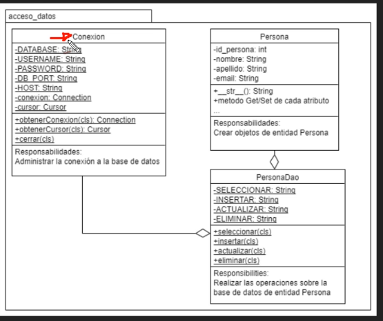

## Creación de una Capa de Datos con Python



### Manejo de Logging en Python

El **manejo de logging en Python** se refiere a la práctica de registrar eventos, mensajes y errores durante la ejecución de un programa. El módulo `logging` de Python es una herramienta poderosa y flexible para este propósito, ya que permite controlar el nivel de detalle de los registros, enviarlos a diferentes destinos (como archivos, consola o servicios externos) y formatearlos según sea necesario.

---

#### **¿Por qué usar logging?**
1. **Depuración**: Registrar mensajes ayuda a identificar y solucionar errores.
2. **Monitoreo**: Permite rastrear el flujo de ejecución de un programa.
3. **Auditoría**: Registra eventos importantes para análisis posteriores.
4. **Personalización**: Puedes controlar el nivel de detalle y el formato de los registros.

---

#### **Componentes principales del módulo `logging`**
1. **Loggers**: Objetos que generan los registros.
2. **Handlers**: Destinos de los registros (archivo, consola, etc.).
3. **Formatters**: Define el formato de los mensajes de registro.
4. **Levels**: Niveles de severidad de los registros (DEBUG, INFO, WARNING, ERROR, CRITICAL).

---

#### **Niveles de logging**
Los niveles de logging, en orden de severidad, son:
1. **DEBUG**: Información detallada para depuración.
2. **INFO**: Confirmación de que las cosas funcionan como se espera.
3. **WARNING**: Indica un problema potencial.
4. **ERROR**: Indica un problema más grave.
5. **CRITICAL**: Indica un error crítico que puede detener la ejecución.

---

#### **Ejemplo básico de logging**

```python
import logging

# Configuración básica del logging
logging.basicConfig(
    level=logging.DEBUG,  # Nivel mínimo de los mensajes a registrar
    format="%(asctime)s - %(levelname)s - %(message)s",  # Formato del mensaje
    filename="app.log",  # Archivo donde se guardarán los registros
    filemode="a",  # Modo de apertura del archivo ("a" para agregar)
)

# Ejemplos de mensajes de logging
logging.debug("Este es un mensaje de depuración")  # No se mostrará si el nivel es mayor que DEBUG
logging.info("Este es un mensaje informativo")     # No se mostrará si el nivel es mayor que INFO
logging.warning("Este es un mensaje de advertencia")
logging.error("Este es un mensaje de error")
logging.critical("Este es un mensaje crítico")
```

---

#### **Explicación del código**

1. **Configuración básica**:
   - `level=logging.DEBUG`: Define el nivel mínimo de los mensajes a registrar.
   - `format="%(asctime)s - %(levelname)s - %(message)s"`: Define el formato del mensaje.
     - `%(asctime)s`: Fecha y hora del registro.
     - `%(levelname)s`: Nivel de severidad (DEBUG, INFO, etc.).
     - `%(message)s`: Mensaje de registro.
   - `filename="app.log"`: Guarda los registros en un archivo llamado `app.log`.
   - `filemode="a"`: Abre el archivo en modo "append" (agregar).

2. **Mensajes de logging**:
   - `logging.debug()`: Mensajes detallados para depuración.
   - `logging.info()`: Mensajes informativos.
   - `logging.warning()`: Advertencias.
   - `logging.error()`: Errores.
   - `logging.critical()`: Errores críticos.

---

#### **Salida en el archivo `app.log`**
El archivo `app.log` contendrá algo como esto:
```
2023-10-05 12:34:56,789 - DEBUG - Este es un mensaje de depuración
2023-10-05 12:34:56,789 - INFO - Este es un mensaje informativo
2023-10-05 12:34:56,789 - WARNING - Este es un mensaje de advertencia
2023-10-05 12:34:56,789 - ERROR - Este es un mensaje de error
2023-10-05 12:34:56,789 - CRITICAL - Este es un mensaje crítico
```

---

#### **Configuración avanzada**
Puedes personalizar el logging usando **loggers**, **handlers** y **formatters** de manera explícita.

##### **Ejemplo avanzado**:
```python
import logging

# Crear un logger
logger = logging.getLogger("mi_aplicacion")
logger.setLevel(logging.DEBUG)  # Nivel mínimo del logger

# Crear un handler para enviar los registros a un archivo
file_handler = logging.FileHandler("app_avanzado.log")
file_handler.setLevel(logging.DEBUG)  # Nivel mínimo del handler

# Crear un formatter para definir el formato de los registros
formatter = logging.Formatter("%(asctime)s - %(name)s - %(levelname)s - %(message)s")
file_handler.setFormatter(formatter)

# Agregar el handler al logger
logger.addHandler(file_handler)

# Ejemplos de mensajes de logging
logger.debug("Este es un mensaje de depuración")
logger.info("Este es un mensaje informativo")
logger.warning("Este es un mensaje de advertencia")
logger.error("Este es un mensaje de error")
logger.critical("Este es un mensaje crítico")
```

---

#### **Ventajas del logging avanzado**
1. **Múltiples handlers**: Puedes enviar registros a diferentes destinos (archivo, consola, red, etc.).
2. **Niveles personalizados**: Define niveles de logging específicos para tu aplicación.
3. **Formato personalizado**: Ajusta el formato de los registros según tus necesidades.

---

#### **Buenas prácticas**
1. **Usar niveles adecuados**: No abuses del nivel `DEBUG` en producción.
2. **Evitar logging en bucles**: Puede afectar el rendimiento.
3. **Rotación de archivos**: Usa `RotatingFileHandler` o `TimedRotatingFileHandler` para evitar archivos de log demasiado grandes.
4. **No registrar información sensible**: Evita registrar contraseñas o datos personales.

---

#### **Resumen**
- El módulo `logging` de Python es una herramienta poderosa para registrar eventos y errores.
- Puedes configurar el nivel de logging, el formato y los destinos de los registros.
- Usa logging para depurar, monitorear y auditar tus aplicaciones.


**📄 Código :**

```python
import logging as log

log.basicConfig(level=log.DEBUG, format='%(asctime)s: %(levelname)s [%(filename)s:%(lineno)s] %(message)s',
                datefmt='%I:%M:%S %p',
                handlers=[
                    log.FileHandler('capa_datos.log'),
                    log.StreamHandler()
                ])

if __name__ == '__main__':
    log.debug('Mensaje a nivel debug')
    log.info('Mensaje a nivel info')
    log.warning('Mensaje a nivel warning')
    log.error('Mensaje a nivel error')
    log.critical('Mensaje a nivel critical')
```

**🟢 Ejecutar:**

```console
03:59:07 PM: DEBUG [logger_base.py:11] Mensaje a nivel debug
03:59:07 PM: INFO [logger_base.py:12] Mensaje a nivel info
03:59:07 PM: WARNING [logger_base.py:13] Mensaje a nivel warning
03:59:07 PM: ERROR [logger_base.py:14] Mensaje a nivel error
03:59:07 PM: CRITICAL [logger_base.py:15] Mensaje a nivel critical
```
